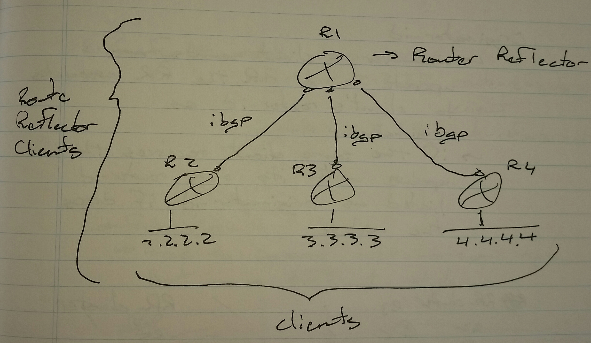
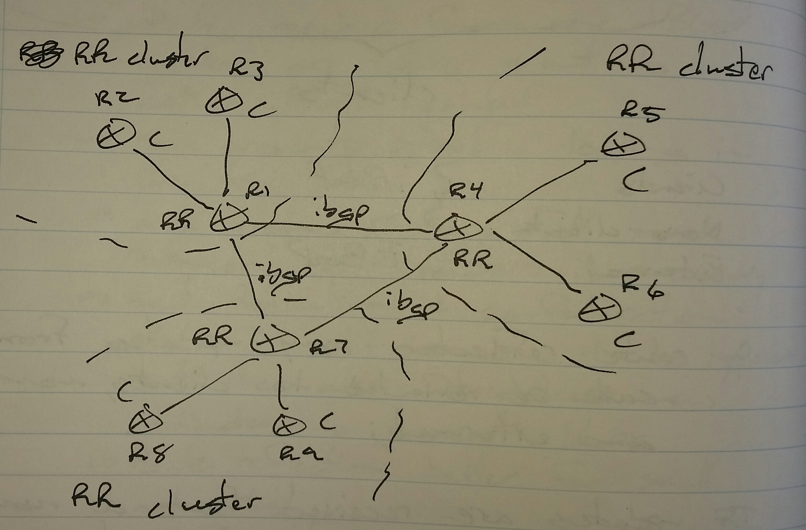
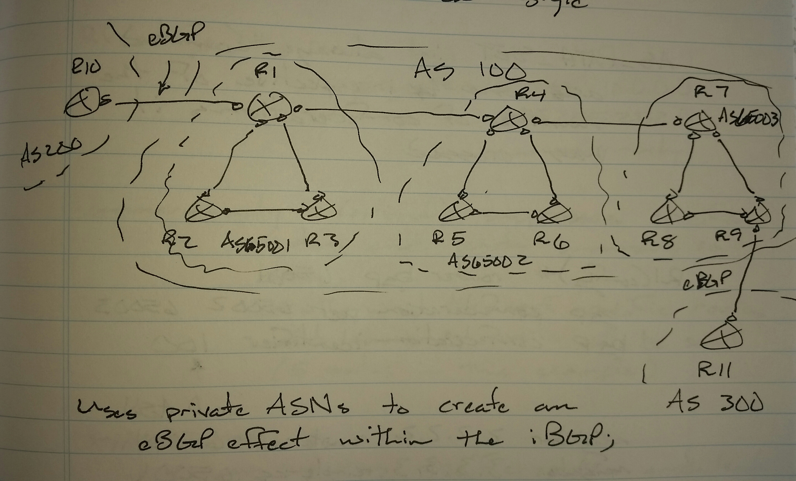
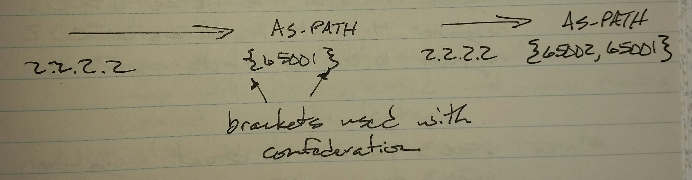
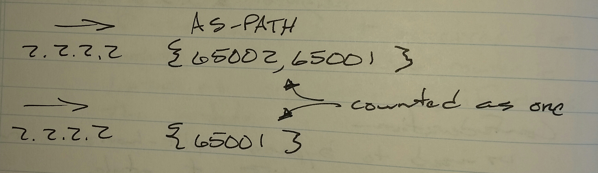

# BGP Route Reflection - Class Notes

**Route Reflection (RR) and Confederation** (25 Aug 2014)Lab:  BGP 1 - 6
**Split-horizon rule of BGP**

- Updates received from one iBGP neighbor are never sent to another iBGP neighbor

- This prevents possible looping in the AS

- Also means that a full mesh between iBGP routers is necessary

- Route Reflection and Confederation allow for split-horizon to be bypassed, but also introduces new attributes to prevent loops

- Route Reflection works better on small networks

- Confederation works better on large networks

Clients - iBGP

Non-clients - iBGP

External - eBGP

On the route reflector (will also be referred to as RR), any updates from clients can be reflected to clients, non-clients, and external.

If updates are received from a non-client, the updates can be reflected to clients and external.

The router reflector does not change the next-hop information when reflecting routers to clients.

To prevent loops, RR introduces two attributes

 - originator-id

     -> router-id of the originating router

 - cluster-id

     -> router-id of route reflector

**Originator-id**

 - Whenever a client sends an update to a RR, the RR associates the client's router-id as the originator-id

 - If a client receives an update with its own router-id listed as originator-id, the update is dropped

**Cluster-id**

 - Whenever an update is sent out of the cluster, the cluster-id is associated with the update

 - When a RR receives an update which lists its own router-id as the cluster-id, the update is dropped

R1(config)# router bgp 100

 neighbor 2.2.2.2 remote-as 100

 neighbor 2.2.2.2 route-reflector-client

 neighbor 3.3.3.3 remote-as 100

 neighbor 3.3.3.3 route-reflector-client

**Confederation**

 - Used to bypass the split-horizon rule, but in a different way

 - Routers are separated into private ASNs to create an eBGP effect within the iBGP AS

Confederation introduces 2 attributes to prevent loops

 - AS_CONFED_SET

     -> Orderly list of confederated ASs the update has traversed

 - CONFED_External

     -> CONFED_Internal

Whenever an update is sent to an eBGP neighbor, the real ASN will be used

AS_PATH_SET is always counted as one, regardless of the number of confederations the update has traversed.

R1(config)# router bgp 65001

 bgp confederation peer 65002 65003

     -> If 65003 is not a direct neighbor, it does not need to be listed

     -> It's a good practice to list all of the confederation ASNs

 bgp confederation indentifier 100

     -> The real ASN used the eBGP

 neighbor 2.2.2.2 remote-as 65001

 neighbor 3.3.3.3 remote-as 65001

 neighbor 4.4.4.4 remote-as 65002

 neighbor 10.0.0.10 remote-as 200
