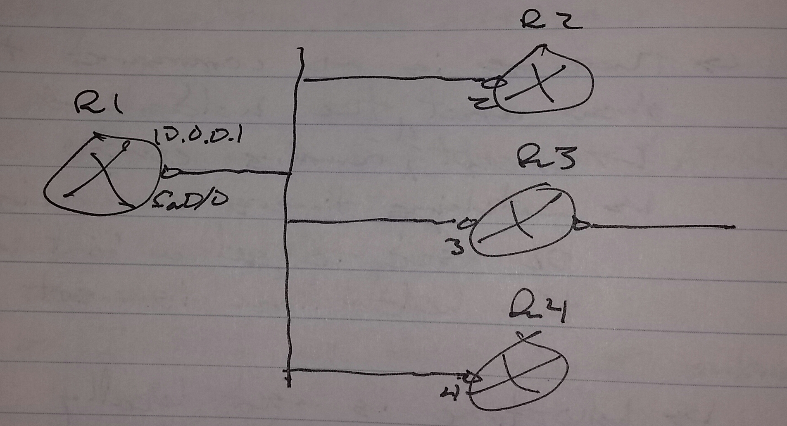
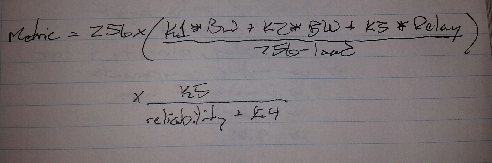
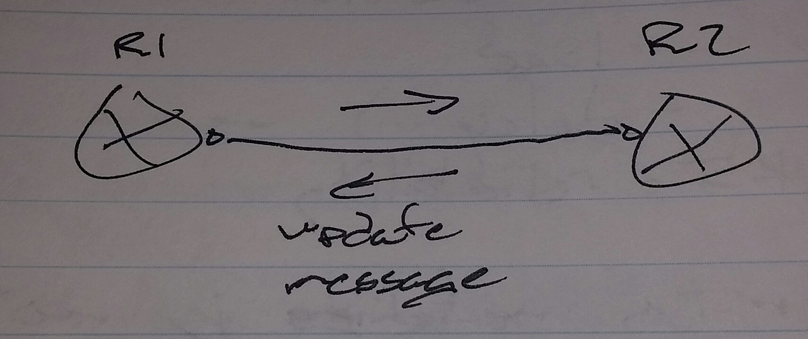
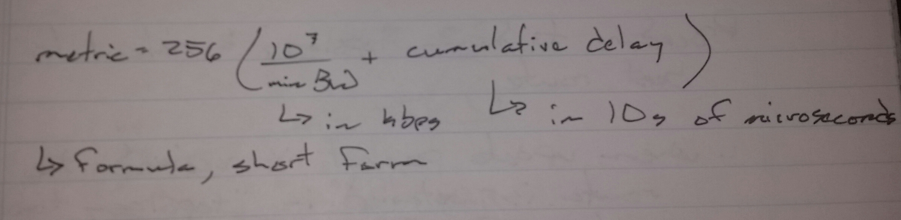
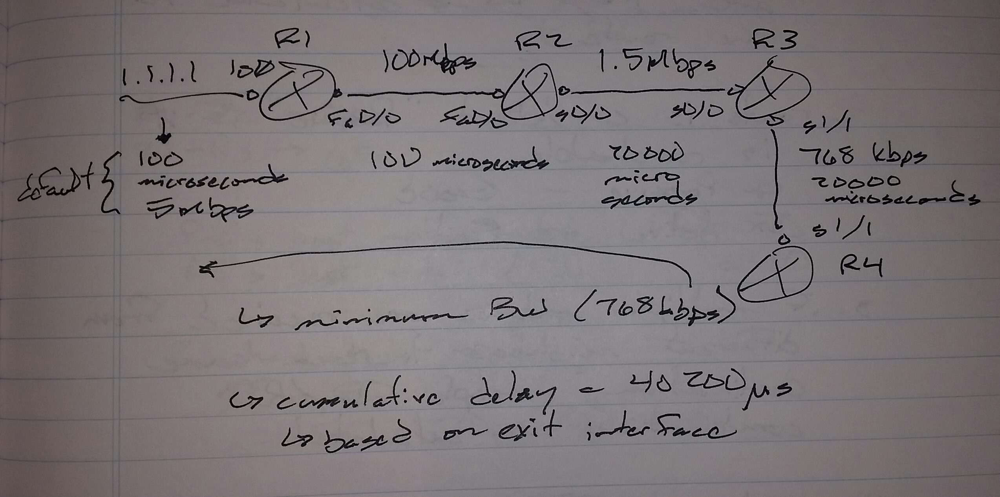
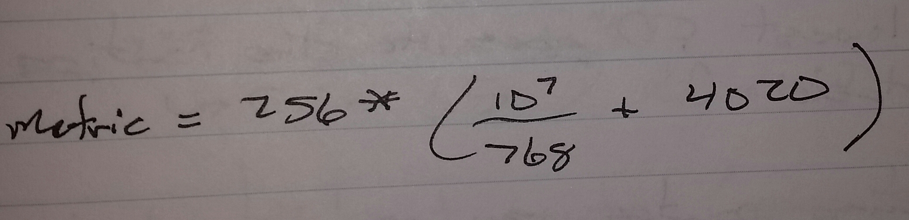
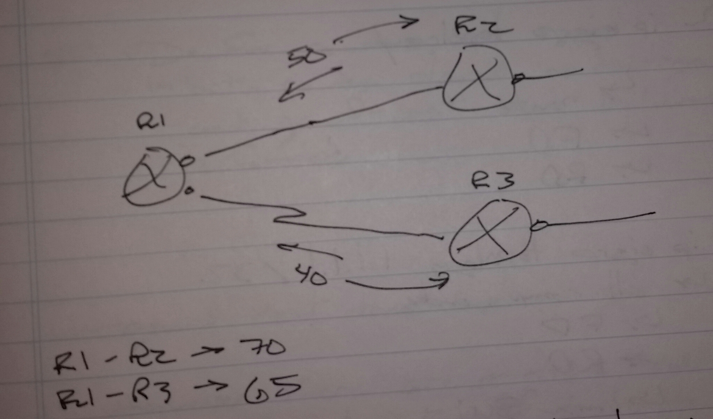

# EIGRP - Class Notes - Part 1

- Note: Split on 6 April 2024, because the original export was 25.5 MB in size. Github file size limit is 25 MB.

**EIGRP** (21 Aug 2014)

 - IP protocol 88

 - Multiple L3 protcols (Protocol Independent)

 - Distance Vector Protocol

 - AD

      -> Internal

           -> 90

      -> External

           -> 170

      -> Summary

           -> 5

 - Composite metric which is calculated by bandwidth and delay by default

      -> Can also use reliability and load

 - Uses 3 tables

      -> Neighbor table

      -> Topology table

      -> Routing table

 - 5 message types

      -> Hello

      -> Update

      -> Query

      -> Reply

      -> Acknowledgement

 - Muilticast 224.0.0.10 to communicate with neighbors

 - Hello time

      -> LAN interface

           -> 5

      -> WAN interface

           -> 60

 - Holddown

      -> LAN interface

           -> 15

      -> WAN interface

           -> 180

 - Incremental and change based updates

 - Supports only MD5 authentication 

 CCNP covers 95% of EIGRP used in CCIE 

**Neighbors**

 Hello message contains

 - Autonomous System Number (ASN)

      -> Must match

 - Network of both ends

      -> Must match

      -> EIGRP is not strict about subnet masks matching (unlike OSPF)

           -> R1 s0/0 - 12.0.0.1 /30

           -> R2 s0/0 - 12.0.0.2 /24

 - Authentication

      -> Must match

 - K-values

      -> Must match 

**Change Timers** (hello | holddown)

 - To speed up or slow down convergence 

int s0/0

ip hello-interval eigrp 1 8

ip hold-time eigrp 1 16

 - There is not command that will show what the hold-time is set to

      -> Except sh run

      -> Watching the timers on a neighbor can be used to get a hint as to what the hold-time is set to

 - Hello-time is used locally

      -> But hold-down time is sent to neighbors

 - To check hello-interval 

sh ip eigrp int s0/0 detail

**Passive Interface**

 - Stops hello processing on the specific interface

 - The network associated with the interface is still advertiseed 

 R1(config)# router eigrp 1

passive-interface { default | <interface> }

sh ip protocols

 - Shows the passive interfaces 

**Manual Neighbors**

 - Uses unicast

 - Stops sending multicast hellos

 - Starts sending unicast hellos

 - Must be enabled on all routers connected to the same segment

 R1(config)# router eigrp 1

neighbor 10.0.0.2 fa0/0

neighbor 10.0.0.3 fa0/0

neighbot 10.0.0.4 fa0/0

sh ip eigrp nei detail

 - Shows if neighbor is dynamic or manual 

**Authentication**

 - MD5 

key chain CISCO

key 1

  key-string CCIE

int s0/0

ip authentication mode eigrp 1 md5

ip authentication key-chaing eigrp 1 CISCO

debup ip eigrp

sh run

sh ip eigrp int detail

debug eigrp packets

 - Will display all 5 message types

debug eigrp packets hello

debug eigrp packets update

debug eigrp packets query

debug eigrp packets reply

debug eigrp packets sia-reply

     -> Stuch In Active

 K-values

 - Used to increase | decrease the importance of specific metric components

 - 0 - 255

 - K1

      -> Bandwidth

 - K2

      -> Load

 - K3

      -> Delay

 - K4 and K5

      -> Reliability

 - MTU matching is not necessary

      -> MTU is only an issue in redistribution

 Default K-values

 - K1 = 1

 - K2 = 0

 - K3 = 1

 - K4 = 0

 - K5 = 0 

router eigrp 1

metric weight <type of service> <k1> <k2> <k3> <k4> <k5>

      -> Type of service is always 0

      -> All routers in the AS must have the same k-values 

sh ip protocols

**Topology Database Exchange**

 Update message

 - prefix / prefix-length

- metric component

      -> Bandwidth

      -> Load

      -> Delay

      -> Reliability

 - Non-metric components

      -> Number of hops

      -> Router-id

      -> MTU

Questions, will ask you to change K-values so that only delay is considered

     -> 256 * Delay = _______

**EIGRP Terminology**

 - Best route

     -> Successor route

 - Backup route

     -> Feasible successor route

 - Lowest Metric

     -> Feasible Distance (FD)

 - Downstream neighbor metric

     -> Reported Distance (RD)

Procedure to form topology and calculate the best route

 - 1. When update packet is received, the route is installed in the "topology table" and FD / RD is calculated for the route

 - 2. Router is considered "Passive" if it is reachable

     -> Passive - Good

     -> Active - Bad

 - 3. If multiple updates are received from different neighbors to reach the same destination, multiple FD / RD combinations are calculated

 - 4. Lowest FD goes to the routing table

 - 5. Remaining routes may or may not be considered feasible successors depending on passing the feasibility condition

 

Feasibility Condition

 - Backup route's RD < current best route's FD

R2's best metric (FD) = 50

R3's best metric (FD) = 40

R1 has two route

 - First route via R2

     -> FD = 70 / RD = 50

 - Second route via R3

     -> FD = 65 / RD = 40

          -> Best route, goes to the routing table

 - FC

     -> 1st route RD < current route's FD

          -> 50 < 65

     -> 1st route is considered a backup route

sh ip eigrp topology

 - Show all routes except non-feasible routers

     -> Routes the fail the feasibility condition

sh ip eigrp topology all-links

 - Will display non-feasible routes

sh ip eigrp topology

 - Route

 - FD

 - RD

sh ip eigrp topology 1.1.1.1/32

 - All components

     -> FD

     -> RD

     -> Minimum BW

     -> Cumulative Delay

     -> Number of hops

sh ip eigrp topology zero-successors

 - Shows best route that cannot be added to the routing table

 - RIB failure

 - The route is already in the routing table

     -> From another routing protocol

     -> Or static route

     -> AD for route was better than EIGRP

sh ip eigrp topology

 - If route shows

     -> FD inaccessable

          -> Route experienced RIB failure

If the FDs for two routes are equal

 - Both routes are placed in the routing table and equal-cost load balancing is performed

**Unequal Cost Load-Balancing**

 - 1. Whenever there are multiple routes with the same FD value, EIGRP performs equal cost load balancing

 - 2. When unequal cost load balancing is activated, EIGRP considers the best and backup routes if their FD fall into a specific range (variance)

 - 3. To calculate the range, a variable called variance is used

     -> 1 - 128

     -> Lowest FD * variance = End point of the range

     -> Lowest FD = Start point of the range

Route 1 FD = 10 (lowest)

Route 2 FD = 15

Route 3 FD = 18

Route 4 FD = 25

Variance = 2

Range = 10 - 20

router eigrp 1

 variance 5

sh ip protocols

 - Displays variance

**Traffic Engineering**

 - Metric tuning

 - Most likely to be asked in the lab

**Metric Tuning**

 - Change bandwidth of an interface

 - Change delay of an interface

int fa0/0

 bandwidth <kbps>

 delay <10th of microseconds>

All show commands display microseconds

 - Configuration and calculations are done in 10ths of microseconds

 - Change K-values

     -> Changes metric calculation

 - Use offset-lists
