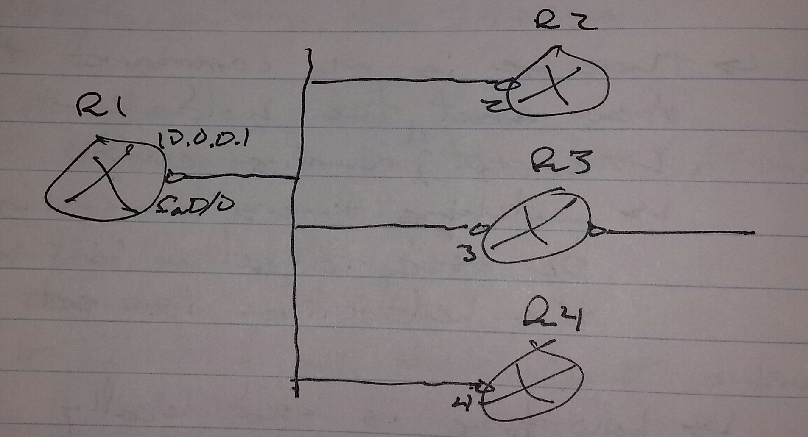
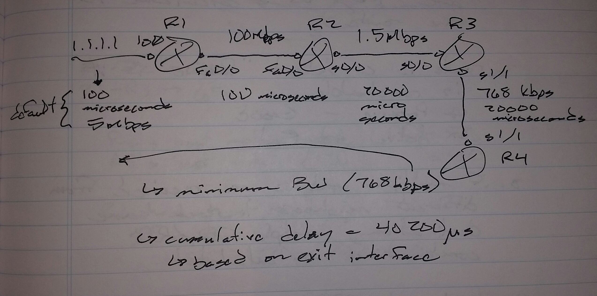
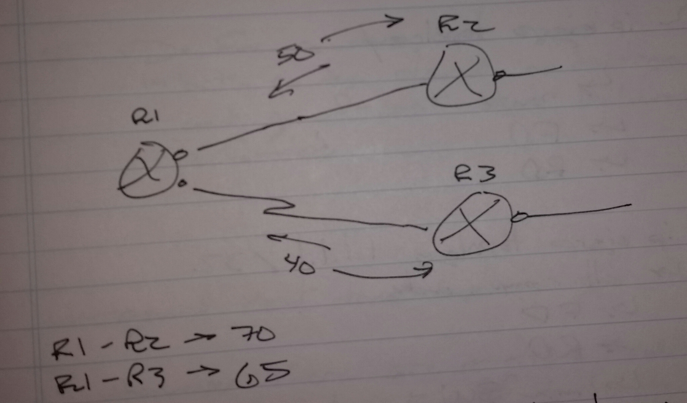
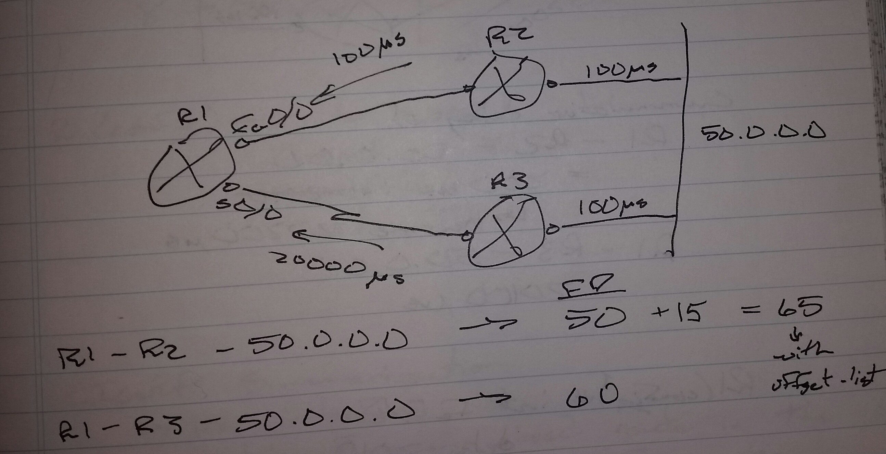
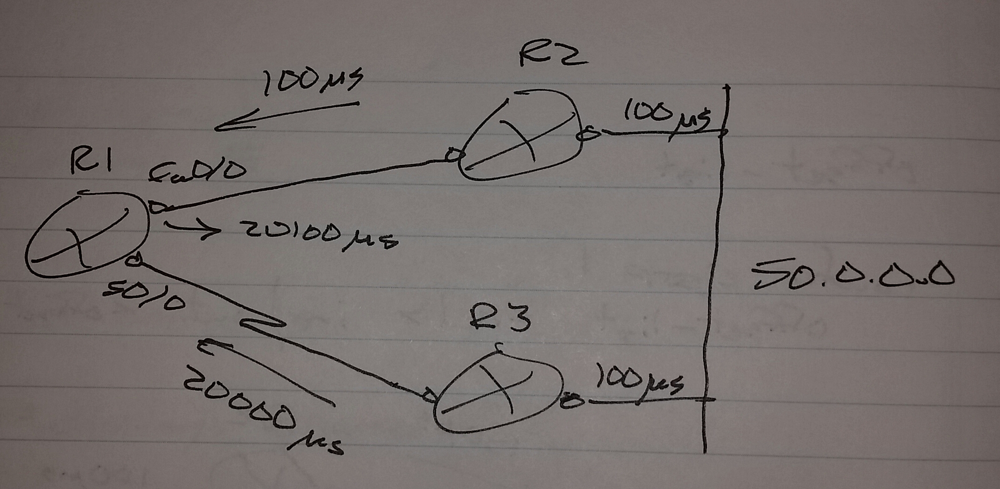
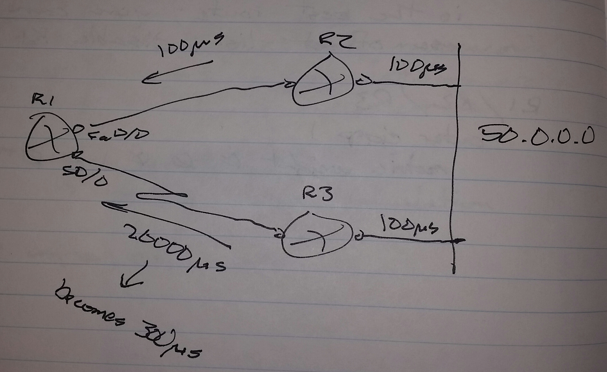
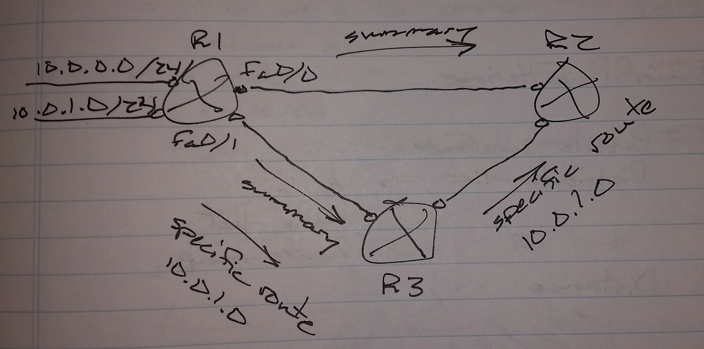
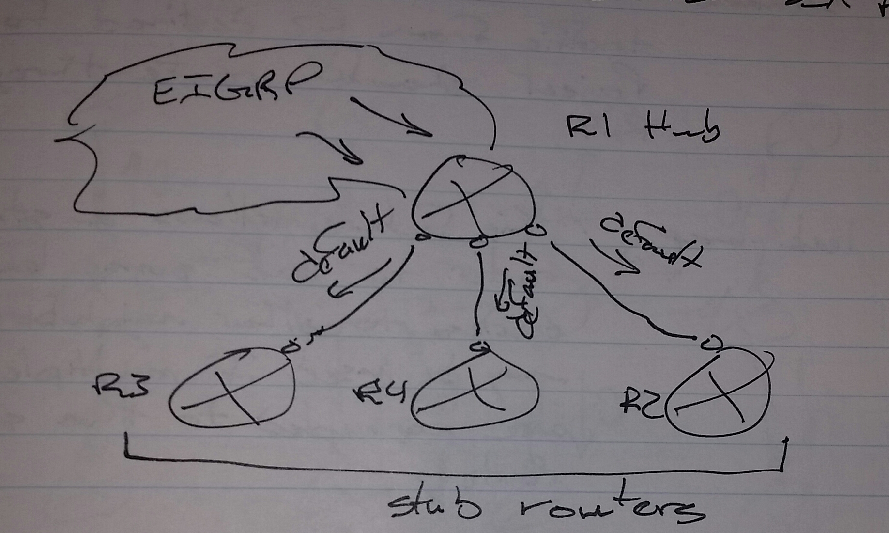
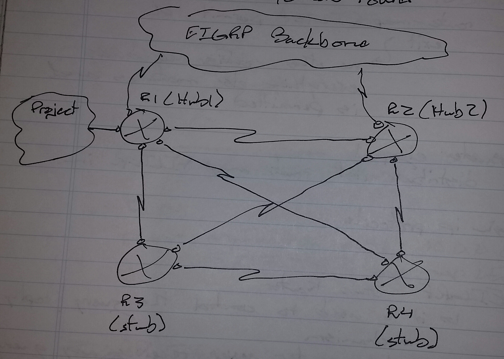
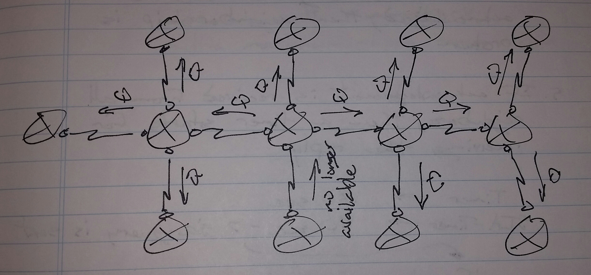

# EIGRP - Class Notes

**EIGRP** (21 Aug 2014)

- IP protocol 88

- Multiple L3 protcols (Protocol Independent)

- Distance Vector Protocol

- AD

     -> Internal

          -> 90

     -> External

          -> 170

     -> Summary

          -> 5

- Composite metric which is calculated by bandwidth and delay by default

     -> Can also use reliability and load

- Uses 3 tables

     -> Neighbor table

     -> Topology table

     -> Routing table

- 5 message types

     -> Hello

     -> Update

     -> Query

     -> Reply

     -> Acknowledgement

- Muilticast 224.0.0.10 to communicate with neighbors

- Hello time

     -> LAN interface

          -> 5

     -> WAN interface

          -> 60

- Holddown

     -> LAN interface

          -> 15

     -> WAN interface

          -> 180

- Incremental and change based updates

- Supports only MD5 authentication

CCNP covers 95% of EIGRP used in CCIE

**Neighbors**

Hello message contains

- Autonomous System Number (ASN)

     -> Must match

- Network of both ends

     -> Must match

     -> EIGRP is not strict about subnet masks matching (unlike OSPF)

          -> R1 s0/0 - 12.0.0.1 /30

          -> R2 s0/0 - 12.0.0.2 /24

- Authentication

     -> Must match

- K-values

     -> Must match

**Change Timers** (hello | holddown)

- To speed up or slow down convergence

int s0/0

ip hello-interval eigrp 1 8

ip hold-time eigrp 1 16

- There is not command that will show what the hold-time is set to

     -> Except sh run

     -> Watching the timers on a neighbor can be used to get a hint as to what the hold-time is set to

- Hello-time is used locally

     -> But hold-down time is sent to neighbors

- To check hello-interval

sh ip eigrp int s0/0 detail

**Passive Interface**

- Stops hello processing on the specific interface

- The network associated with the interface is still advertiseed

R1(config)# router eigrp 1

passive-interface { default | <interface> }

sh ip protocols

- Shows the passive interfaces

**Manual Neighbors**

- Uses unicast

- Stops sending multicast hellos

- Starts sending unicast hellos

- Must be enabled on all routers connected to the same segment

R1(config)# router eigrp 1

neighbor 10.0.0.2 fa0/0

neighbor 10.0.0.3 fa0/0

neighbot 10.0.0.4 fa0/0

sh ip eigrp nei detail

- Shows if neighbor is dynamic or manual

**Authentication**

- MD5

key chain CISCO

key 1

  key-string CCIE

int s0/0

ip authentication mode eigrp 1 md5

ip authentication key-chaing eigrp 1 CISCO

debup ip eigrp

sh run

sh ip eigrp int detail

debug eigrp packets

- Will display all 5 message types

debug eigrp packets hello

debug eigrp packets update

debug eigrp packets query

debug eigrp packets reply

debug eigrp packets sia-reply

     -> Stuch In Active

K-values

- Used to increase | decrease the importance of specific metric components

- 0 - 255

- K1

     -> Bandwidth

- K2

     -> Load

- K3

     -> Delay

- K4 and K5

     -> Reliability

- MTU matching is not necessary

     -> MTU is only an issue in redistribution

Default K-values

- K1 = 1

- K2 = 0

- K3 = 1

- K4 = 0

- K5 = 0

router eigrp 1

metric weight <type of service> <k1> <k2> <k3> <k4> <k5>

     -> Type of service is always 0

     -> All routers in the AS must have the same k-values

sh ip protocols

**Topology Database Exchange**

Update message

- prefix / prefix-length

- metric component

     -> Bandwidth

     -> Load

     -> Delay

     -> Reliability

- Non-metric components

     -> Number of hops

     -> Router-id

     -> MTU

Questions, will ask you to change K-values so that only delay is considered

     -> 256 * Delay = _______

**EIGRP Terminology**

 - Best route

     -> Successor route

 - Backup route

     -> Feasible successor route

 - Lowest Metric

     -> Feasible Distance (FD)

 - Downstream neighbor metric

     -> Reported Distance (RD)

Procedure to form topology and calculate the best route

 - 1. When update packet is received, the route is installed in the "topology table" and FD / RD is calculated for the route

 - 2. Router is considered "Passive" if it is reachable

     -> Passive - Good

     -> Active - Bad

 - 3. If multiple updates are received from different neighbors to reach the same destination, multiple FD / RD combinations are calculated

 - 4. Lowest FD goes to the routing table

 - 5. Remaining routes may or may not be considered feasible successors depending on passing the feasibility condition

 

Feasibility Condition

 - Backup route's RD < current best route's FD

R2's best metric (FD) = 50

R3's best metric (FD) = 40

R1 has two route

 - First route via R2

     -> FD = 70 / RD = 50

 - Second route via R3

     -> FD = 65 / RD = 40

          -> Best route, goes to the routing table

 - FC

     -> 1st route RD < current route's FD

          -> 50 < 65

     -> 1st route is considered a backup route

sh ip eigrp topology

 - Show all routes except non-feasible routers

     -> Routes the fail the feasibility condition

sh ip eigrp topology all-links

 - Will display non-feasible routes

sh ip eigrp topology

 - Route

 - FD

 - RD

sh ip eigrp topology 1.1.1.1/32

 - All components

     -> FD

     -> RD

     -> Minimum BW

     -> Cumulative Delay

     -> Number of hops

sh ip eigrp topology zero-successors

 - Shows best route that cannot be added to the routing table

 - RIB failure

 - The route is already in the routing table

     -> From another routing protocol

     -> Or static route

     -> AD for route was better than EIGRP

sh ip eigrp topology

 - If route shows

     -> FD inaccessable

          -> Route experienced RIB failure

If the FDs for two routes are equal

 - Both routes are placed in the routing table and equal-cost load balancing is performed

**Unequal Cost Load-Balancing**

 - 1. Whenever there are multiple routes with the same FD value, EIGRP performs equal cost load balancing

 - 2. When unequal cost load balancing is activated, EIGRP considers the best and backup routes if their FD fall into a specific range (variance)

 - 3. To calculate the range, a variable called variance is used

     -> 1 - 128

     -> Lowest FD * variance = End point of the range

     -> Lowest FD = Start point of the range

Route 1 FD = 10 (lowest)

Route 2 FD = 15

Route 3 FD = 18

Route 4 FD = 25

Variance = 2

Range = 10 - 20

router eigrp 1

 variance 5

sh ip protocols

 - Displays variance

**Traffic Engineering**

 - Metric tuning

 - Most likely to be asked in the lab

**Metric Tuning**

 - Change bandwidth of an interface

 - Change delay of an interface

int fa0/0

 bandwidth <kbps>

 delay <10th of microseconds>

All show commands display microseconds

 - Configuration and calculations are done in 10ths of microseconds

 - Change K-values

     -> Changes metric calculation

 - Use offset-lists

**Offset List**

router eigrp 1

 offset-list <acl> in | out <offset number> <interface>

R1(config)# access-list 1 permit 50.0.0.0

router eigrp 1

 offset-list 1 in 15 fa0/0

Scenario -> Make sure R1 - R3 route is the best route;  you cannot use offset-lists;

On R1 / R2 / R3:

router eigrp 1

 metric weight 0 0 0 1 0 0

Cumulative delay of 

 - R1 - R2

     -> 200 microseconds

 - R1 - R3

     -> 20100 microseconds

R1(config)# int fa0/0

 delay 2010

Scenario -> Configure unequal cost load balancing in a manner such that there will be 2:1 load balancing between the R1 - R2 route and the R1 - R3 route

R1 - R2

 - Delay - 200 microseconds

     -> x = 200 microseconds

R1 - R3

 - Delay - 20000 microseconds

     -> 2x = 400 microseconds

          -> So, 400 - 100 = the delay the interface on R1 needs to be set to

R1(config)# router eigrp 1

 variance 2

int s0/0

 delay 30 

**EIGRP Summarization**

 - Per interface

 - Metric of summarized route is the least metric among specific routes

 - AD of summarized route is 5

     -> AD is only locally significant

     -> Other routers will use AD of 90 for the summarized route

int fa0/0

 ip summary-address eigrp 1 <network> <subnet mask> [AD]

EIGRP Default Routing

 - Network 0.0.0.0

 - Problems

     -> Requires an existing default route in the routing table

     -> It also advertises connected networks

R1(config)# int lo0

 ip add 15.0.0.1/24

router eirgp 1

 network 15.0.0.0

ip default-network 15.0.0.0

sh ip route

 - D* 15.0.0.0

     -> Star means candidate default route

Scenario -> Inject a default route by using summarization

int fa0/0

 ip summary-address eigrp 1 0.0.0.0 0.0.0.0

If a question asks to suppress all routes except the default route, use a leak-map

**Leak Map**

 - This feature allows for a summary route to be sent along with one or more specific routes

Scenario -> Summarize 10.0.0.0/24 and 10.0.1.0/24 to both R2 and R3 and make sure R2 uses the path R2-> R3 -> R1 to reach 10.0.1.0

R1(config)# access-list 1 permit 10.0.1.0 0.0.0.255

route-map LEAK

 match ip add 1

int fa0/0

 ip summary-address eigrp 1 10.0.0.0 255.255.254.0

int fa0/1

 ip summary-address eigrp 1 10.0.0.0 255.255.254.0 leak-map LEAK

**EIGRP Filtering**

 - **See RIPv2 notes for details on filtering as the methods are the same**

 - Passive interface

 - Distribute-list

     -> ACL

     -> Prefix-list

     -> Route-map

 - Distance

Scenario -> Filter all routes with FD in the range 400000 to 600000

R1(config)# route-map FILTER deny 10

 match metric 500000 +- 100000

route-map FILTER permit 20

     -> No other config needed as everything else matches and is permitted

router eigrp 1

 distribute-list route-map FILTER in

sh ip protocols

**EIGRP Stub Router**

 - It is used to control the query | reply mechanism

 - A stub router never receives any query message

     -> Can be used to control SIA problems

On R2 / R3 / R4:

router eigrp 1

 eigrp stub [ connected | summary | static | redistribute | receive-only | leak-map <leak> ]

 - Static

     -> Sends all redistributed static routes to the hub

 - Redistributed

     -> Sends all redistributed routes to the hub

 - Recieve-only

     -> Does not send any updates to the hub router

Scenario -> Link between R1 and R2 is down;  Traffic from R2 destined for Project should route through R4

 - Leak-map

     -> This feature allows a stub router to leak some learned routes to other neighbors.  This may be used if multiple hubs are connected to the stub router

R3(config)# **access-list 1 permit 50.0.0.0**

**route-map LEAK**

** match ip add 1**

**router eigrp 1**

** eigrp stub leak-map LEAK**

sh ip eigrp neighbor detail

 - To display if neighbor is a stub router

Instructor comment, "DUAL is a joke.  It's not an algorithm."

**Diffusion Update Algorithm (DUAL)**

 - This is the process of query / reply

 - It is only used if the successor route is down and there is no feasible successor

The diagram shows diffusing the query

1. Whenever the successor route is lost and there is no feasible successor, the router sends a query message to multicast address 224.0.0.10

2. An acknowledgment is expected from neighbor within "multicast flow timer"

sh ip eigrp int

     -> To display the multicast flow timer

3. If one or more neighbors do not reply, a unicast query is sent to those specific neighbors and an acknowledgment is expected within the Retransmission Time Out (RTO)

sh ip eigrp nei

     -> To display the RTO

4. If 16 consecutive queries are not acknowledged, then the neighbor relationship is broken

5.  If acknowledgment is received from all neighbors, then a timer starts for receiving the reply

 - Timer

     -> 180 seconds

 - SIA Timer

     -> 90 secconds

          -> sia-query is sent

          -> If a reply is received, then the main query timer is reset to 180 seconds

!!! Note to self !!!

!!! This part needs to be verified !!!

query - > 90 seconds

sia-query -> 90 seconds

sia-query -> 90 seconds

sia-query -> 90 seconds

sia-query -> 90 seconds

     -> 90 seconds - then neighbor relationship is broken

router eigrp 1

 timers active-time <sec>

Router-id in EIGRP does not need to be unique

 - Unless redistribution is being done

     -> The redistribution router needs a unique router-id

     -> The other conflicting router will not accept the updates

router eigrp 1

 eigrp router-id <ip add>

 maximum-path <number>

 metric maximum-hops <number>

On stub router:

sh ip protocol | in Stub

 - Stub, receive-only

On peer:

sh ip eigrp neighbor detail

 - Receive-Only Peer Advertising (No) Routes

 - Suppressing queries

Verify unequal cost load balancing

sh ip route 24.0.0.0 255.0.0.0

 - traffic share count is 1

 - traffic share count is 4
