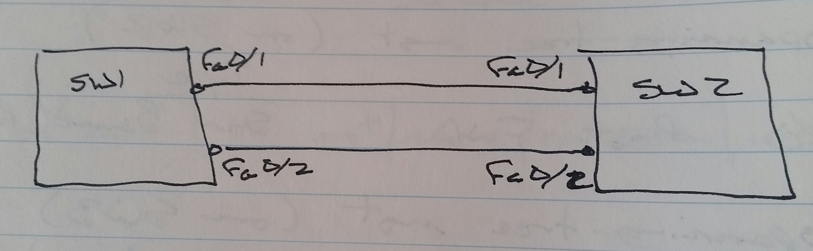
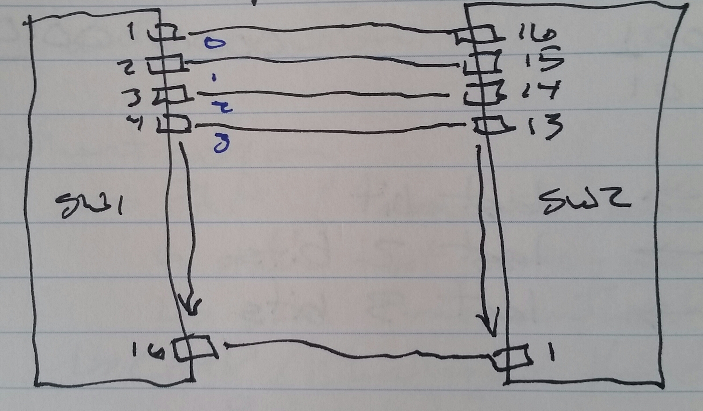
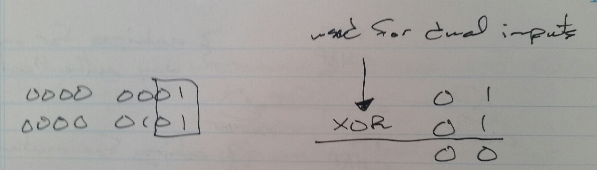

# Etherchannel - Class Notes

**Etherchannel**

 - It’s an interfaced bundling technology

 - Used to group up to 8 (2 to 8) similar interfaces

     -> Must have same properties

          -> Speed

          -> Duplex

          -> Interface mode

               -> Access

               -> Trunk

          -> VLAN-ID (for access ports)

 - Protocols can be used to configure the etherchannel

     -> Port Aggregation Protocol (PAgP)

          -> Master - desirable

          -> Slave - auto

     -> Link Aggregation Control Protocol (LACP)

          -> 802.1ad

          -> Can have up to 8 backup interfaces

          -> Master - active

          -> Slave - passive

     -> Manual etherchannel configuration

          -> only keyword is “on"

SW1(config)# int range fa0/1 - 2

 channel group 5 mode { desirable | auto | active | passive | on }

show etherchannel sum

     Po1     SU     Fa0/1(P), Fa0/2(P)

**L3 Ehterchannel**

SW1(config)# int range fa0/1 - 2

 no switchport

 - “no switchport” must be configured before the channel-group configuration

**LACP**

 - Uses concept of Master / Slave to decide negotiator

 - Master is elected according to lower priority

     -> Default system priority - 32768

     -> Then lowest MAC address

     -> Lowest Port-ID used first

 - Negotiator (Master) determines which ports are used

     -> Other ports become backup ports (if more than 8 are configured)

SW1(config)# lacp system-priority 100

Once master is elected, port-priority can be used to decide which ports are used

 - Lower is better (default is 32768)

SW1(config)# int range fa0/9 - 16

 lacp port-priority 100

**Load Balancing Mechanism**

 - 9 algorithms are available to decide exit interface

 - Only 1 algorithm can be configured

 - Sending side affected only

 - Single input

     -> src-ip

     -> dst-ip

     -> src-mac

     -> dst-mac

     -> src-port

     -> dst-port

 - Dual input

     -> src-dst-ip

     -> src-dst-mac

     -> src-dst-port

src-dst-ip

 - Source IP:  10.0.0.1 (0000 0001)

 - Source IP:  10.0.0.2 (0000 0010)

 - Destination IP:  10.0.0.5 (0000 0101)

 - 2 links

     -> last bit

 - 3 to 4 links

     -> last 2 bits

 - 5 - 8 links

     -> last 3 bits

XOR used for dual input algorithms

SW1(config)# port-channel load-balance { src-ip | dst-ip | src-mac | dst-mac | src-port | dst-port | src-dst-ip | src-dst-mac | src-dst-port }
