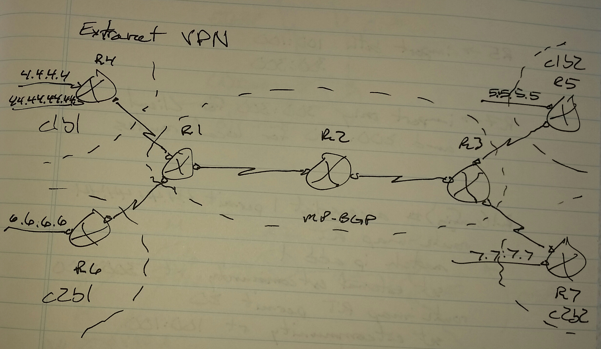

# Extranet VPN - Class Notes

**Extranet VPN** (3 Sept 2014)

Lab:  MPLS 1 - 3

Customer 1 -> Route-target 100:100 import / export

Customer 2 -> Route-target 200:200 import / export

Scenario -> R7 should receive 44.44.44.44 from Customer 1, but nothing else

R7(config)# ip vrf c2b2

 route-target both 200:200

 route-target import 100:100

     -> This will import all routes, so it will not work with this scenario.

**Export Map / Import Map Feature**

On R1 for prefix 44.44.44.44 export route-target is 300:300 and everything else for Customer 1 is 100:100

On R5, import both 100:100, import both 300:300

On R7, import only 300:300 for Customer 1 and 200:200 for local routes

R1(config)# access-list 1 permit 44.44.44.44

 route-map RT

  match ip add

  set ext-community rt 300:300

 route-map RT permit 20

  set ext-community rt 100:100

 ip vrf c1b1

-

  no route-target export 100:100

  export map RT

  router-target import 100:100

R3(config)# ip vrf c1b2

 route-target import 300:300

 route-target import 100:100

 route-target export 100:100

 

ip vrf c2b2

 route-target import 200:200

 route-target both 200:200
