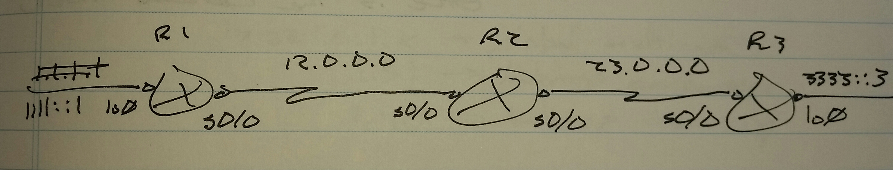

# IPV6 over IPV4 Tunneling - Class Notes

**IPv6 over IPv4 Tunneling** (28 Aug 2014)

Lab:  IPv6 1 and 2

R1

 - Source: 12.0.0.1

 - Destination: 23.0.0.3

R3

 - Source: 23.0.0.3

 - Destination: 12.0.0.1

Static tunnel

 - point-to-point tunnel

 - IPv6IP

     -> IPv6 payload only

     -> Smaller header

     -> IP protocol 41

 - GRE IP

     -> Multiprotocol support

     -> Larger header

     -> IP protocol 47

During the troubleshooting section of the R&S lab, there may be an ACL blocking IP protocol 41 or 47

R1(config)# int tu0

 ip add 2001::1/64

 tunnel source 12.0.0.1

 tunnel destination 23.0.0.3

 tunnel mode ipv6ip

     -> The tunnel mode will be GRE, by default, if the tunnel mode is not specified
