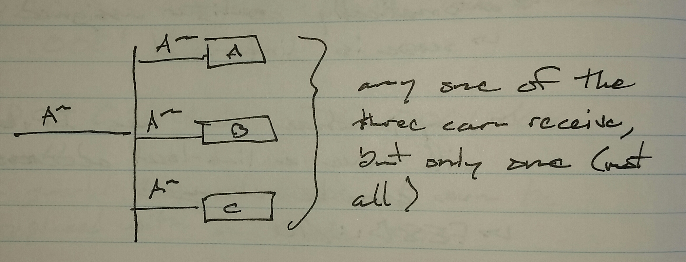
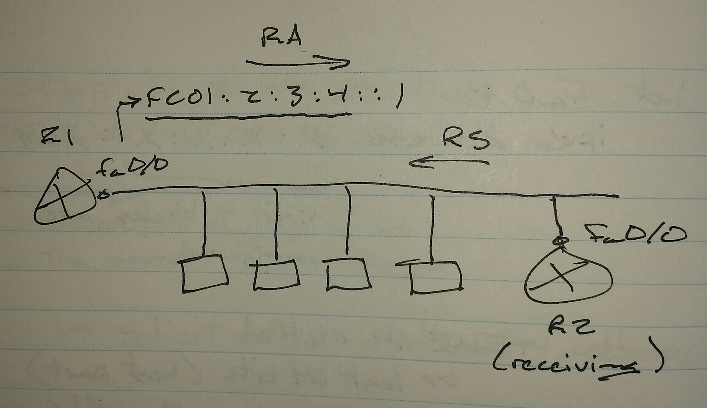
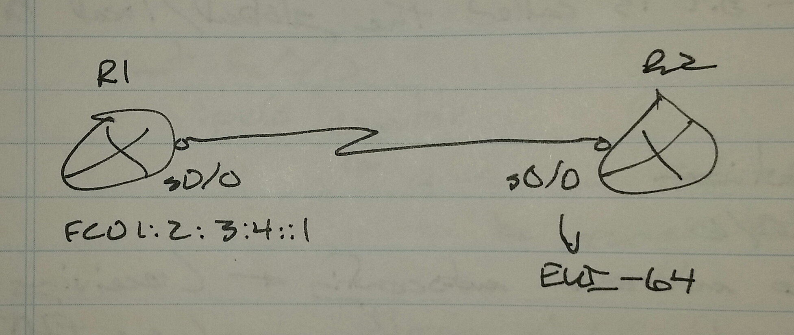
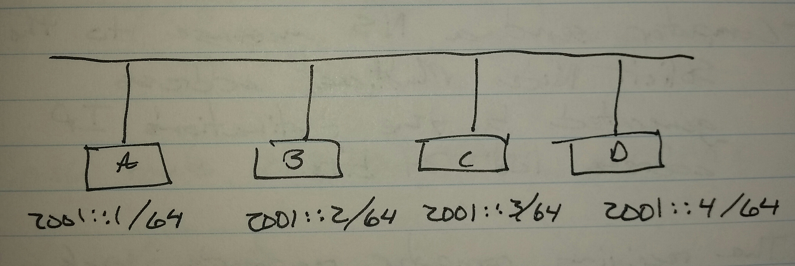

# IPv6 - Class Notes

**IPv6** (28 Aug 2014)

Lab:  IPv6 1 and 2

 - 128 bit address represented in HEX format

     -> 1 hex = 4 bits

     -> 32 HEX numbers = 1 IPv6 address

 - 8 quartets (16-bit blocks) or 4 HEX numbers each

12CD:0000:0000:0000:0635:0000:0000:0001 /64

If a quartet has all zeros, it can be replaced with a single zero

12CD:0:0:0:0635:0:0:001 /64

Leading zeros in a quartet can be dropped

12CD:0:0:0:635:0:0:1 /64

Consecutive quartets of zeros can be replaced with a double colon (::) once

12CD::635:0:0:1 /64

**Unicast**

 - Globally unique (public IPs

 - Range - 2000:: /3

 - 001x -> first 3 bits will always be the same

 - Will always start with 2 or 3

     -> 0010 - 2

     -> 0011 - 3

**local-link addresses**

 - Automatically assigned

     -> scope is link-local

 - Any interface that has IPv6 activated will have a link-local address

     -> Can be changed

 - Range - FE80:: /10

**Multicast**

 - Range - FF00:: /8

 - The fourth HEX character in the first quartet is called the scope field

     -> 2 - scope is link-local

     -> 5 - scope is site-local

     -> E - scope is global

          -> FF0E:: /16 - used on the Internet

**Well known multicast addresses**

 - FF02::1 -> all nodes in the segment

 - FF02::2 -> all routers in the segment

 - FF02::5 -> OSPF all routers

 - FF02::6 -> OSPF all DRs

 - FF02::9 -> RIPng

 - FF02::A -> EIGRPv6

 - FF05::1:2 -> DHCPv6

 - FF02::1:FF00:0000 /104 -> Solicit Node Multicast Address

     -> first 104 bits stay the same

          -> FF02::1:FF

     -> last 24 bits can change

          -> 00:0000

**Anycast**

 - One - to - one of many

 - Any IPv6 address can be flagged as Anycast

**IPv6 Address Assignment**

int fa0/0

 ipv6 enable

     -> Causes a link-local address to be generated

 ipv6 address <ipv6 add>/<network mask>

     -> Manual addressing

 ipv6 address dhcp

     -> Receive address from DHCPv6 server

 ipv6 address [x:x:x:x::](file:///x:x:x:x::) /64 eui-64

     -> EUI-64 method

 ipv6 address autoconfig

     -> Autoconfiguration

EUI-64 Method

 - last 64 bits (host part) id derived from the MAC address of the interface

     -> MAC address -> 48 bits

     -> FFFE -> inserted in the middle of the MAC address

     -> The 7th bit is then flipped

     -> The 7th bit is called the global / local bit

0001.0002.0003 plus FFEE

 - Becomes

     -> 0001.00FF.FE02.0003

0001 in HEX

 - 0000000000000001 in decimal

7th bit flipped

 - 0000001000000001 in decimal

 - 0201 in HEX

So, 0001.0002.0003 plus FFFE plus 7th bit flipped becomes

 - 0201.00FF.FE02.0003

     -> host part of the EUI-64 address

**Autoconfiguration**

R2(config)# int fa0/0

 ipv6 enable

 ipv6 address autoconfig

     -> Receiving side

     -> Uses EUI-64

R1 sends periodic Router Advertisement (RA) messages

 - Clients can also request an address by sending Router Solicitaion (RS) messages

 - RA contains the first 64 bits of router's address

     -> FC01:2:3:4 in this case

 - When the client receives the RA message, it uses the 64 bits in the message as the network part and calculates the host 64 bits by using the EUI-64 method

RA / RS messages

 - Part of the family of ICMPv6

By default, RA messages are suppressed on serial interfaces

R1(config)# int s0/0

 no ipv6 nd ra suppress

R2(config)# int s0/0

 ipv6 enable

 ipv6 address autoconfig

Serial interfaces don't have MAC addresses

 - Autoconfig on a serial interface will use (borrow) the MAC address of an ethernet interface on the router

**IPv6 Neighbor Discovery (ARP)**

 - NS -> Neighbor Solicitation

 - NA -> Neighbor Advertisement

FF02::1 -> all nodes

Solicite Node Multicast group is joined by every IPv6 enabled device

FF02::1:FF00:0000 /104

     -> Last 24 bits are taken from IPv6 address of the device

2000:0:0:0:0:0:0:1

     -> Last 24 bits - 00:0001

The multicast group the computer will join

     -> FF02::1:FF:00:001 - Computer A

     -> FF02::1:FF:00:002 - Computer B

     -> FF02::1:FF:00:003 - Computer C

     -> FF02::1:FF:00:004 - Computer D

Computer1> ping 2001::3

 - Computer sends a NS message to the Solicit Node Multicast addressed generated by the last 24 bits of the destinations IP address

 - The receiving computer responds back with a unicast NA message which contains the MAC address

**Duplicate Address Detection (DAD)**

 - Devices send NS to the multicast group that itself has joined asking for it's own IPv6 address

 - If anyone else replies, then there is a conflict
