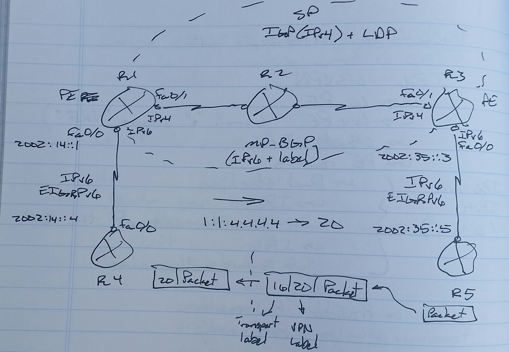

# IPv6 MPLS L3VPN (6PE) - Class Notes

**IPv6 MPLS L3VPN (6PE)** (15 Sept 2014)

Lab: 6PE

 - 6PE

 - 6vPE

     -> Small "v" means VRF

 - Client side

     -> IPv6

 - PE routers

     -> IPv6 over IPv4 (6to4)

     -> Dual stack

          -> IPv4 towards core of SP

          ->IPv6 towards the client

 - P (provider) routers

     -> IPv4 only

LDP only works with IPv4

**6PE**

 - Without VRFs on PE routers

 - IPv6 address-family between PE - PE  and PE - CE routers

 - Not as easy to configure as it should seem

**6vPE**

 - with VRFs on PE routers

 - VPNv6 address-family between PE - PE routers

 - IPv6 address-family between PE - CE routers

Transport label

 - LDP

     -> for BGP next-hop

VPN label

 - BGP VPNv4

     -> for client networks

IPv6 Table

               next-hop

               ::ffff:<ipv4 address of the PE router>

**6PE Rules**

 1. Client has an IPv6 neighbor relationship with PE router

 2. PE routers will perform mutual redistribution between "IPv6 IGP / eBGP" and "MP-BGP IPv6"

 3. PE - PE will be IPv6 + label

**6PE on IOS Routers**

R4(config)# ipv6 eigrp 1

 no shut

 eigrp router-id 4.4.4.4

int fa0/0

 ipv6 eigrp 1

int lo0

 ipv6 eigrp 1

R1(config)# ipv6 router eigrp 1

 no shut

 eigrp router-id 1.1.1.1

int fa0/0

 ipv6 eigrp 1

router bgp 100

 no bgp default ipv4-unicast

 neghbor 3.3.3.3 remote-as 100

 neighbor 3.3.3.3 update-source lo0

 address-family ipv6 unicast

  neighbor 3.3.3.3 activate

  neighbor 3.3.3.3 send-label

     -> Have to force the router to send labels in IPv6

     -> Sending labels is the default in IPv4

redistribute eigrp 1

ipv6 router eigrp 1

redistribute bgp 100 metric 1 1 1 1 1

Problem with 6PE

 - There is no isolation that can be provided by VRFs

 - PE routers have to be dedicated for each customer

     -> Otherwise, the customers will see the IPv6 routes of any other customer connected to the PE router

R3

 - LDP

     -> Label for 1.1.1.1

          -> 16 (transport label)

 - BGP

     -> Label for 2002:14::4

          -> 20 (VPN label)

sh bgp ipv6 unicast

                         next-hop

2002:14::4         ::ffff:1.1.1.1

sh bgp ipv6 u label

 - If labels are not present, then "neighbor x.x.x.x send-label" configuration is missing

     | 16 | 20 | IPv6 |

To check PE - PE IPv6 communicastion, the following command is required

R1(config)# mpls ipv6 source-interface <int>

**eBGP is required for PE - CE on XR routers**

R1(config)# router bgp 100

 address-family ipv6 unicast

  allocate-label all

 neighbor 3.3.3.3

  remote-as 100

  update-source lo0

  address-family ipv6 labeled-unicast

 neighbor 2002:14::4

  remote-as 50

  address-family ipv6 unicast

   route-policy PASS in

   route-policy PASS out

   as-override

route-pocily PASS

 pass

 root

 show config

 commit

**IOS:**

sh bgp vpnv4 u all sum

sh bgp vpnv4 u all

sh bgp vpnv6 u all sum

sh bgp vpnv6 u all

**XR:**

sh bgp vpnv4 u sum

sh bgp vpnv4 u

sh bgp vpnv6 u sum

sh bgp vpnv6 u

.png)

**! R1**

router bgp 50

 bgp router-id 1.1.1.1

 address-family ipv6 unicast

  network 2002:1:1:1::1/128

 neighbor 2002:12::2

  remote-as 100

   address-family ipv6 unicast

   route-policy allow-all in

   route-policy allow-all out

 route-policy allow-all

  pass

  end

 

**! R2**

router ospf 1

  router-id 2.2.2.2

  area 0

  int lo0

  int gi0/0/0/1

!

mpls ldp

 router ospf 1

  mpls ldp auto-config

!

router bgp 100

  bgp router-id 2.2.2.2

  address-family ipv6 unicast

  allocate-label all

 neighbor 2002:12::1

  remote-as 50

   address-family ipv6 unicast

    route-policy allow-all in

    route-policy allow-all out

    as-override

 route-policy allow-all

  pass

  end

!

router bgp 100

 neighbor 5.5.5.5

  remote-as 100

   update-source lo0

   address-family ipv6 labeled-unicast

**! R3**

int lo0

  ip ospf 1 area 0

 int e1/0

  ip ospf 1 area 0

 int e1/1

  ip ospf 1 area 0

router ospf 1

 router-id 3.3.3.3

!

mpls label protocol ldp

mpls ldp router-id lo0 force

int e1/0

 mpls ip

 int e1/1

 mpls ip

**! R4**

router ospf 1

  router-id 4.4.4.4

  area 0

  int lo0

  int gi0/0/0/0

  int gi0/0/0/1

!

mpls ldp

router ospf 1

 mpls ldp auto-config

**! R5**

router ospf 1

  router-id 5.5.5.5

  area 0

  int lo0

  int gi0/0/0/0

  int gi0/0/0/1

!

mpls ldp

 router ospf 1

  mpls ldp auto-config

!

router bgp 100

bgp router-id 5.5.5.5

address-family ipv6 unicast

 allocate-label all

 neighbor 2002:56::6

  remote-as 50

   address-family ipv6 unicast

    route-policy allow-all in

    route-policy allow-all out

    as-override

 route-policy allow-all

  pass

  end

!

router bgp 100

 neighbor 2.2.2.2

  remote-as 100

   update-source lo0

   address-family ipv6 labeled-unicast

**! R6**

router bgp 50

  bgp router-id 6.6.6.6

 no bgp default ipv4-unicast

 neighbor 2002:56::5 remote-as 100

 address-family ipv6

  network 2002:6:6:6::6/128

  neighbor 2002:56::5 activate

 

**Verification:**

**! R1 and R6**

sh bgp ipv6 u sum

sh bgp ipv6 u

sh route ipv6

ping ipv6 2002:6:6:6::6 source 2002:1:1:1::1

ping ipv6 2002:1:1:1::1 source 2002:6:6:6::6

**! R2 and R5**

sh mpls int

sh mpls ldp nei bri

sh mpls forwarding

sh bgp ipv6 u sum

sh bpg ipv6 u

sh bgp ipv6 all sum

     -> To see information about the MP-BGP neighbor

sh bgp ipv6 labeled-unicast sum

     -> To see information about the MP-BGP neighbor

sh bgp ipv6 labeled-unicast

sh bgp ipv6 u 2002:1:1:1::1

sh bgp ipv6 u 2002:6:6:6::6

sh bgp ipv6 u labels

sh route ipv6
