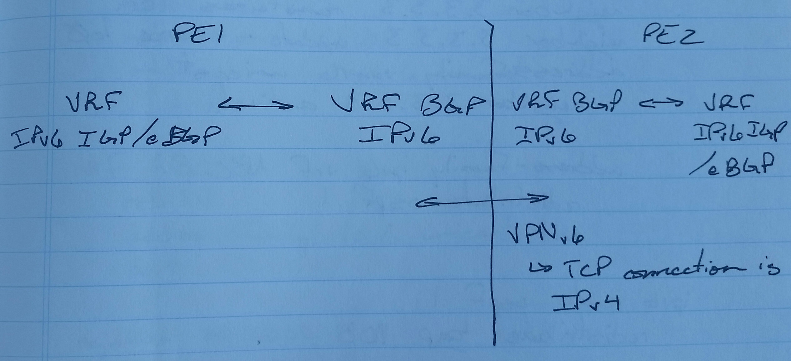

# IPv6 MPLS L3VPN (6vPE) - Class Notes

**IPv6 MPLS L3VPN (6vPE)** (15 Sept 2014)

Lab: 6vPE

- with VRFs on PE routers

- VPNv6 address-family between PE - PE routers

- IPv6 address-family between PE - CE routers

RD + IPv6 = VPNv6

64 bits + 128 bits = 192 bits

**VPNv6**

- VRF required on PE - CE

- VPN label exchange is automatic

**6vPE on IOS Routers**

1. VRF creation

2. Interface association

3. VRF IGP association

4. Mutual redistribution between VRF IGP and MP-BGP

R1(config)# vrf definition ABC

rd 1:1

address-family ipv6 unicast

  route-target both 1:1

int fa0/0

vrf forwarding ABC

ip add 14.0.0.1 255.0.0.0

ipv6 router ospf 1 vrf ABC

exit

int fa0/0

ipv6 ospf 1 area 0

router bgp 100

no bgp default ipv4-unicast

neighbor 3.3.3.3 remote-as 100

neighbor 3.3.3.3 update-source lo0

address-family vpnv6 unicast

  neighbor 3.3.3.3 activate

address-family ipv6 vrf ABC

  redistribute ospf 1

ipv6 router ospf 1

redistribute bgp 100

**6vPE on XR Routers**

R1(config)# vrf ABC

address-family ipv6 unicast

  import route-target 1:1

  export route-target 1:1

int g0/0/0/0

no ipv6 add

vrf ABC

ipv6 add <ip add>/<nm>

router bgp 100

address-family vpnv6 unicast

neighbor 3.3.3.3

  remote-as 100

  update-source lo0

  address-family vpnv6 unicast

vrf ABC

  rd 1:1

  address-family ipv6 unicast

neighbor 2002:14::4

  remote-as 50

  address-family ipv6 unicast

  route-policy PASS in

  route-policy PASS out

  as-override

.png)

**! R1**
router bgp 50
 bgp router-id 1.1.1.1
 address-family ipv6 unicast
  network 2002:1:1:1::1/128
 neighbor 2002:12::2
  remote-as 100

  address-family ipv6 unicast

   route-policy allow-all in

   route-policy allow-all out

route-policy allow-all

 pass

 end

**! R2**
router ospf 1

 router-id 2.2.2.2

 area 0
  int lo0
  int gi0/0/0/1
!
mpls ldp

router ospf 1

 mpls ldp auto-config
!
vrf ABC

 address-family ipv6 unicast

  export route-target 1:1
  import route-target 1:1
int gi0/0/0/0
 no ipv4 address 9.9.12.2 255.255.255.0

 no ipv6 address 2002:9:9:12::2/64

 vrf ABC

 ipv4 address 9.9.12.2 255.255.255.0

 ipv6 address 2002:9:9:12::2/64

router bgp 100

 vrf ABC

   rd 1:1

!

router bgp 100

 bgp router-id 9.9.0.2

 address-family vpnv6 unicast

 ! -> needed before “address-family ipv6 unicast” can be configured inside “vrf ABC”

 vrf ABC
  address-family ipv6 unicast
   network 2002:2:2:2::2/128
  neighbor 2002:12::1
   remote-as 50

   address-family ipv6 unicast

    route-policy allow-all in

    route-policy allow-all out

    as-override

route-policy allow-all

 pass

 end
!
router bgp 100

 neighbor 3.3.3.3

  remote-as 100

  update-source lo0
  address-family vpnv6 unicast

**! R3**
int lo0

 ip ospf 1 area 0

int e1/0

 ip ospf 1 area 0

int e1/1

 ip ospf 1 area 0

router ospf 1

 router-id 3.3.3.3
!
mpls label protocol ldp

mpls ldp router-id lo0 force

router ospf 1

 mpls ldp autoconfig

**! R4**
router ospf 1
 router-id 4.4.4.4
 area 0
  int lo0
  int gi0/0/0/0
  int gi0/0/0/1
!
mpls ldp

router ospf 1
 mpls ldp auto-config

**! R5**
router ospf 1
 router-id 5.5.5.5
 area 0
  int lo0
  int gi0/0/0/1
!

mpls ldp

router ospf 1

 mpls ldp auto-config
!
vrf ABC

 address-family ipv6 unicast

  export route-target 1:1
  import route-target 1:1
int gi0/0/0/0
 no ipv6 address 2002:56::5/64
 vrf ABC
 ipv6 address 2002:56::5/64
router bgp 100

 vrf ABC

   rd 1:1
!
router bgp 100
 bgp router-id 5.5.5.5
 address-family vpnv6 unicast
! -> needed before “address-family ipv6 unicast” can be configured inside “vrf ABC”

 vrf ABC
  address-family ipv6 unicast
  neighbor 200256::6
   remote-as 50

   address-family ipv6 unicast

    route-policy allow-all in

    route-policy allow-all out

    as-override

route-policy allow-all

 pass

 end
!
router bgp 100
 neighbor 2.2.2.2
  remote-as 100

  update-source lo0

  address-family vpnv6 unicast

**! R6**
router bgp 50
 bgp router-id 6.6.6.6
 no bgp default ipv4-unicast
 neighbor 2002:56::5 remote-as 100
 address-family ipv6
  network 2002:6:6:6::6/128
  neighbor 2002:56::5 activate
