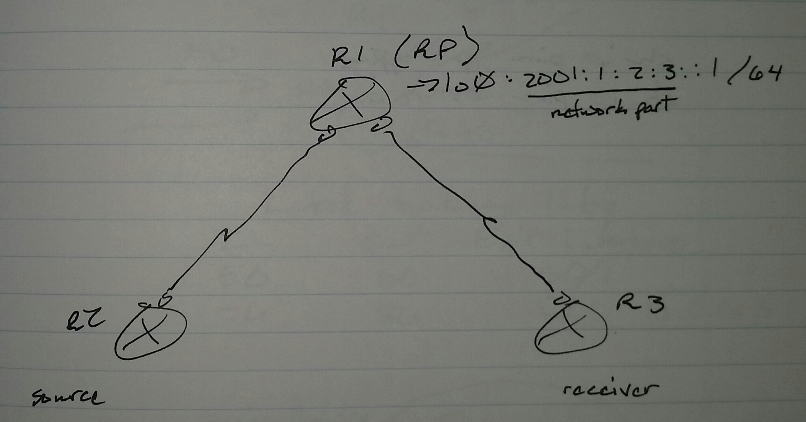

# IPv6 Multicast - Class Notes

**IPv6 Multicast** (1 Sept 2014)

Lab: Multicast 1 - 4

 - IGMP is now -> Multicast Listen Discovery (MLD)

     -> IGMPv1 -> no longer supported

     -> IGMPv2 -> MLDv1

     -> IGMPv3 -> MLDv2

ip igmp ... -> ipv6 mld ...

ipv6 multicast-routing

 - Activates PIM-SM on all interfaces

 - Only PIMv2 is supported with sparse mode

 - There is no dense mode in IPv6

**To disable PIM-SM on an interface**

int fa0/0

 no ipv6 pim

**Configuring RP**

 - Manual

ipv6 pim rp-address <ipv6 add> [<acl>]

 - Dynamic

     -> BSR

     -> Embedded RP

**Configuring BSR**

On RP

ipv6 pim bsr candidate rp <int> [group-list <acl>]

On BSR

ipv6 pim bsr candidate bsr <int> [hash-mode]

**Embedded RP**

R1(config)# ipv6 pim rp-address 2001:1:2:3::1

FF7x:0YZZ:<first 4 blocks of RP address>:<last 2 blocks of multicast address>

 - x - scope

     -> always use 5 (site-local)

     -> or E (global)

     -> 2 (link-local) is not used

 - Y - Last block of RP address

 - ZZ - prefix-length of RP in hexidecimal format

FF7E:0140:2001:1:2:3:200:300

RP address network portion has to be 4 blocks, subnet mask /64

For IPv6, SSM reserved range is

     -> FF3X::

sh ip pim rp mapping

sh ip pim bsr-router
