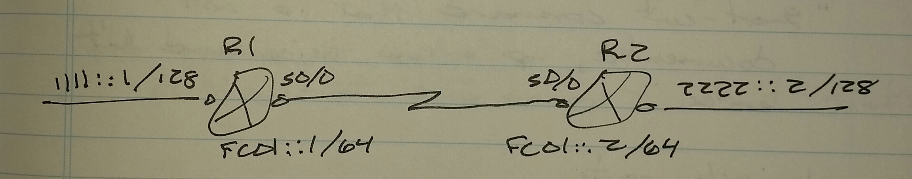

# IPv6 Static Routing - Class Notes

**IPv6 Static Routing** (28 Aug 2014)

Lab:  IPv6 1 and 2

R1(config)# ipv6 unicast-routing

 ipv6 route 2222::2/128 FC01::2

sh ipv6 route

**Default routing**

ipv6 route ::/0 s0/0
