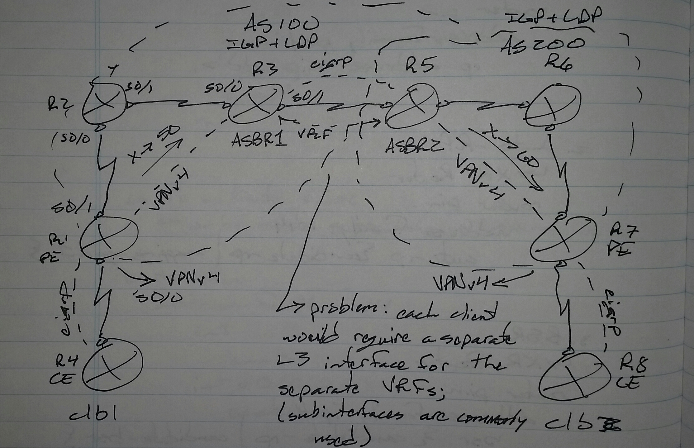

# Inter-AS VPN - Class Notes

**Inter-AS VPN** (16 Sept 2014)
Lab: Inter-AS A, Inter-AS B, Inter-AS C

 - VNPv4 communication between 2 ASs to exchange client routes

Problem
 - Each client would require a separate L3 interface for the separate VRFs
     -> Subinterfaces are commonly used to solve this

Client-to-client over multiple ASs must be a Labeled Switched Path (LSP), unless a VRF is being used somewhere in an AS

Thee are three was to enable inter-AS communication

 - Inter-AS Option (10) A
     -> Back-to-back VRF
 - Inter-AS Option (10) B
     -> ASBR VPNv4 MP-eBGP
 - Inter-AS Option (10) C
     -> Multihop MP-BGP

**Cisco Docs:**

MPLS VPN Inter-AS IPv4 BGP Label Distribution
[http://www.cisco.com/c/en/us/td/docs/ios/12_2s/feature/guide/fsiaslbl.pdf](http://www.cisco.com/c/en/us/td/docs/ios/12_2s/feature/guide/fsiaslbl.pdf)
