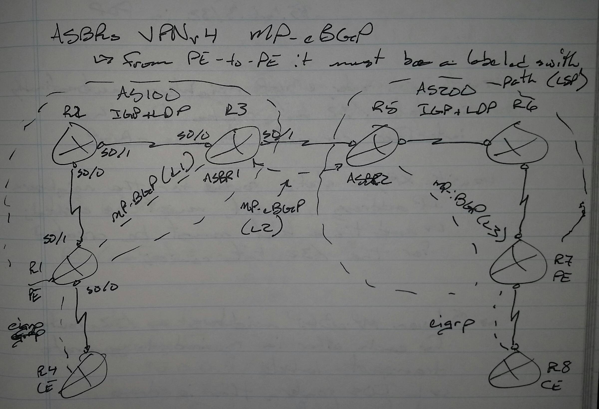
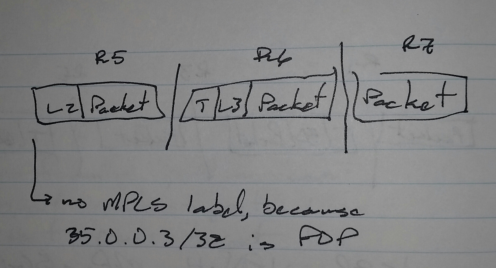

# Inter-AS VPN Option (10) B - Class Notes

**Inter-AS VPN Option (10) B** (16 Sept 2014)

Lab: Inter-AS A, Inter-AS B, Inter-AS C

 - ASBR VPNv4 MP-eBGP

     -> From PE to PE, it must be a Labeled Switched Path (LSP)

     -> At every next-hop rewrite on a BGP VPNv4 router, the VPN label is also rewritten

     -> When updates come from MP-eBGP neighbor and go to MP-iBGP neighbor, the next-hop will be unchanged by default

     -> Between MP-eBGP neighbors, a /32 bit route for other is required to generate transport labels

          -> With IOS routers, eBPG neighbors automatically install /32 bit routes for the interface connected to the eBGP

          -> With XR routers, a static route for the neighbors IP addresses, /32 bit, must be created

               -> The label must be created for the /32 bit route

     -> POP shows the neighbor does MPLS

          -> no label says the neighbor does not do MPLS

**IOS Router**

R3(config)# **router bgp 100**

** no bgp default ipv4-unicast**

** neighbor 1.1.1.1 remote-as 100**

** neighbor 1.1.1.1 update-source lo0**

** neighbor 35.0.0.5 remote-as 200**

** address-family vpnv4 unicast**

**  neighbor 1.1.1.1 activate**

**  neighbor 1.1.1.1 next-hop-self**

**  neighbor 35.0.0.5 activate**

**XR Router**

R5(config)# **route-policy PASS**

** pass**

**router static**

** address-family ipv4 unicast**

**  35.0.0.3/32 s0/0**

**router bgp 200**

** address-family vpnv4 unicast**

** neighbor 7.7.7.7**

**  remote-as 200**

**  update-source lo0**

**  address-family vpnv4 unicast**

**   next-hop-self**

** neighbor 35.0.0.3**

**  remote-as 100**

**  address-family vpnv4 unicast**

**   route-policy PASS in**

**   route-policy PASS out**

**To check the transport label**

**sh mpls forwarding-table**

     -> IOS

**sh mpls forwarding**

     -> XR

**To check the VPN label**

**sh bgp vpnv4 unicast all labels**

     -> IOS

**sh bgp vpnv4 unicast labels**

     -> XR

**To check updates received**

**sh bpg vpnv4 unicast all**

     -> IOS

     -> On any VPNv4 router

**sh bgp vpnv4 unicast**

     -> XR

**The check updates sent**

**sh bgp vpnv4 unicast all neighbor <ip add> advertised-routes**

     -> IOS

**sh bgp vpnv4 unicast neighbor <ip add> advertised-routes**

**To see which routes are received after incoming filtering**

**sh bgp vpnv4 unicast all neighbor <ip add> routes**

     -> IOS

**sh bgp vpnv4 unicast neighbor <ip add> routes**

     -> XR

.png)

**! R1**

**int lo0**

** ip ospf 1 area 0**

**int e1/1**

** ip ospf 1 area 0**

**router ospf 1**

** router-id 1.1.1.1**

**! R2**

**mpls label protocol ldp**

**mpls ldp router-id lo0 force**

**int lo0**

** ip ospf 100 area 0**

**int e1/0**

** ip ospf 100 area 0**

**router ospf 100**

** router-id 2.2.2.2**

** mpls ldp autoconfig**

!

**vrf definition ABC**

** rd 1:1**

** address-family ipv4**

**  route-target both 1:1**

**int e1/1**

** vrf forwarding ABC**

** ip address 12.0.0.2 255.255.255.0**

!

**router ospf 1 vrf ABC**

** network 12.0.0.2 0.0.0.0 area 0**

!

**router bgp 100**

** bgp router-id 2.2.2.2**

** no bgp default ipv4-unicast**

** neighbor 4.4.4.4 remote-as 100**

** neighbor 4.4.4.4 update-source lo0**

** address-family vpnv4**

**  neighbor 4.4.4.4 activate**

**  neighbor 4.4.4.4 send-community extended**

!

**router ospf 1 vrf ABC**

** redistribute bgp 100 subnets**

**router bgp 100**

** address-family ipv4 vrf ABC**

**  redistribute ospf 1 vrf ABC match internal external 1 external 2**

**vrf definition ABC**

** address-family ipv4**

**  route-target import 2:2**

**! R3**

**mpls ldp**

**router ospf 100**

** router-id 3.3.3.3**

** mpls ldp auto-config**

** area 0**

**  int lo0**

**  int gi0/0/0/0**

**  int gi0/0/0/1**

**! R4**

**mpls ldp**

**router ospf 100**

** router-id 4.4.4.4**

** mpls ldp auto-config**

** area 0**

**  int lo0**

**  int gi0/0/0/0**

!

**router bgp 100**

** bgp router-id 4.4.4.4**

** address-family vpnv4 unicast**

**  retain route-target all**

** neighbor 2.2.2.2**

**  remote-as 100**

**  update-source lo0**

**  address-family vpnv4 unicast**

!

**router bgp 100**

** neighbor 2.2.2.2**

**  address-family vpnv4 unicast**

**   next-hop-self**

** neighbor 45.0.0.5**

**  remote-as 200**

**  address-family vpnv4 unicast**

**   route-policy allow-all in**

**   route-policy allow-all out**

**router static**

** address-family ipv4 unicast**

**  45.0.0.5/32 gi0/0/0/1**

**route-policy allow-all**

** pass**

** end**

**! R5**

**mpls ldp**

**router ospf 100**

** router-id 5.5.5.5**

** mpls ldp auto-config**

** area 0**

**  int lo0**

**  int gi0/0/0/0**

!

**router bgp 200**

** bgp router-id 5.5.5.5**

** address-family vpnv4 unicast**

**  retain route-target all**

** neighbor 7.7.7.7**

**  remote-as 200**

**  update-source lo0**

**  address-family vpnv4 unicast**

!

**router bgp 200**

** neighbor 7.7.7.7**

**  address-family vpnv4 unicast**

**   next-hop-self**

** neighbor 45.0.0.4**

**  remote-as 100**

**  address-family vpnv4 unicast**

**   route-policy allow-all in**

**   route-policy allow-all out**

**router static**

** address-family ipv4 unicast**

**  45.0.0.4/32 gi0/0/0/1**

**route-policy allow-all**

** pass**

** end**

**! R6**

**mpls label protocol ldp**

**mpls ldp router-id lo0 force**

**int lo0**

** ip ospf 200 area 0**

**int e1/0**

** ip ospf 200 area 0**

**int e1/1**

** ip ospf 200 area 0**

**router ospf 200**

** router-id 6.6.6.6**

** mpls ldp autoconfig**

**! R7**

**mpls label protocol ldp**

**mpls ldp router-id lo0 force**

**int lo0**

** ip ospf 200 area 0**

**int e1/0**

** ip ospf 200 area 0**

**router ospf 200**

** router-id 7.7.7.7**

** mpls ldp autoconfig**

!

**vrf definition DEF**

** rd 2:2**

** address-family ipv4**

**  route-target both 2:2**

**int e1/1**

** vrf forwarding DEF**

** ip address 78.0.0.7 255.255.255.0**

!

**router ospf 1 vrf DEF**

** network 78.0.0.7 0.0.0.0 area 0**

!

**router bgp 200**

** bgp router-id 7.7.7.7**

** no bgp default ipv4-unicast**

** neighbor 5.5.5.5 remote-as 200**

** neighbor 5.5.5.5 update-source lo0**

** address-family vpnv4**

**  neighbor 5.5.5.5 activate**

**  neighbor 5.5.5.5 send-community extended**

!

**router ospf 1 vrf DEF**

** redistribute bgp 200 subnets**

**router bgp 200**

** address-family ipv4 vrf DEF**

**  redistribute ospf 1 vrf DEF match internal external 1 external 2**

**vrf definition DEF**

** address-family ipv4**

**  route-target import 1:1**

**! R8**

**router ospf 1**

** router-id 8.8.8.8**

** area 0**

**  int lo0**

**  int gi0/0/0/0**

**Verification:**

**! R1**

**sh ip ospf int bri**

**sh ip ospf nei**

**sh ip route ospf**

**ping 8.8.8.8**

**! R2**

**sh ip ospf int bri**

**sh ip ospf nei**

**sh ip route ospf**

**sh mpls int**

**sh mpls ldp nei**

**sh mpls ldp dis**

**sh vrf detail**

**sh ip ospf int bri**

**sh ip ospf nei**

**sh ip route vrf ABC ospf**

**sh bgp vpnv4 u all sum**

**sh ip route vrf ABC ospf**

**sh bgp vrf ABC**

**sh bgp vrf ABC vpnv4 u all**

**sh bgp vrf ABC vpnv4 u all labels**

**sh ip route vrf ABC bgp**

**sh ip ospf database**

**sh mpls forwarding**

**! R3**

**sh ospf int bri**

**sh ospf nei**

**sh route ospf**

**sh mpls int**

**sh mpls ldp nei bri**

**sh mpls ldp dis**

**! R4**

**sh ospf int bri**

**sh ospf nei**

**sh route ospf**

**sh mpls int**

**sh mpls ldp nei bri**

**sh mpls ldp dis**

**sh bgp vpnv4 u sum**

**sh bgp vpnv4 u**

**sh bgp vpnv4 u labels**

**sh mpls forwarding**

**! R5**

**sh ospf int bri**

**sh ospf nei**

**sh route ospf**

**sh mpls int**

**sh mpls ldp nei bri**

**sh mpls ldp dis**

**sh bgp vpnv4 u sum**

**sh bgp vpnv4 u**

**sh bgp vpnv4 u labels**

**sh mpls forwarding**

**! R6**

**sh ip ospf int bri**

**sh ip ospf nei**

**sh ip route ospf**

**sh mpls int**

**sh mpls ldp nei**

**sh mpls ldp dis**

**! R7**

**sh ip ospf int bri**

**sh ip ospf nei**

**sh ip route ospf**

**sh mpls int**

**sh mpls ldp nei**

**sh mpls ldp dis**

**sh vrf detail**

**sh ip ospf int bri**

**sh ip ospf nei**

**sh ip route vrf DEF ospf**

**sh bgp vpnv4 u all sum**

**sh ip route vrf DEF ospf**

**sh bgp vrf DEF**

**sh bgp vrf DEF vpnv4 u all**

**sh bgp vrf DEF vpnv4 u all labels**

**sh ip route vrf DEF bgp**

**sh ip ospf database**

**sh mpls forwarding**

**! R8**

**sh ospf int bri**

**sh ospf nei**

**sh route ospf**

**ping 1.1.1.1**
