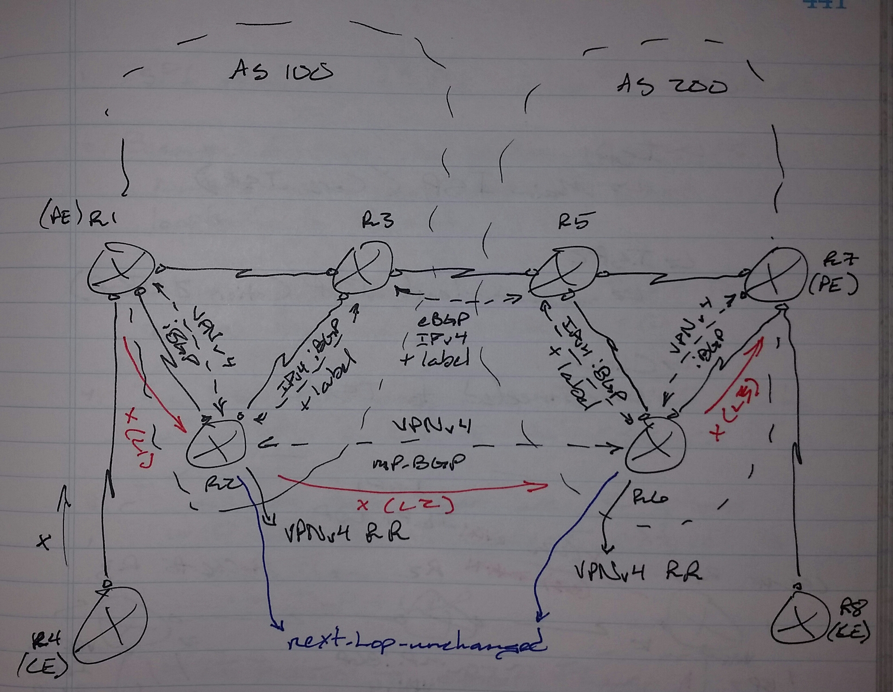

# Inter-AS VPN Option (10) C - Class Notes

**Inter-AS VPN Option (10) C** (16 Sept 2014)

Lab: Inter-AS A, Inter-AS B, Inter-AS C

- Multihop MP-BGP

- VPNv4 neighbor relationship between PE routers or router reflectors

     -> Must be able to ping each others loopback interfaces

PE Routers | Route Reflectors should be able to ping loopback to loopback (IPv4)

 - Control Plane

     -> PE - ASBR

          -> iBGP IPv4

     -> ASBR - ASBR

          -> eBGP IPv4

     -> Advertise loopback into BGP

          -> On PE router

 - Data Plane

     -> On XR routers, static routes are needed on the ASBR routers for the transport labels

 - VPNv4 neighbor relationship between R1 and R7 will use loopbacks

     -> 1.1.1.1

     -> 7.7.7.7

     -> Labels must be associated with the next-hop address

          -> 1.1.1.1, 7.7.7.7

 - PE - PE communications

     -> Labels

          -> iBPG / eBGP + IPv4

 - CE - CE communications

     -> Labels

          -> eBGP VPNv4 

          -> PE routers

**Configuration**

 1. IPv4 - iBGP + label between PE - ASBR

 2. IPv4 - eBGP + label between ASBRs

     -> Configure next-hop-self on both ASBRs towards the PE routers

 3. Static route for each other on ASBRs

     -> XR routes only

 4. MP-eBGP VPNv4 neighbors between PE routers | Router Reflectors loopback to loopback

     -> Multihop

 5. PE - CE VRF and IGP configuration

 6. Mutual redistribution between VRF IGP and VRF BGP

**Option C with Router Reflectors**

 1. MP-eBGP VPNv4 is configured between Router Reflectors

 2. MP-iBGP VPNv4 between Router Reflector and PE routers

 3. IPv4 - eBGP + label between ASBRs

 4. IPv4 - iBGP between ASBR - RR - PE routers

 5. Loopback addresses of PE routers and Route Reflectors are exchanged

 6. PE - CE stuff

.png)

**! R1**

**router bgp 50**

** bgp router-id 1.1.1.1**

** no bgp default ipv4-unicast**

** neighbor 12.0.0.1 remote-as 100**

** address-family ipv4**

**  network 1.1.1.1 mask 255.255.255.255**

**  neighbor 12.0.0.1 activate**

**! R2**

**mpls label protocol ldp**

**mpls ldp router-id lo0 force**

**int lo0**

** ip ospf 1 area 0**

**int e1/0**

** ip ospf 1 area 0**

**router ospf 1**

** router-id 2.2.2.2**

** mpls ldp autoconfig**

!

**vrf definition ABC**

** rd 1:1**

** address-family ipv4**

**  route-target both 1:1**

**int e1/1**

** vrf forwarding ABC**

** ip address 12.0.0.2 255.255.255.0**

!

**router bgp 100**

** bgp router-id 2.2.2.2**

** no bgp default ipv4-unicast**

** address-family ipv4 vrf ABC**

**  neighbor 12.0.0.1 remote-as 50**

**  neighbor 12.0.0.1 activate**

**  neighbor 12.0.0.1 as-override**

**  redistribute connected**

!

**router bgp 100**

** neighbor 4.4.4.4 remote-as 100**

** neighbor 4.4.4.4 update-source lo0**

** address-family ipv4**

**  network 2.2.2.2 mask 255.255.255.255**

**  neighbor 4.4.4.4 activate**

**  neighbor 4.4.4.4 send-label**

!

**router bgp 100**

** neighbor 7.7.7.7 remote-as 200**

** neighbor 7.7.7.7 update-source lo0**

** neighbor 7.7.7.7 ebgp-multihop 255**

** address-family vpnv4**

**  neighbor 7.7.7.7 activate**

**  neighbor 7.7.7.7 send-community extended**

**vrf definition ABC**

** address-family ipv4**

**  route-target import 2:2**

**! R3**

**mpls ldp**

**router ospf 1**

** router-id 9.9.0.3**

** mpls ldp auto-config**

** area 0**

**  int lo0**

**  int gi0/0/0/0**

**  int gi0/0/0/1**

**! R4**

**mpls ldp**

**router ospf 1**

** router-id 4.4.4.4**

** mpls ldp auto-config**

** area 0**

**  int lo0**

**  int gi0/0/0/0**

!

**router bgp 100**

** bgp router-id 4.4.4.4**

** address-family ipv4 unicast**

**  allocate-label all**

** neighbor 45.0.0.5**

**  remote-as 200**

**  address-family ipv4 labeled-unicast**

**   route-policy allow-all in**

**   route-policy allow-all out**

**route-policy allow-all**

** pass**

** exit**

**router static**

** address-family ipv4 unicast**

**  45.0.0.5/32 gi0/0/0/1**

!

**router bgp 100**

** neighbor 2.2.2.2**

**  remote-as 100**

**  update-source lo0**

**  address-family ipv4 labeled-unicast**

**   next-hop-self**

**! R5**

**mpls ldp**

**router ospf 1**

** router-id 5.5.5.5**

** mpls ldp auto-config**

** area 0**

**  int lo0**

**  int gi0/0/0/0**

!

**router bgp 200**

** bgp router-id 5.5.5.5**

** address-family ipv4 unicast**

**  allocate-label all**

** neighbor 45.0.0.4**

**  remote-as 100**

**  address-family ipv4 labeled-unicast**

**   route-policy allow-all in**

**   route-policy allow-all out**

**route-policy allow-all**

** pass**

** exit**

**router static**

** address-family ipv4 unicast**

**  45.0.0.4/32 gi0/0/0/1**

!

**router bgp 200**

** neighbor 7.7.7.7**

**  remote-as 200**

**  update-source lo0**

**  address-family ipv4 labeled-unicast**

**   next-hop-self**

 

**! R6**

**mpls label protocol ldp**

**mpls ldp router-id lo0 force**

**int lo0**

** ip ospf 1 area 0**

**int e1/0**

** ip ospf 1 area 0**

**int e1/1**

** ip ospf 1 area 0**

**router ospf 1**

** router-id 6.6.6.6**

** mpls ldp autoconfig**

**! R7**

**mpls label protocol ldp**

**mpls ldp router-id lo0 force**

**int lo0**

** ip ospf 1 area 0**

**int e1/0**

** ip ospf 1 area 0**

**router ospf 1**

** router-id 7.7.7.7**

** mpls ldp autoconfig**

!

**vrf definition DEF**

** rd 2:2**

** address-family ipv4**

**  route-target both 2:2**

**int e1/1**

** vrf forwarding DEF**

** ip address 78.0.0.7 255.255.255.0**

!

**router bgp 200**

** bgp router-id 7.7.7.7**

** no bgp default ipv4-unicast**

** address-family ipv4 vrf DEF**

**  neighbor 78.0.0.8 remote-as 50**

**  neighbor 78.0.0.8 activate**

**  neighbor 78.0.0.8 as-override**

**  redistribute connected**

!

**router bgp 200**

** neighbor 5.5.5.5 remote-as 200**

** neighbor 5.5.5.5 update-source lo0**

** address-family ipv4**

**  network 7.7.7.7 mask 255.255.255.255**

**  neighbor 5.5.5.5 activate**

**  neighbor 5.5.5.5 send-label**

!

**router bgp 200**

** neighbor 2.2.2.2 remote-as 100**

** neighbor 2.2.2.2 update-source lo0**

** neighbor 2.2.2.2 ebgp-multihop 255**

** address-family vpnv4**

**  neighbor 2.2.2.2 activate**

**  neighbor 2.2.2.2 send-community extended**

**vrf definition DEF**

** address-family ipv4**

**  route-target import 1:1**

**! R8**

**router bgp 50**

** bgp router-id 8.8.8.8**

** address-family ipv4 unicast**

**  network 8.8.8.8/32**

** neighbor 78.0.0.7**

**  remote-as 200**

**  address-family ipv4 unicast**

**   route-policy allow-all in**

**   route-policy allow-all out**

**route-policy allow-all**

** pass**

** end**

**Verification:**

**! R1**

**sh bgp sum**

**sh bgp**

**sh ip route bgp**

**ping 8.8.8.8 source lo0**

**! R2**

**sh ip ospf int bri**

**sh ip ospf nei**

**sh ip route ospf**

**sh mpls int**

**sh mpls ldp nei**

**sh mpls ldp dis**

**sh vrf detail**

**sh bgp vrf ABC all sum**

**sh bgp vrf ABC all**

**sh bgp sum**

**sh bgp**

**sh bgp vpnv4 u all sum**

**sh bgp vpnv4 u all**

**sh mpls forwarding**

**! R3**

**sh ospf int bri**

**sh ospf nei**

**sh route ospf**

**sh mpls int**

**sh mpls ldp nei bri**

**sh mpls ldp dis**

** ! R4**

**sh ospf int bri**

**sh ospf nei**

**sh route ospf**

**sh mpls int**

**sh mpls ldp nei bri**

**sh mpls ldp dis**

**sh bgp ipv4 labeled-unicast sum**

**sh bgp ipv4 labeled-unicast**

**sh mpls forwarding**

**! R5**

**sh ospf int bri**

**sh ospf nei**

**sh route ospf**

**sh mpls int**

**sh mpls ldp nei bri**

**sh mpls ldp dis**

**sh bgp ipv4 labeled-unicast sum**

**sh bgp ipv4 labeled-unicast**

**sh mpls forwarding**

**! R6**

**sh ip ospf int bri**

**sh ip ospf nei**

**sh ip route ospf**

**sh mpls int**

**sh mpls ldp nei**

**sh mpls ldp dis**

**! R7**

**sh ip ospf int bri**

**sh ip ospf nei**

**sh ip route ospf**

**sh mpls int**

**sh mpls ldp nei**

**sh mpls ldp dis**

**sh vrf detail**

**sh bgp vrf DEF all sum**

**sh bgp vrf DEF all**

**sh bgp sum**

**sh bgp**

**sh bgp vpnv4 u all sum**

**sh bgp vpnv4 u all**

**sh mpls forwarding**

**! R8**

**sh bgp sum**

**sh bgp**

**sh ip route bgp**

**ping 1.1.1.1 source 8.8.8.8**
