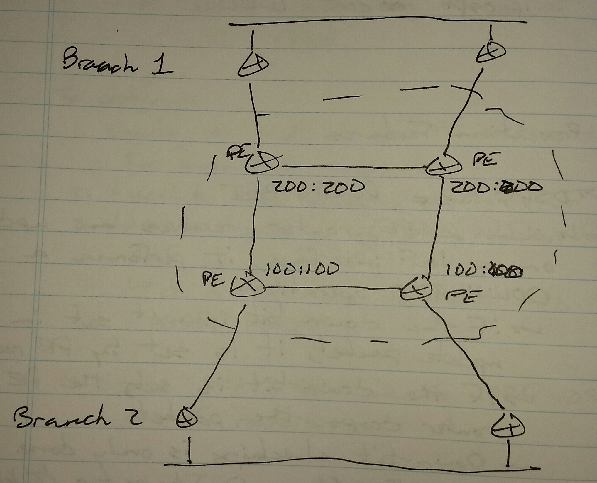

# L3VPN Loop Prevention Features - Class Notes

**L3VPN Loop Prevention Featurees** (3 Sept 2014)

Lab:  MPLS 1 - 3

**OSPF**

- Uses DOWN-BIT

     -> When a PE router receives an update on a VRF interface, it performs a DOWN-BIT operation

          -> If the down-bit is not set in the update packet, it is set by the PE router

          -> If the down-bit is set, the PE router drops the packet

          -> Down-bit checking is only done on type 3 LSAs (Inter-Area)

          -> Doesn't work for type 1 LSAs used by sham-links

          -> No configuration required

**BGP**

- Can use extended community called "site-of-origin"

     -> Can be set on incoming VRF interface

     -> SoO = 64 bit value represented at [X:Y](file:///X:Y%5D)

          -> Must be different on each PE router

R1(config)# router bgp 100

address-family ipv4 vrf c1b1

  neighbor 14.0.0.4 soo 100:100

R3(config)# router bgp 100

address-family ipv4 vrf c1b2

  neighbor 35.0.0.5 soo 200:200

SoO value should be the same on PE routers connected to the same branch.

**EIGRP**

 - Can use "site-of-origin" to prevent loops

R1(config)# router-map SOO

 set ext-community soo 100:100

int s0/0

 ip vrf sitemap SOO

Sitemap

 - If SoO is not set, then set

 - If SoO is set, then drop
