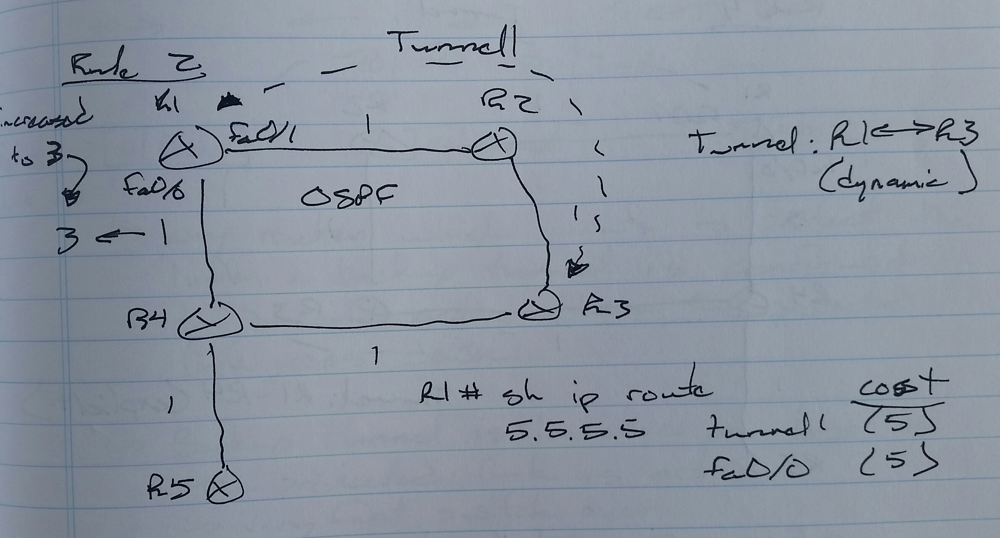
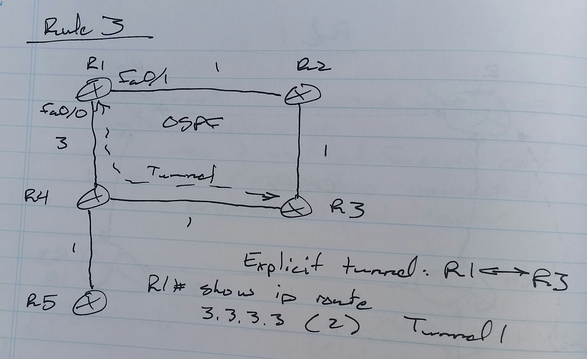

# MPLS Traffic Engineering (MPLS TE) - Class Notes - Part 1

- Note: Split on 8 April 2024, because the original export was 33 MB in size. Github file size limit is 25 MB.

**MPLS Traffic Engineering (MPLS TE)** (10 Sept 2014)

Lab: MPLS TE 1 - 2

- This mechanism allows for a predefined route from source to destination

- It can use a path that meets the interface property requirements

     -> Bandwidth

     -> Delay

Starting point

- MPLS tunnel head end

End point

- MPLS tunnel tail end

**TE Components**

1. Interface constraints

     -> Bandwidth

     -> Delay

     -> Jitter

2. Link state routing protocol

     -> To advertise the link constaints

3. Algorithm

     -> To calculate the best routes according to tunnel requirements of interface constraints

     -> PCALC

          -> Path Calculation

     -> OSPF constraint-based SPF

4. Tunnel signaling

     -> The process of requesting and receiving MPLS labels

     -> Resource Reservation Protocol

5. Fowarding traffic over the tunnel

Interface Constraints

- Max bandwidth

     # **bandwidth <kbps>**

- Max reservable bandwidth

     # **ip rsvp bandwidth <kbps>**

- Available bandwidth

     -> Variable which the router calculates

- Administrative groups

     -> Optional

     -> 32 bit value used to define other attributes

          -> Delay

          -> Jitter

R1(config)# **mpls traffic-eng tunnels**

**int fa0/0**

**  bandwidth <kbps>**

     -> all interfaces have to set

**  mpls traffic-eng tunnels**

**  ip rsvp bandwidth <kbps>**

**  mpls traffic-eng administrative-group <value in hex>**

**Routing Protocols**

- OSPF and IS-IS can be used

- OSPF

     -> Opaque LSAs 9, 10, and 11 are used

     -> LSA 9

          -> Link-local

     -> LSA 10

          -> Area-local

          -> Intra-area MPLS-TE

     -> LSA 11

          -> Domain-local

          -> Inter-area MPLS-TE

- IS-IS

     -> Introduces two new TVLs

          -> Extended IS Reachability

          -> Extended IP Reachability

**OSPF**

- On all routers

(config)# **router ospf 1**

**mpls traffic-eng router-id lo0**

**mpls traffic-end area 0**

**IS-IS**

- On all routers

(config)# **router isis ABC**

**mpls traffic-eng router lo0**

**mpls traffic-eng level-2**

RSVP

- RSVP Path Message

- RSVP Reserve Message

Explicit Router Object (ERO)

- Headend router sends path message with the ERO in the message

     -> ERO contains a collection of next-hops to be used

          -> 16.0.0.1

          -> 13.0.0.3

          -> 34.0.0.4

          -> 45.0.0.5

When any router receives the path message, it checks the ERO and removes its own IP address and sends the message to the next-hop

The path message also contains the bandwidth requirement of the tunnel

When the path message reaches the tailend router, the tailend router generates a RESV message that contains the label to be used

- Each router that receives the RESV message changes the message with its generated label to be used

     -> RSVP label, not an MPLS label

**Headend Tunnel Configuration**

- Tunnel IP address

     -> Unnumbered

     -> Linked to a loopback interface

- Destination IP address

     -> Router-id of the tailend router

- Bandwidth required

- Path options

     -> Manual

          -> Explicit path

     -> Dynamic

          -> PCALC

          -> SPF

- Setup and holding priorities

     -> Tunnel parameters

- Affinity

- Tunnel metric

     -> IGP

      -> TE 

R6 (headend) -> R1 -> R3 -> R4 -> R5 (tailend)

R6(config)# **int tu0**

**unnumbered lo0**

**tunnel mode mpls traffic-eng**

**tunnel destination 5.5.5.5**

**tunnel mpls traffic-eng bandwidth <kbps>**

**tunnel mpls traffic-eng path-option explicit name <name>**

**ip explicit-path name <name> enable**

**next-address 16.0.0.1**

**next-address 13.0.0.3**

**next-address 34.0.0.4**

**next-address 45.0.0.5**

**show mpls traffic-eng tunnels [name]**

**Path Option Priority**

- Multiple path-option commands can be configured for some tunnel with different priority value

     -> 1 to 1000

     -> Priority

          -> Lower value

Scenario ->

- Configure MPLS TE on all routers to support max reservable bandwidth 2Mbps

- Configure OSPF area 0

- Configure an MPLS TE tunnel from R1 to R3 with 1Mbps bandwidth requirement

- Use dynamic path option

R1(config)# **mpls traffic-eng tunnels**

**int fa0/0**

**  mpls traffic-eng tunnels**

**  ip rsvp bandwidth 2000**

**router ospf 1**

**network 12.0.0.1 0.0.0.0 area 0**

**network 1.1.1.1 0.0.0.0 area 0**

**mpls traffic-eng router-id lo0**

**mpls traffic-eng area 0**

**int tu0**

**ip unnumbered lo0**

**tunnel mode mpls traffic-eng**

**tunnel destination 3.3.3.3**

**tunnel mpls traffic-eng bandwidth 1000**

**tunnel mpls traffic-eng path-options 1 dynamic**

**Path Option Exclude Address**

R1(config)# **ip explicit-path name NOR3 enable**

**exclude-address 3.3.3.3**

**tunnel mpls traffic-eng path-option 1 explicit name NOR3**

**Affinity and Administrative Group**

Tunnel interface

- Affinity

     -> Requirement

     -> 32 bit variable in HEX

     -> 0x00000000

On any other router in the path, administrative group a a viable resource

     -> 32 bit variable in HEX

     -> 0x0000FFFF

On headend router

**int tu0**

**tunnel mpls traffic-eng affinity 0x01000000 mask 0x0000FFFF**

On all of the interfaces of routers in the path

R2(config)# **int g0/0/0/0**

**mpls traffic-eng attribute-flag 0x01000000**

**Setup and Holding Priorities**

- Every tunnel is assigned two priorities

     -> Setup Priority

          -> Decides whether a tunnel can ask for specific bandwidth or not in case bandwidth is already assigned to another tunnel

          -> Preemptive

          -> 0 - 7 (lower is better)

     -> Holding Priority

          -> Decides whether a tunnel can still reserve the bandwidth in cast another tunnel is requesting bandwidth

- Setup priority cannot be lower than holding priority

Headend Router

**int tu0**

**  tunnel mpls traffic-eng priority <setup> <holding>**

**Re-Optimization**

- When new links or more resources are available

- 3 ways to re-optimize

     -> Periodic

          # **mpls traffic-eng reoptimize timers frequency <minutes>**

     -> Event Driven

          # **mpls traffic-ing reoptimize event linkup**

     -> Manual

          # **mpls traffic-eng reoptimize [tunnel <number>]**

**RSVP**

- Tailend router uses explicit null

     -> But penultimate router consider it as implicit null

- On penultimate router (hidden command)

     # **mpls traffic-eng signalling interpret explicit-null**

**Forwarding Traffic over Tunnel Interface**

1. Static route

R1(config)# **ip route 50.0.0.0 255.0.0.0 tu1**

2. Policy Based Routing (PBR)

     - Scenario -> Traffic from R6 shoulduse tunnel 1 and traffic from R7 should use tunnel 2

R1(config)# **route-map MAP1**

**set interface tu1**

**route-map MAP2**

**set interface tu2**

**int fa0/0**

**ip policy route-map MAP1**

**int fa0/1**

**ip policy route-map MAP2**

3. Autoroute Announce

     -> The tunnel is included in SPF calculation as a valid exit interface

     -> All of the up stream network connected to the tailend router will have tunnel as the exit interface

     -> If multiple tunnels are available, then the nearest TE router to the destination is used as the exit interface

(config)# **int tu1**

**tunnel mpls traffic-eng autoroute-announce**

**Forwading Adjacency**

- The tunnel is considered as a single link

- All of the non-TE enabled routers will also consider the link when calculating best path

- The tunnels must be two way to be considered a link

On the Headend Routers

(route)# **int tu1**

**tunnel mpls traffic-eng forwarding-adjacency**

**MPLS TE on XR Routers**

1. On all routers, activate MPLS TE

     -> for interfaces

     -> routing protocols

     -> RSVP max reservable bandwidth

2. To configure tunnel interface on headend router

     -> IOS

**router ospf 1**

**mpls traffic-eng router-id lo0**

**mpls traffic-eng area 0**

**int fa0/0**

**mpls traffic-eng tunnels**

**ip rsvp bandwidth <kbps>**

     -> XR

**mpls traffic-eng**

**int fa0/0**

**int s0/0**

**rsvp**

**int fa0/0**

**  bandwidth 50000**

**int s0/0**

**  bandwidth 50000**

**router ospf 1**

**mpls traffic-eng router-id lo0**

**area 0**

**  mpls traffic-eng**

IOS (attribute flag)

**int fa0/0**

**mpls traffic-eng attribute-flags 0x01000000**

XR (attribute flag)

**mpls traffic-eng**

**int fa0/0**

**  attribute-flag 0x01000000**

IOS (tunnel configuration)

**int tu1**

**ip unnumbered lo0**

**tunnel mode mpls traffic-eng**

**tunnel destination 3.3.3.3**

**tunnel mpls traffic-eng bandwidth 5000**

**tunnel mpls traffic-eng path-option 1 explicit name EXP1**

**exit**

**ip explicit-path name EXP1 enable**

**next-address 12.0.0.2**

**next-address 23.0.0.3**

XR (tunnel configuration)

**int tunnel-te 1**

**ipv4 unnumbered lo0**

**destination 3.3.3.3**

**signalled-bandwidth 5000**

**path-option 1 explicit name EXP1**

**explicit-path name EXP1**

**index 10 next-address strict ipv4**

**  unicast 12.0.0.2**

**index 20 next-address strict ipv4**

**  unicast 23.0.0.3**

**sh mpls traffic-eng tunnels [tunnel-id]**

     -> both IOS and XR

IOS (reoptimization timers)

(config)# **mpls traffic-eng reoptimization timers frequency <minutes>**

XR (reoptimization timers)

(config)# **mpls traffic-eng**

**reoptimization timers frequency <minutes>**

**TE Metric**

 - There are two metrics

     -> IGP metric

     -> TE metric

 - By default, TE metric is used to setup the tunnel if the dynamic path-option is used

 - By default, TE metric is equal to IGP metric

     -> To change change the TE metric

R1(config)# **int fa0/0**

** mpls traffic-eng administrative-weight <value>**

Tunnel R1 - R4

R1(config)# **int fa0/0**

** mpls traffic-eng administrative-weight 65**

**TE Metric Autoroute Announce**

 - Autoroute announce the best route metric calculation

     -> It uses the tunnel interface as exit for all the prefixes connected to and beyond tail-end router

R1 -> R3 + autoroute announce

**sh ip route**

                    exit interface

4.4.4.4          Tunnel1

3.3.3.3          Tunnel1

34.0.0.0        Tunnel1

The metric calculated for these prefixes follow some specific rules (four)

**Rule 1**

 - For prefixes directly connected to the tail-end router, the tunnel path is always used

Tunnel R1 - R5 (dynamic)

 - Both the IGP and TE metric will be the same

**Rule 2**

 - Load balancing for the prefixes beyond the tail-end router is possible with IGP, provided that autoroute announce metric and IGP metric is the same

**Rule 3**

 - Autoroute announce always checks the "least cost IGP" path to reach the tail-end router when calculating metric for the prefixes connected to and beyond the tail-end router

**Rule 4**

 - If the tail-end router is in the path of the IGP route, the IGP route is not considered at all
