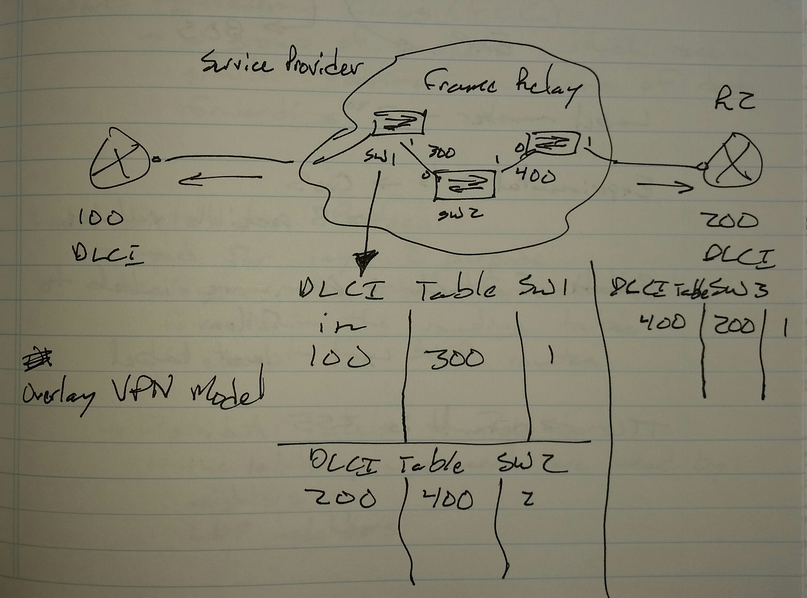
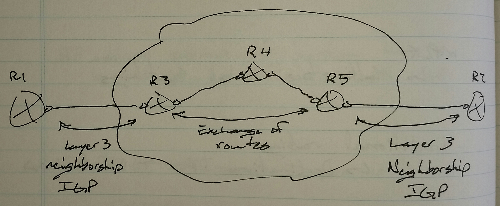
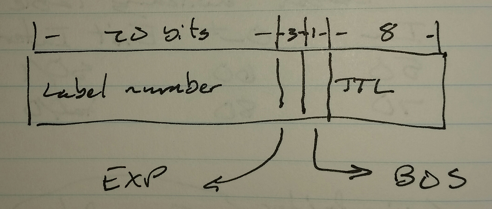
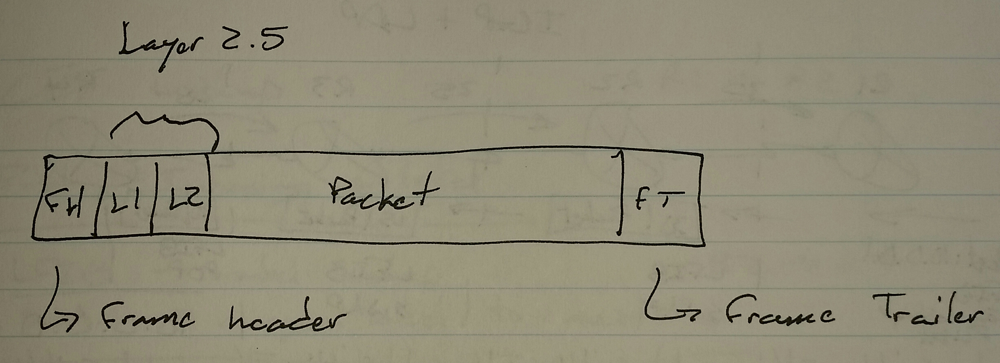
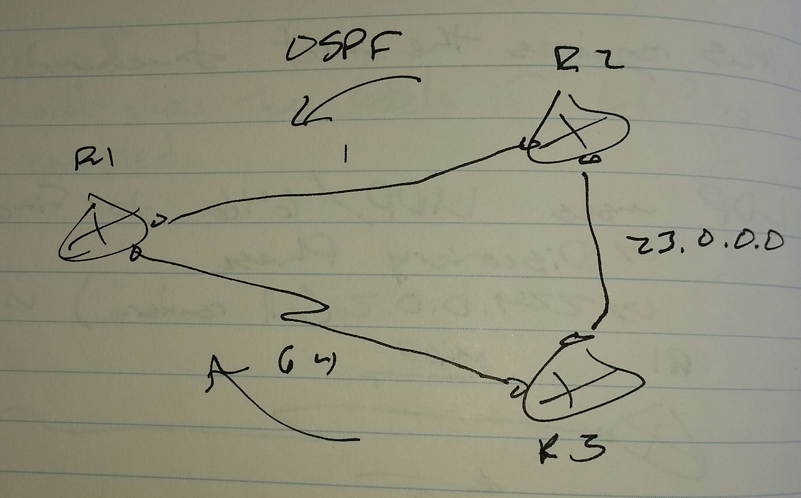
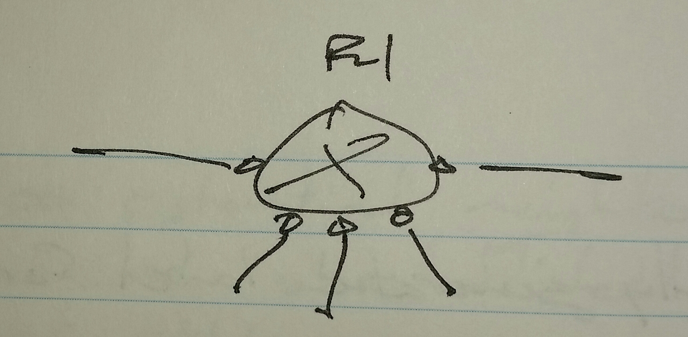

# Multi-protocol Label Switching (MPLS) - Class Notes

**Multi-protocol Label Switching (MPLS)** (2 Sept 2014)

Lab:  MPLS 1 - 3

Traditional routing

- Destination IP -> Next hop

MPLS

- Labels -> Next hop

- No need to look to routing table

DLCI -> Labels

**MPLS Architecture**

 - Labels

     -> 32-bit value used for data propogation

Label number -> 2^20

Experimental bits

     -> QoS

     -> 8 possible values

Bottom of Stack

     -> 0 - More labels to follow

     -> 1 - Last label

TTL

     -> Default is 255

**Terminology**

 - LSR

     -> Label Switching Router

 - LSP

     -> Label Switched Path

     -> The path a labeled packet takes to reach destination

**Label Switching Protocols**

 - TDP

     -> Tag Distribution Protocol

     -> Cisco Proprietary

     -> Deprecated

     -> Appears in the Troubleshooting section of the R&S lab

 - LDP

     -> Label Distribution Protocol

     -> Open standard

**Forward Equivalency Class (FEC)**

 - A group of packets which receive similar treatment in terms of data forwarding

**Label Distribution Protocol**

 - Used for layer 2 purposes

     -> To generate labels for all routes found in the routing table

          -> Except for BGP routes

     -> Distribute labels to neighbors

          -> The labels a route generates are used by LDP neighbors

Label Forwarding Information Base (LFIB)

 - Used by CEF

 

Frame header has a protocol type file

 - Code for MPLS packet

 - Code for IP packet

Packet with label

 - Check LFIB

Packet without label

 - Check FIB

A label for every route is listed in the FIB

**sh ip cef detail**

 - Will show the labels if LDP is enable

R1 -> R2

 - CEF lookup

 - Push -> Imposing a label

R2 -> R3

 - LFIB -> Label lookup

 - Swap -> Change label to next hop

R3 -> R4

 - LFIB -> Label lookup

 - Swap -> Change label to next hop

R4 -> Destination

 - LFIB -> Label lookup

 - Pop -> Remove the label

 - CEF lookup

The last hop router has to do two lookup

 - To change to one lookup

     -> R3 uses label "3" instead of 20

     -> When R4 sees label "3", it doesn't do an LFIB looup

          -> It Pops the label and goes straight to a CEF lookup

     -> show command doesn't show "3", but "POP"

Instructor comment, "MPLS requires the most structured teaching."

LDP uses UDP port 646 to find neighbors

 - Discovery phase

     -> 224.0.0.2 (all routers) UDP port 646

     -> After finding a potential neighbor, a TCP session is established on TCP port 646

     -> Hellos are sent every 5 seconds

     -> Hold down timer is 15 seconds

 - TCP Session

     -> Once a TCP session is established

          -> Keepalives are sent every 60 seconds

          -> Hold down timer is 180 seconds

 - After neighbor formation

     -> Labels are exchanged

     -> Kept in Label Information Base (LIB)

     -> LIB contains all labels, but might not have the best path (route)

     -> The best labels from the LIB are sent to the LFIB

          -> The routing table is referenced to determine the exit interface

LIB

 - Locally generated label for 23.0.0.0

     -> 20

     -> 12.0.0.3 - 3

     -> 23.0.0.3 - 3

LFIB

 in  | out     next-hop

 20 | 3        fa0/0 -> 12.0.0.2

**Configuration**

 1. Activate CEF (activated by default)

 2. Activate MPLS

 3. Activate LDP

 4. Configure LDP on the interfaces where neighbors can be found

R1(config)# **ip cef**

 **mpls ip**

     -> Enabled if an interface is configured

 **mpls label protocol { ldp | tdp }**

 **int s0/0**

  **mpls ip**

**"Always check CEF"**

      -> During troubleshooting section of the R&S lab

**OSPF Autoconfig**

 - Configures MPLS on all interfaces configured for OSPF

**router ospf 1**

 **mpls ldp autoconfig**

After MPLS and LDP is configured, LDP selects a router-id

 - Manual

 - Highest loopback IP address

 - Highest physical interface IP address

LDP starts sending "discovery hellos" to 224.0.0.2, UDP port 646

 - Contains

     -> Router-id (LDP)

     -> Transport address

          -> Used for TCP session

          -> By default, the router-id is used

Scenario -> The loopbacks of R1 and R2 can not be advertised in IGP

 

Solution 1 -> Change the LDP router-id to something reachable

R1(config)# **mpls ldp router-id { <interface> | <ip address> } [force]**

     -> Force is optional, but always use it

          -> Without force, the LDP router-id will only change after the next reboot

     -> Interface uses the IP address of the interface

Solution 2 -> Change the transport IP address

     - Interface specific command

R1(config)# **int s0/0**

 **mpls ldp discovery transport-address { <interface> | <ip address> }**

Discovery Timer

R1(config)# **mpls ldp discovery hello { interval | hello } <seconds>**

TCP Keepalive Timer

R1(config)# **mpls ldp holddown <seconds>**

Label Numbers

 - 2^20

 - But in Cisco, only 0 - 100000 are used

Reserved Labels

 - 0 - 15

     -> 0 - explicit NULL

          -> Used when you keep the experimental bit (Used for QoS)

          -> Last router will have to do two lookups

               -> LFIB

               -> CEFaaq

     -> 3 - implicit NULL

 

To use explicit NULL (0)

R1(config)# **mpls ldp explicit-null**

To change the label range

R1(config)# **mpls label range <lower> <upper>**

**sh mpls label range**

**mpls ldp advertise-label**

 - LDP, by default, generates the labels for every route in the routing table and advertises them to neighbors

 - This behavior can be changed to control which labels (routes) are advertised and to which neighbors they can be advertised

**no mpls ldp advertise-labels**

**mlps ldp advertise-labels for <acl> [to <peer acl>]**

     -> for <acl>

          -> For which routes labels are to be advertised

     -> to <peer acl>

          -> To which neighbors labels will be advertised

Scenario -> On R1 and R2, advertise labels only for loopbacks.

R1(config)# **access-list 1 permit 1.1.1.1**

 **access-list 1 permit 2.2.2.2**

 **no mpls ldp advertise-labels**

 **mpls ldp advertise-labels for 1**

The ACL must list all "routes" to be advertised

Instructor comment, "LDP is a huge topic.  I highly recommend reading a book on LDP."

**Verification:**

**IOS:**

**sh mpls int**

**sh mpls ldp nei**

**sh mpls ldp discovery**

**sh mpls forwarding-table**

**sh mpls int vrf ABC**

**sh mpls ldp nei vrf ABC**

**sh mpls forwarding-table vrf ABC**

**sh ip cef vrf ABC**

**sh ip cef vrf ABC 1.1.1.1**

**sh ip cef vrf ABC 1.1.1.1 detail**

**sh ip cef vrf ABC 1.1.1.1 interna.**

**sh tcp bri | in .646**

**XR:**

sh mpls int

sh mpls ldp nei

sh mpls forwarding

sh mpls forwarding vrf ABC
