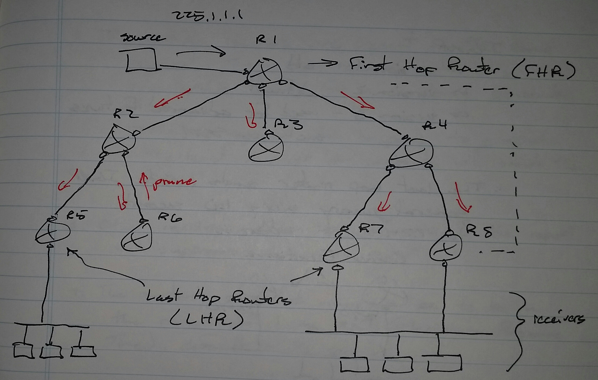
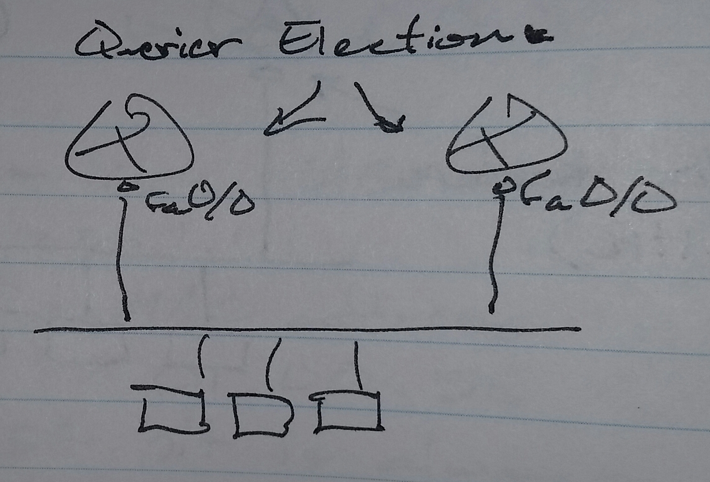
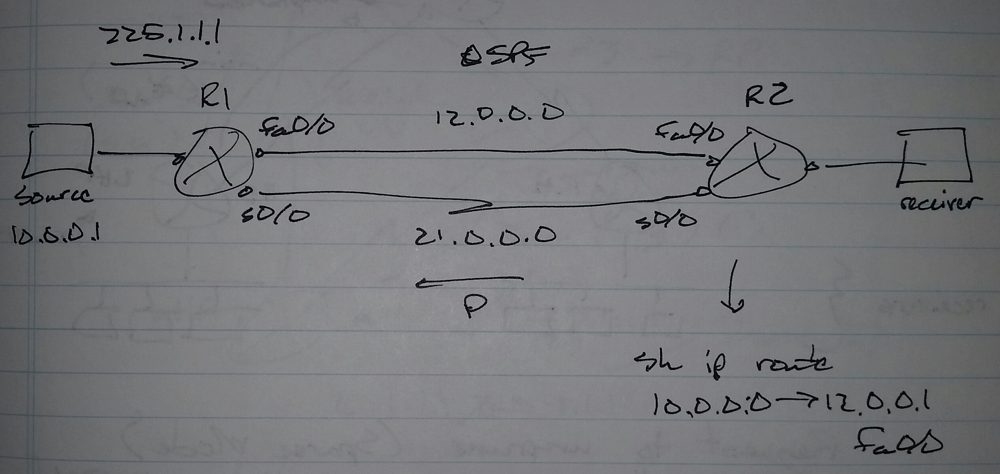
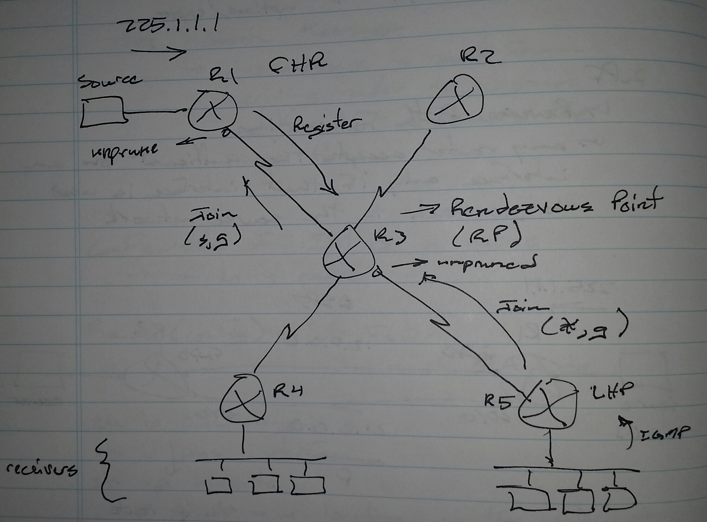
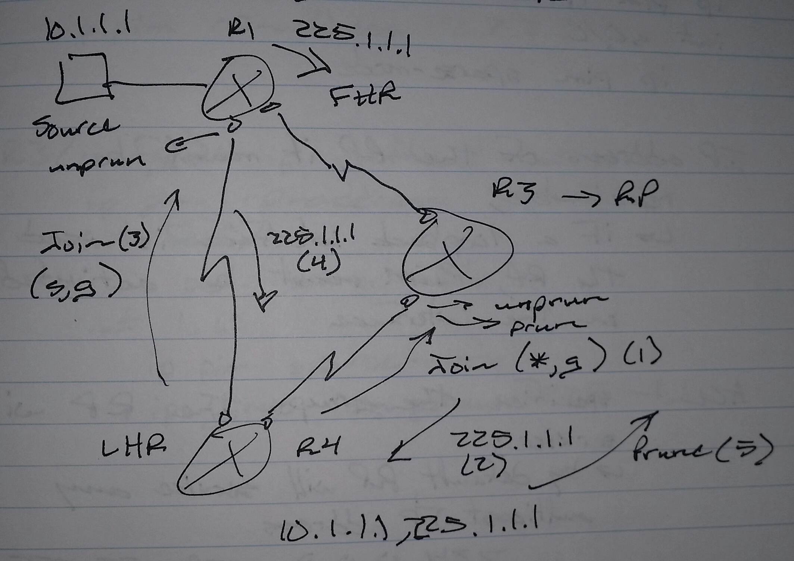
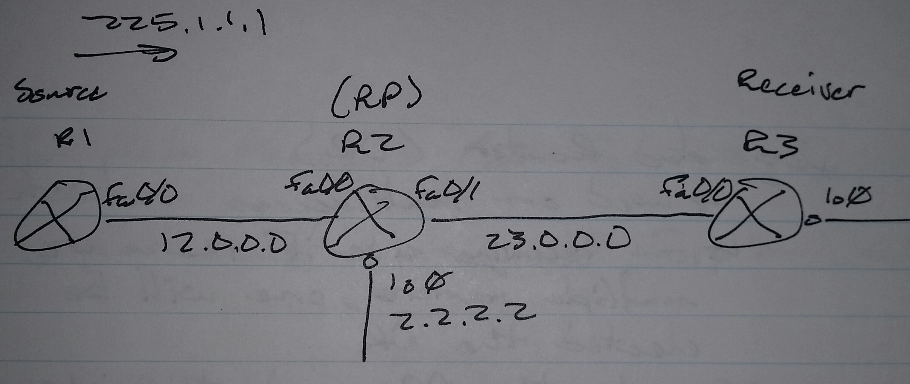
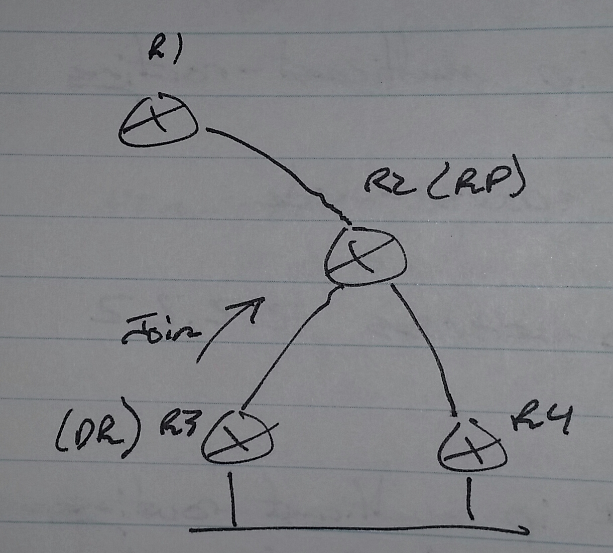
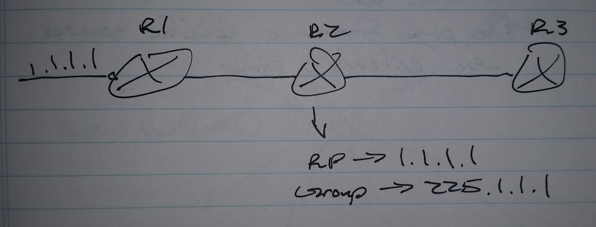

# Multicast - Class Notes

**Multicast** (29 Aug 2014)

Lab: Multicast 1 - 4

- One-to-many

- Layer 3 address range

     -> Class D

     -> 224.0.0.0

     -> 239.255.255.255

     -> First four bits are always

          -> 1110.

     -> Last 23 bits are used to create the MAC address

     -> 5 bits in the middle can change

     -> 2^5 = 32 IP address for one MAC address

- Reserved management range

     -> 224.x.x.x

     -> 224.0.0.x

          -> Link-local multicast

     -> 224.0.0.1 - all nodes on segment

     -> 224.0.0.2 - all routers on segment

     -> 224.0.0.3 - Distance Vector Multicast Routing Protocol (DVMRP)

     -> 224.0.0.5 - OSPF routers

     -> 224.0.0.6 - OSPF DR routers

     -> 224.0.0.9 - RIPv2

     -> 224.0.0.10 - EIGRP

     -> 224.0.0.13 - PIMv2 (Protocol Independent Multidast)

     -> 224.0.0.18 - VRRP

- 224.0.1.x

     -> global multicast

     -> 224.0.1.39 - Auto-RP accouncer

     -> 224.0.1.40 - Auto-RP Discovery

- 232.x.x.x

     -> Source Specific Multicast (SSM)

- 239.x.x.x

     -> Administratively scoped addresses

     -> Similar to private IP addresses

     -> Traffic should not be sent to the Internet

**Multicast MAC Address**

- xx.xx.xx.xx.xx.xx

     -> xx.xx.xx. - Organizationally Unique Identifier (OUI)

     -> OUI of multicast MAC addresses is always

          -> 01.00.5E.

If destination IP address is 225.1.1.1

     -> First 24 bits

          -> 01.00.5E

     -> 25th bit is always 0

     -> Last 23 bits taken from the multicast IP address

     -> 01.00.5E.01.01.01

**Internet Group Management Protcol (IGMP)**
 - A communication protocol between multicast receivers and the last hop routers
 - Used to request the traffic sent to a specific multicast address

Communication between the first hop router and the last hop router is done with multicast routing protocols
 - DVMRP
 - Core Based Tree (CBT)
 - MOSPF
 - PIM
     -> Dense
     -> Sparse

IGMP Versions
 - Version 1 - Old
 - Version 2 - Default
 - Version 3 - Used for advanced features such as SSM

**Joining the group**

1. The last hop router sends a periodic IGMP general query every 60 seconds to 224.0.0.1 (all nodes)

2. If there are multiple routers on the same segment, there will be a querier election by comparing the segment facing IP addresses of the router
     -> Lower is better

3. If the querier misses sending 2 consecutive general queries, the other router preempts the querier role

4. Whenever a client is interested in a specific multicast stream, it sends an IGMP Membership Report message destined to the multicast address it wishes to join

5. If multiple receivers are present on the same segment, then every receiver hols it's membership report for a randomly generated time

6. Other receivers, upon hearing (receiving) the report will suppress their own report

7. The randomly generated numbs has to be in the range of 1 to the Maximum Response Time (MRT)
     -> Default MRT is 10 seconds

**Leaving the group**

1. Whenever a client wants to leave the group, it sends a "leave-group" message to 224.0.0.2 (all routers)

2. Upon receiving the "leave-group" message, the router responds by sending a "group-specific-query" to the multicast group address

3. The query is sent every second for the next 3 second
      -> If nobody replies, the router stops sending multicast traffic out that port

Configuration on the Last Hop Router (LHR)

R8(config)# int fa0/0
 ip igmp query-interval <sec>
 ip igmp querier-timeout <sec>
 ip igmp query-max-response-time <sec>
 ip igmp version { 1 | 2 | 3 }
 ip igmp last-member-query-interval <msec>
 ip igmp limit <number of reports>
 ip igmp access-group <acl>
 ip igmp join-group <ip add>

**Default IGMP Timers**
 - query-interval
     -> 60 seconds
 - querier-timeout
     -> 120 seconds
 - query-max-response-time
     -> 10 seconds
 - last-member-query-interval
     -> 1000 ms

ip  igmp access-group <acl>
 - Defines the multicast groups permitted | denied

ip igmp join-group <ip add>
 - Makes the router a receiver
 - Good for testing multicast
 - Recommended to use a loopback interface

**Multicast Routing Protocols**
 - Multicast Tree
     -> FLow of multicast traffic from source to receiver for a group
     -> On any router which is part of the tree will have an (s,g) entry
          -> s - source
          -> g - multicast group

The methods to propogate the traffic from First Hop Router (FHR) to Last Hop Router (LHR)
 1. Flood and pruse
     -> PIM dense mode
 2. Request to unprune

**PIM Dense Mode**
 - Traffic is flooded to every branch to every router
 - Every receiving router checks two things
     -> Are there any receivers
     -> Are there any downstream routers
 - By default, PIMv2 is used
     -> uses 224.0.0.13 to form neighbors and send periodic hellos
          -> Hellos sent every 30 seconds
 - Messages
     -> Prune
          -> Request to stop sending traffic
          -> Upon receiving this message, the router stops sending traffic for 3 minutes
          -> After the 3 minutes, multicast traffic is sent again
     -> Graft
          -> Unprune a pruned link
     -> Graft Acknowledgement
          -> Upstream router acknowledges receiving a Graft message, but it may not have traffic to send
          -> Upstream router may have to send it's own Graft message
     -> Static Refresh
          -> This message is sent from the receiving router to upstream router to refresh the prune time

Configuration of PIM Dense Mode

R1(config)# int fa0/0
 ip pim dense-mode

sh ip pim neighbors
sh ip pim interface
sh ip mroute
 - Shows your location in the multicast tree
 - Shows the number of active multicast trees (flows) along with detailed information
     -> Source of the multicast
     -> Multicast group
     -> Incoming interface
     -> Outgoing interface and their states
     -> Flags

Flags
 - D
     -> Dense mode
 - S
     -> Sparse mode
 - P
     -> Pruned
 - T
     -> Shortest Path Tree

sh ip mroute
 (10.0.0.1, 255.1.1.1)          uptime / expire
     incoming interface: fa0/0
     outgoing interface:
               s0/0 -> uptime / expire
               s0/1 -> uptime / expire

**Reverse Path Forwarding (RPF)**
     -> Any router accepts the multicast on an interface only if that interface is used to back to the source network

By default, the unicast routing table is checked for RPF check
 - It can be overridden by using static mroutes

ip mroute <source ip> <source mask> <incoming int>

ip mroute 10.0.0.0 255.0.0.0 s0/0

Troubleshooting section of the lab usually has RPF failures

**Rendezvous Point (RP)**

Request to unprune (sparse mode)
 - All ports are pruned by default
 - Ports are unpruned on request
     -> Join message
 - (*,g) join message is sent by the LHR to RP
     -> Creates a Shared Tree

(s,g) -> Shortest Path Tree (SPT)
(*,g) -> Shared Tree

FHR sends a unicast message to RP call a Register message
 - The message is a request to RP to send the join message
 - Sent every 60 seconds
 - Join messages are sent every 60 seconds
 - Upon receiving a Register message, the RP sends an (s,g) join message towards the source
 - After receiving traffic on RP, the RP sends a Register-stop message to FHR

**SPT-Switchover**
 - Once the LHR joins the shared tree and receives the first packet, it knows about the source and sends a (s,g) join message towards the source
 - When traffic starts coming through the SPT, the router sends a prune message to the shared tree

Configuring PIM Sparse Mode
 1. Activate multicast routing
 2. Configure interfaces for PIM sparse mode
 3. Configure RP information
     -> Manual
          -> Configure RP on all routers manually 
     -> Automatic
          -> Distribute RP information by using a protocol (dynamic)

On all routers

R1(config)# ip multicast-routing
 ip pim rp-address <ip add> [<acl>]
int s0/0
 ip pim sparse-mode

The IP address of the RP must be reachable
 - If a loopback interface is used as the RP, PIM must be activated on the interface

ACL
 - specifies the group the RP will service
 - By default, the RP will service any multicast IP address
     -> 224.0.0.0 - 239.255.255.255

R1(config)# ip multicast-routing
 int fa0/0
  ip pim sparse-mode
 ip pim rp-address 2.2.2.2

R2(config)# ip multicast-routing
int range lo0, fa0/0 - 1
  ip pim sparse-mode
ip pim rp-address 2.2.2.2

R3(config)# ip multicast-routing
ip pim rp-address 2.2.2.2
int fa0/0
 ip pim sparse-mode
int lo0
 ip pim sparse-mode
 ip igmp join-group 225.1.1.1

**Designated Router (DR)**
 - Used on multiaccess network
 - On receiving side if there are multiple routers, one will be elected the DR
 - Only the DR will send join messages

On sending side if there are multiple routers connected to the same segment, one will be elected as the DR
 - The DR will send the Register message to the RP

DR Election
 - higher is better
 - Checks priority
     -> Default is 1
 - Then checks IP address of the segment-facing interface

int fa0/0
 ip pim dr-priority 100

**Filter Join Messages**
 - Only for (*,g) join messages
 - Can be configured anywhere, but it is best to configure on the RP itself

ip pim accept-rp <ip add of RP> [<acl>]

R2(config)# access-list 1 permit 225.1.1.1
ip pim access-rp 1.1.1.1 1

 (*,225.1.1.1
     RP -> 1.1.1.1

**Filter Register Messages**
 - Only configured on the RP
 - This does not work if the source is also the DR

ip pim accept-register { list <acl> | route-map <name> }

ACL -> extended
 - What source register message is coming from
 - What group it is requesting

**Troubleshooting Multicast**

ping 225.1.1.1
 - By default, the source is all interfaces where PIM is activated
     -> If there are 3 interfaces, 3 pings will be sent
 - To ping from a specific source, use extended ping
 - It helps if ip igmp join-group 225.1.1.1 is configured on a LHR
 - To troubleshoot multicast, use an extended ping and set the repeat count to a large number
     -> Multicast is hard to troubleshoot if there is no multicast traffic
          -> Troubleshooting QoS is worse in a lab environment
