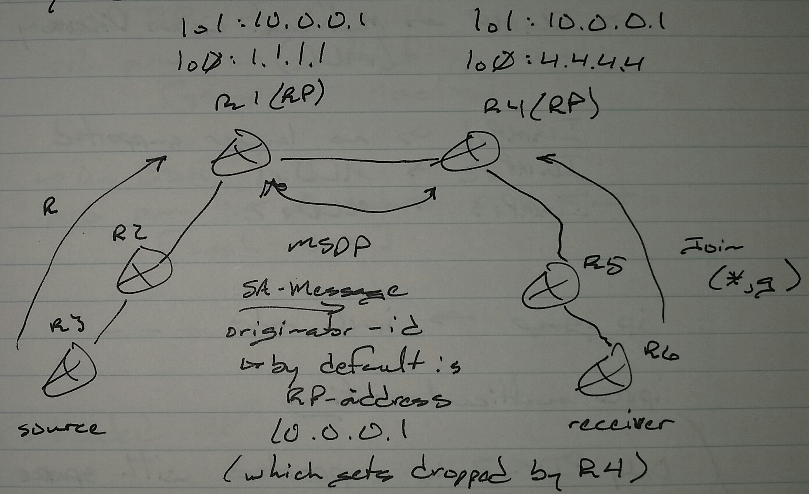

# Multicast Anycast RP - Class Notes

**Multicast Anycast RP** (1 Sept 2014)Lab: Multicast 1 - 4

 - Allows the load balancing between RPs based on IGP metric (proximity) instead of groups

R1(config)# int lo1

 ip add 10.0.0.1 255.255.255.255

ip pim rp-candidate lo1

ip pim bsr-candidate lo1

router eigrp 100

 network 10.0.0.1 0.0.0.0

ip msdp peer 4.4.4.4 connect-source lo0

R4(config)# int lo1

 ip add 10.0.0.1 255.255.255.255

ip pim rp-candidate lo1

ip pim bsr-candidate lo1

router eigrp 100

 network 10.0.0.1 0.0.0.0

ip msdp peer 1.1.1.1 connect-source lo0

ip msdp originator-id lo0

     -> **Needed on one side, otherwise the other RP will drop the MSDP packets**
