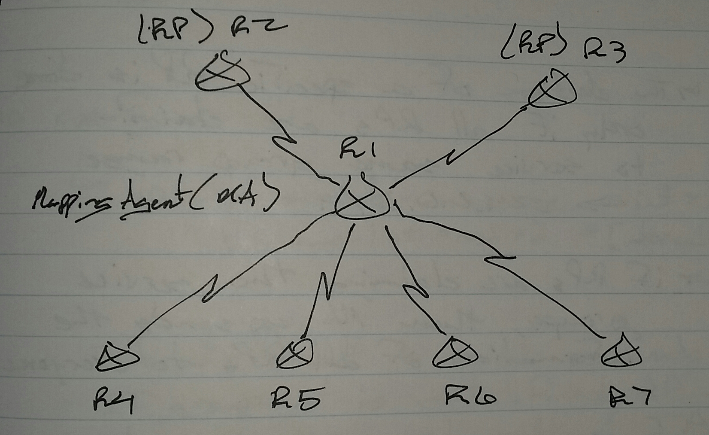

# Multicast Auto-RP - Class Notes

**Multicast Auto-RP** (1 Sept 2014)

Lab: Multicast 1 - 4

 - Cisco proprietary

 - Uses a Mapping Agent (MA) to distribute RP information

 - RP informs the MA about themselves

     -> Announce message

 - MA sends a Discovery message to all routes

 - Announce message are multicast messages sent by RPs to the destination

     -> 224.0.1.39, UDP port 496

     -> Only MAs join the group and will receive the message

 - Discovery messages are multicast messages sentby the MA to

     -> 224.0.1.40, UDP port 496

     -> All routers join this group and will receive the message

 - If multiple RPs exist, only the higher IP address RP information is sent by the MA

 - The election of a specific RP is done only if all RPs are claiming to service the same group range

     -> 224.0.0.0/4

 - If RPs are claiming the service groups, then MA sends the information of all RPs to everyone

e.g. -

R2 -> 224.0.0.0 - 231.255.255.255

R3 -> 232.0.0.0 - 239.255.255.255

     -> Both RPs will be used

Scenario - R2 (2.2.2.2) -> 224.0.0.0 - 235.255.255.255

R3 (3.3.3.3) -> 232.0.0.0 - 239.255.255.255

     -> Overlapping range

          -> 232.0.0.0 - 235.255.255.255

          -> R3 will be used for the RP because of the higher IP address

If multiple RPs are claiming the same range with different prefix-lengths, then the longest matching prefix will be used

**Configuring the RP**

ip pim send-rp-announce <int> scope <ttl> [group-list <acl>] [interval <sec>]

 - The interval default is 60 seconds

 - If group-list is not definded, the RP will claim to serve all multicast IP addresses

**Configuring the MA**

ip pim send-rp-discovery <int> scope <ttl> [interval <sec>]

 

 - The interval default is 60 seconds

R2(config)# access-list 1 permit 224.0.0.0 7.255.255.255

R3(config)# access-list 1 permit 224.0.0.0 15.255.255.255

 access-list 1 permit 224.0.0.0 15.255.255.255

     -> This ACL covers the entire multicast IP address range

On any router

sh ip pim rp mapping

Configuring Auto-RP

 1. Activate multicast routing

 2. Configure PIM sparse mode on all interfaces

 3. Configure RP and MA

Join messages have to be sent to

 - Accounce -> 224.0.1.39

 - Discovery - 224.0.1.40

 - Problem

     -> The router cannot join without knowing where to send the join messages

     -> The links are pruned

     -> This means that announce and discovery messages cannot be sent by default

 - Solution

     -> Send messages in dense mode and flood the messages

          -> Change all ports to sparse-dense-mode

                    - or -

          -> Use sparse-mode and configure all routers with ip pim autorp listener

               -> This commands converts the annouce and discovery groups to dense mode
