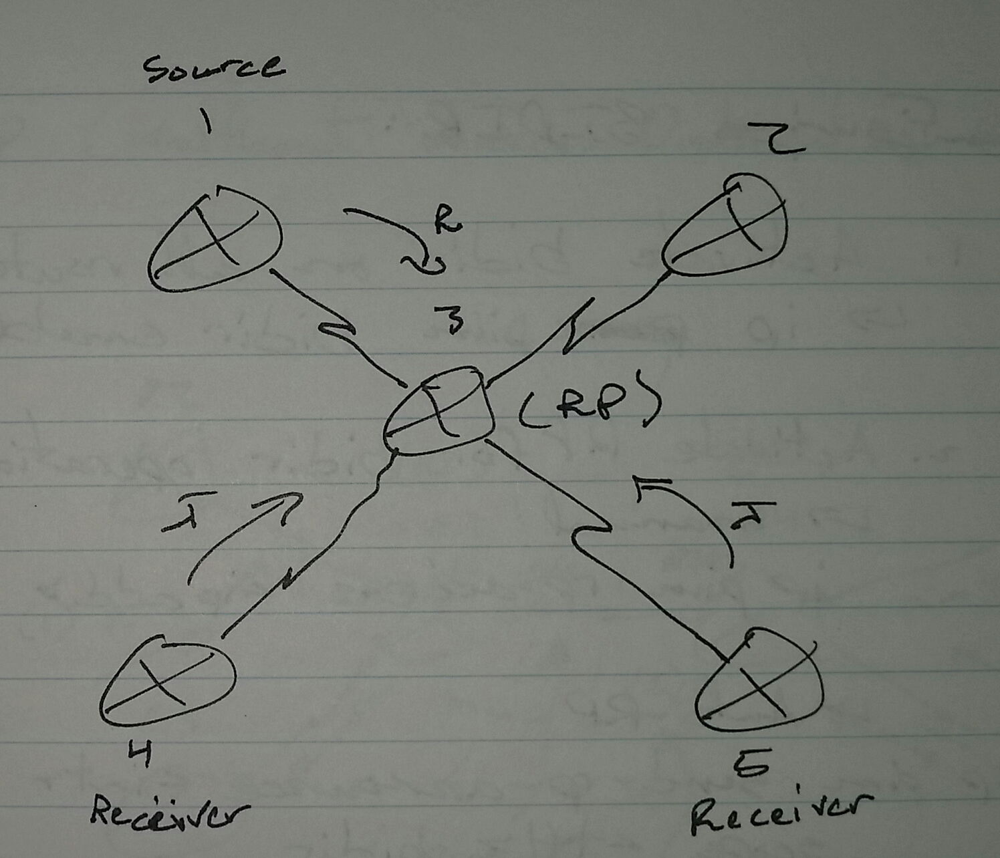

# Multicast Bidirectional PIM - Class Notes

**Multicast Bidirectional PIM** (1 Sept 2014)Lab: Multicast 1 - 4

Sources don't register anymore

 - BIDIR-PIM is a two-way multicast tree which is originated at the RP and goes to all LHRs

 - Sources can start directly sending traffic to the RP without registering

     -> RP will receive the multicast traffic

          -> If there are no receivers, the traffic is dropped

 - The receiver must send (*,g) join messages to the RP

 - After receving the first multicast traffic, the receivers do not try to switch to SPT (s,g)

**Configuring BIDIR-PIM**

 1. Activate BIDIR on all routers

ip pim bidir enable

 2. Activate RP for BIDIR operations

     -> Manual

ip pim rp-address <ip add> bidir

     -> Auto-RP

ip pim send-rp-announce <int> scope <ttl> bidir

     -> BSR - RP

ip pim rp-candidate <int> bidir

sh ip pim rp mapping

sh ip mroute

     -> Will always show (*,g)

 
