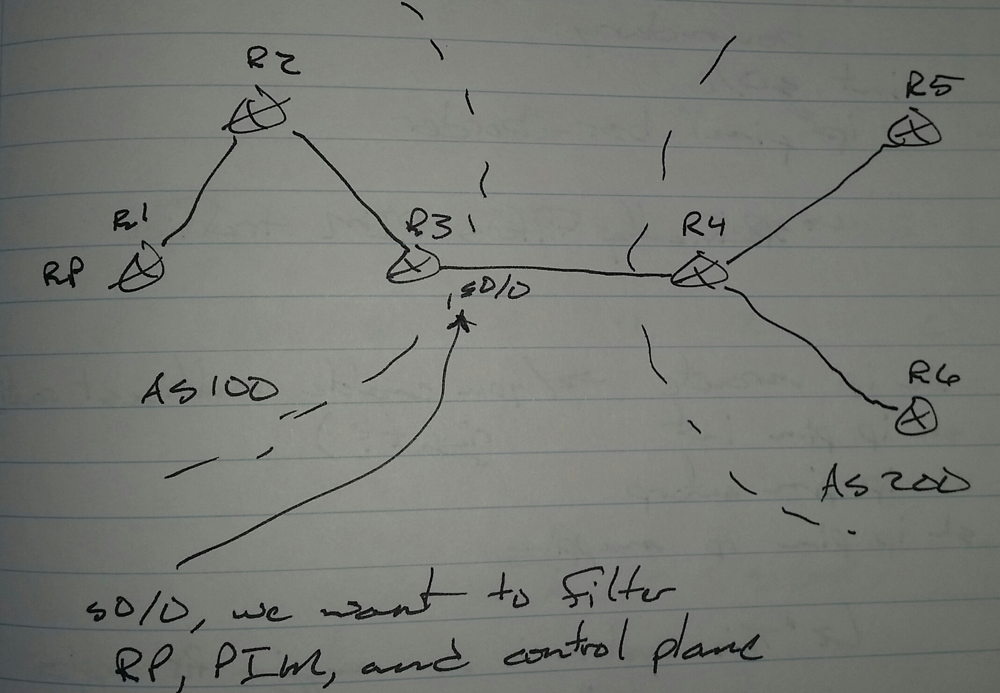

# Multicast Bootstrap Router (BSR) - Class Notes

**Multicast Bootstrap Router (BSR)** (1 Sept 2014)
Lab: Multicast 1 - 4
 - Open standard
 - PIM version 2 messages
 - RP information is distributed by BSR
 - If there are multiple RPs, then priorities are checked
     -> Lower is better
 - If there are multiple BSRs, then higher priority is better
     -> Then higher IP address

**Hask-mask**
 - Sent by BSR
     -> A value between 0 - 32
     -> Default is 0

**Group Address and RP**
 - Value1 = f (Hash and group, RP1)
 - Value2 = f (Hash and group, RP2)

**Configuring RP**

ip pim rp-candidate <int> [group-list <acl>] [interval <sec>] [priority <value>]

**Configuring BSR**
 
ip pim bsr-candidate <int> [interval <sec>] [<hask-mask-length>] [priority <value>]

R2(config)# ip pim rp-candidate lo0

R3(config)# ip pim bsr-candidate lo0

**RP-Announce Filter**
 - Controls which routers can become RPs

Configuring MA

ip pim rp-announce-filter rp-list <acl> [group-list <acl>]

 - rp-list <acl>
     -> Permit - filter the RP
     -> Deny - allow the RP
     -> Reverse logic

**Multicast Data Plane Filtering**

int fa0/0
 ip multicast rate-limit { in | out } [limit <kbps>] [source-list <acl>] group-list <acl>]

**Auto-RP Filtering**
 - On boundary ports to other organizations, RP announce | discovery messages should be filtered and PIM should not be exchanged
     -> But you still may want to allow multicast traffic

R3(config)# int s0/0
 ip multicast boundary <acl> [filter-autorp] [in | out]

 - <acl>
     -> Group for which traffic will be controlled

By default, incoming control plane and outgoing data plane traffic is controlled

Instructor comment, "BSR is better method because is doesn't need dense mode."

**BSR Filtering on Boundary**
 - Specifically filters PIM traffic

int s0/0
 ip pim bsr-boundary

sh ip mroute
     -> You enabled multicast routing, right?
sh ip pim int
sh ip pim autorp
sh ip pim rp mapping
     -> "This system is an RP-mapping agent."
