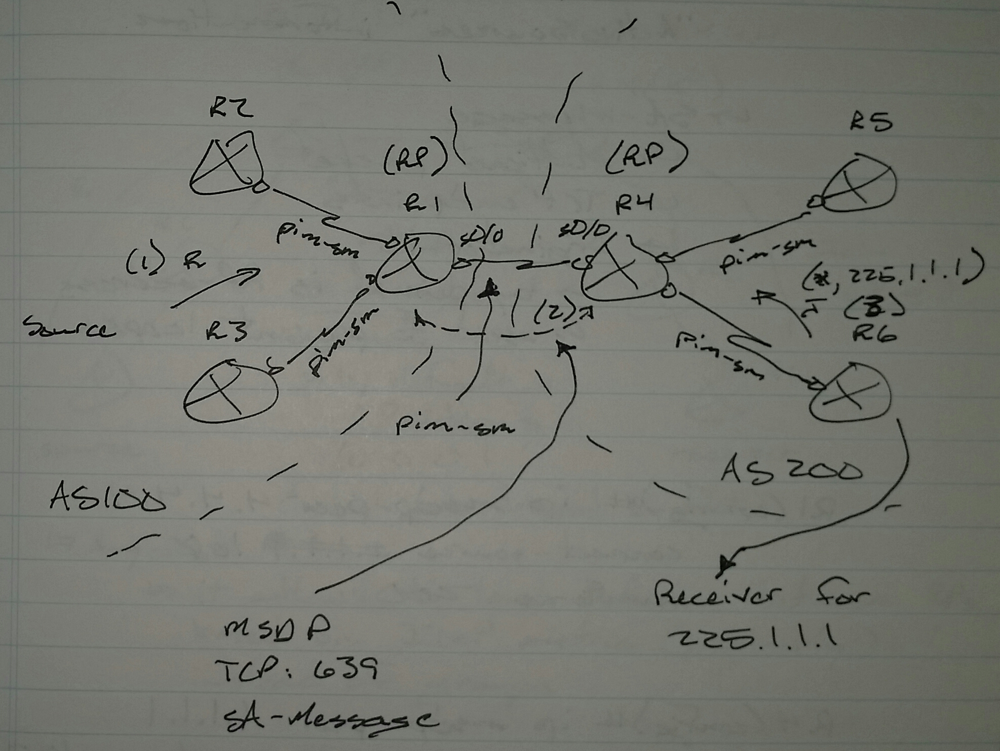

# Multicast Source Distribution Protocol (MSDP) - Class Notes

**Multicast Source Distribution Protocol (MSDP)** (1 Sept 2014)Lab: Multicast 1 - 4

MSDP is a TCP connection between RPs in different ASs to exchange "Active Sources" information

1. R3 sends register message to R1

2. R1 extracts the message and sends a multicast packet to R4 by encapsulating it in a Source-Active (SA) message

3. R4 receives a join message from R6 (*,g)

4. R4 receives SA message containing the first multicast packet

5. R4 sends an (s,g) join message towards R3 and sends the extracted multicast packet to R6

6. R3, upon receiving the join message, starts sending multicast traffic

**SA Message**

 - Multicast packet

 - TCP port 639

 - TCP endpoints

 - Originator-id

     -> By default is the RP address

     -> Used to prevent loops

R1(config)# ip msdp peer 4.4.4.4 connect-source lo0 remote-as 200

R4(config)# ip msdp peer 1.1.1.1 connect-source lo0 remote-as 100

sh ip msdp summary

sh ip msdp peer

sh ip msdp sa-cache

     -> Shows active sources in the other organization

MSDP troubleshooting is a big part of the lab

 - Configuration messed up

 - Configuration missing

 - ACL blocking the source

 - ACL blocking TCP 639
