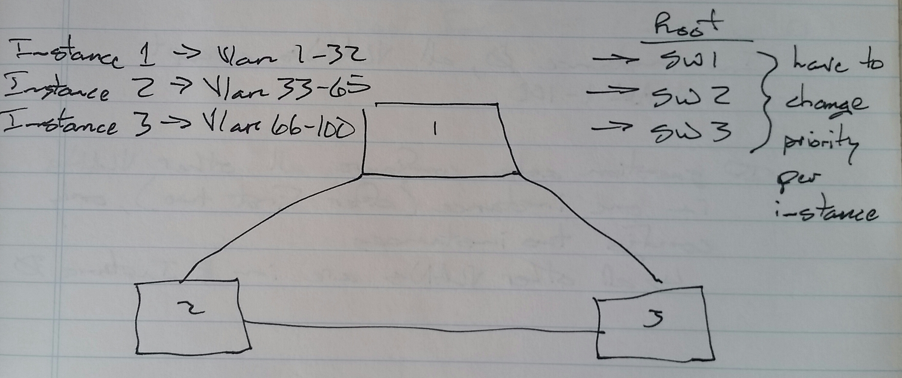
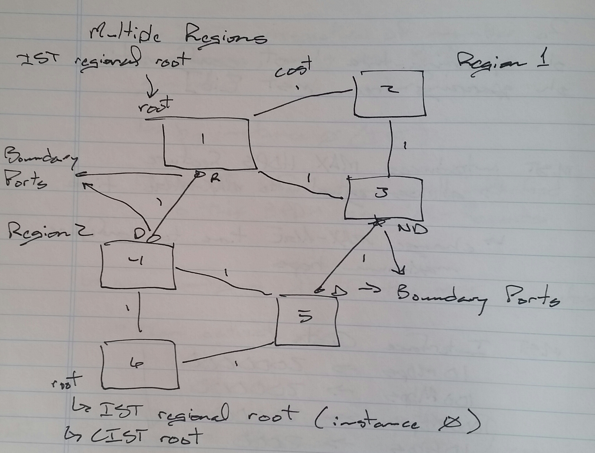
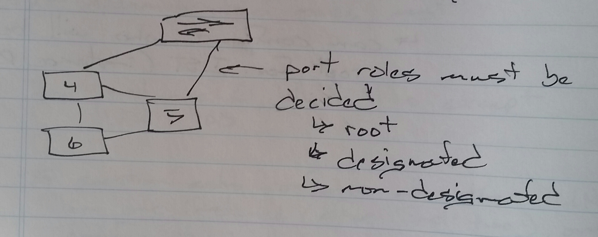
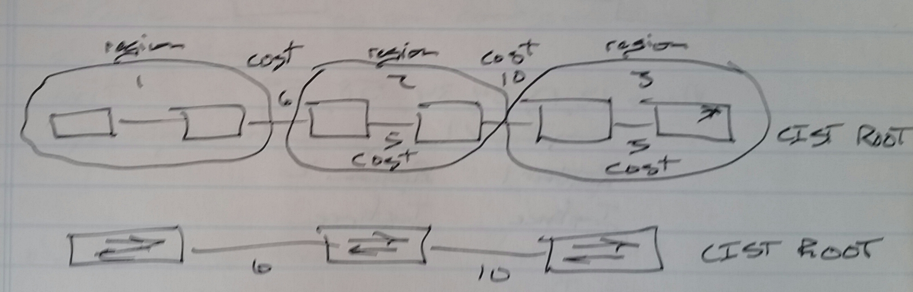
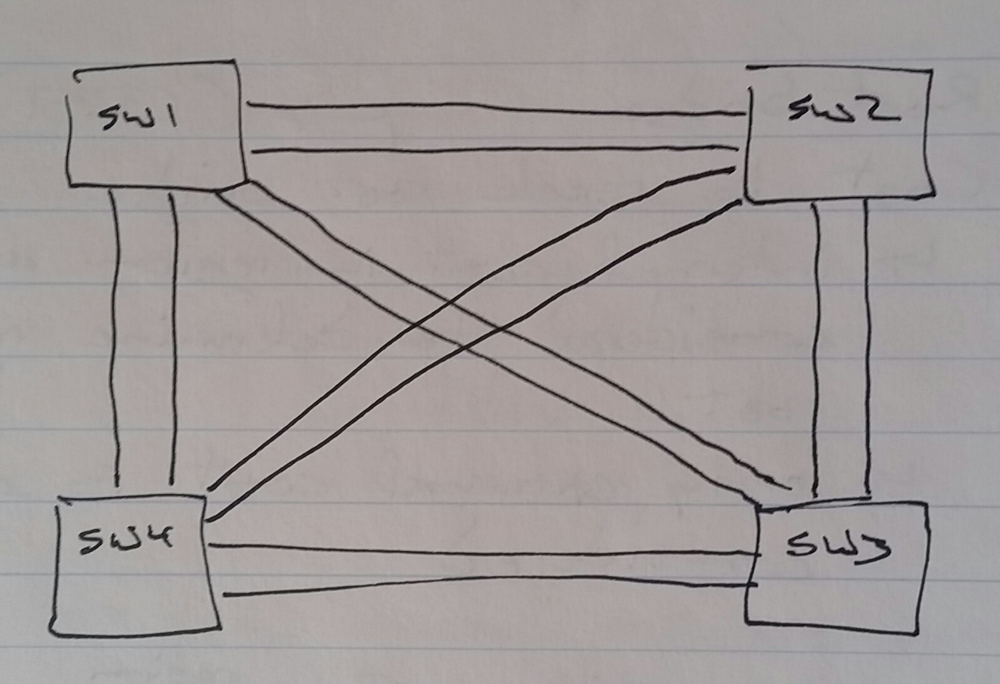
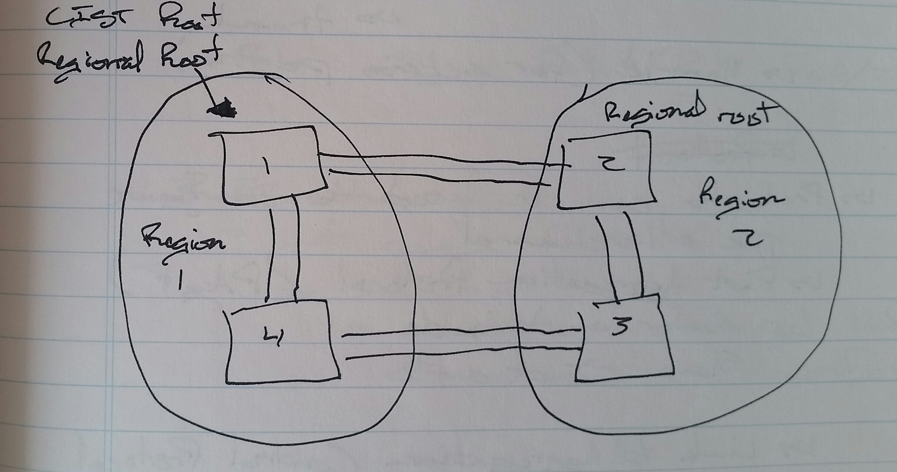

# Multiple Spanning Tree (MST) - Class Notes

**Multiple Spanning Tree (MST)**
 - 802.1S
 - Called MSTP by Cisco previously
 - Can map VLANs to STP instances
     -> e.g. - 
          -> Instance 1
               -> VLAN 1 - 32
          -> Instance 2
               -> VLAN 33 - 65
          -> Instance 3
               -> VLAN 66 - 100
 - Only supports RSTP for convergence
     -> Activated automatically
 - Problem
     -> Every switch needs to be configured the same
          -> Manually
     -> VTP cannot be used
     -> Use notepad
 - MST creates a set of switches using the same configuration
     -> Called a Region
     -> All have the exact same configuration
     -> Allows up to 16 instances per Region
          -> Instance 0 - 15
          -> Instance 0
               -> Internal Spanning Tree (IST)
               -> By default, all VLANs map to IST
 - Every MST configuration has 3 variables
     -> Region name
          -> Default is NULL
     -> Revision number
          -> Default is 0
     -> Instance to VLAN mapping
          -> Default, all VLANs map to IST
 - Configure one switch, then copy that configuration to all other switches
 - Can configure all of the MST parameters, then activate MST
 - Only one BPDU is sent
     -> Controlled by the IST
     -> Specific information about instances attaches as “M-Records"

SW1(config)# spanning-tree mst configuration
SW1(config-mst)# name CISCO
 revision 10
 instance 1 vlan 1 - 32
 instance 2 vlan 33 - 65
 instance 3 vlan 66 - 100
 show pending
 exit
SW1(config)# spanning-tree mode mst

Scenario -> In instance 0, configure all VLANs except VLANs 1 - 100.
 - If the question asks you to configure all other VLANs to one instance (after first two), only configure two instances.
     -> All other VLANs will be in instance 0

show spanning-tree mst configuration
show spanning-tree mst [id]

**MST introduces MAX HOPS feature**
 - Allows equal to MAX-AGE time
 - Change MAX-AGE time to configure the maximum hops

**MST Interface Costs**
 - 10 Mbps —> 2000000
 - 100 Mbps —> 200000
 - 1 Gbps —> 20000
 - 10 Gbps —> 2000

SW1(config)# spanning-tree mst 1 priority 4096

     - or -

SW1(config)# spanning-tree mst 1 root primary

     - or -

SW1(config)# spanning-tree mst 1 root secondary

Can configure who will be the root for IST (instance 0)

Only the IST communicates between Regions
 - Sends a single BPDU
     -> Removes M-Records
          -> This hides the topology of the Region
          -> Similar to the ABR in OSPF
 - One Region appears as a single switch to another Region

**CIST Root**
 - The best Bridge-ID switch among all Regions

**Region Root**
 - Instance 0 root bridge in every Region
 - In any Region, only a boundary switch can be a Region root
     -> Exception, the CIST root is also the Region root and does not have to be a boundary switch
     1.  Root bridge
     2.  Cost to reach root bridge (CIST)
          -> Internal cost within the Region are not considered to determine the Region root
          -> Only external cost is considered
     3.  Sender Bridge-ID
     4.  Sender Port-ID

**Master Port**
 - Root port of any Region
 - On Region root
 - Seen as “master port” by non-IST instances
     -> Going toward the master

show spanning-tree mst 0
 - Shows the root port

show spanning-tree mst 1
 - Show the master port

show run | in mst|name|rev|ins
show spanning-tree mst configuration
 - Should be the same as
     -> show pending
show spanning-tree mst

clear spanning-tree detected-protocols
 - To switch to MST faster

SW1(config)# spanning-tree mode pvst+
no spanning-tree mst configuration
<paste MST configuration from Notepad>
 show pending
 exit
spanning-tree mode mst

SW2# show spanning-tree mst
 E3/0     Root     FWD     Shr Bound (RSTP)

SW3# show spanning-tree mst
 E3/0     Altn     BLK     Shr Bound (RSTP)
 E3/1     Altn     BLK     Shr Bound (RSTP)

SW2# show spanning-tree mst 1
 E3/0     Mstr     FWD     Shr Bound (RSTP)
