# OSPF - Class Notes

`classnotes`

**OSPF -> Open Shortest Path First**

Lab:  OSPF 1, OSPF 2a

- Open standard
- IP protocol 89 

- Multicast addresses

     -> 224.0.0.5 - all routers

     -> 224.0.0.6 - all DR

- Metric is cost

- Link state protocol

- Uses 3 tables

     -> Neighbor table

     -> Database table

     -> Routing table

- SPF algorithm

- Uses Designated Router and Backup Designated Router concept on multiaccess networks

     ->

- Uses concept of areas

- Types of packets

     -> Hello

     -> Database Descriptors (DBD)

     -> Link State Request (LSR)

     -> Link State Update (LSU)

     -> Link State Acknowledgment (LSAck)

**Neighbor formation**

- Hellos are sent to 224.0.0.5

- Hello packet

     -> Router-id (must be unique)

     -> Area-id (must match)

     -> Timers (must match)

          -> hello timer - 10 sec (LAN) | 30 sec (WAN)

          -> dead timer - 40 sec (LAN) | 120 sec (WAN)

     -> Authentication
     -> Network / subnet mask (must match)
     -> MTU (must match)
     -> Number of neighbors in the segment (must match)

**Finite State Machine (FSM)**

1. Down - no hellos sent

2. Attempt - frame-relay or non-broadcast networks where multicast hellos will not work

3. INIT - Hello is sent to 224.0.0.5

4. 2-WAY - Parameters in hello packets match and both routers list each other as neighbors in hello packets

5. EXSTART - Master / Slave election; router-ids are compared (higher is better)

6. EXCHANGE - DBDs are exchanged (header information of the database, not the entire database)

7. Loading - Exchange of database

8. Full - Both routers are completely synchronized

Steps 1 - 4, a basic neighborship is formed

Step 8, fully adjacent neighborship

**Neighborship Control**

- Timers -> 10 / 40

     int fa0/0

          ip ospf hello-interval <sec>

          ip ospf dead-interval <sec>

     sh ip ospf interface

     int fa0/0

          ip ospf dead-interval minimal hello-multiplier <number of hellos>

               -> dead interval set to 1 sec

               -> Hello -> e.g. - 4 times a second, every 250 ms

- Passive interface

     -> multicast hello processing is disabled

     router ospf 1

          passive-interface { default | <int> }

     sh ip protocols

**Manual Neighborship**

- Only allowed on non-broadcast multi-access (NBMA) networks

     router ospf 1

          neighbor <ip address>

**OSPF Authentication**

- 3 types

     -> type 0 - NULL

     -> type 1 - plain text

     -> type 2 - MD5

- Configuration

     -> Interface - connected neighbor must be configured

     -> Area-wide - all routers in the area must be configured

Interface level configuration

- Plain text (type 1)

     int s0/0

          ip ospf authentication

          ip ospf authentication-key <password>

- MD5 (type 2)

     int s0/0

          ip ospf authentication

          ip ospf message-digest-key <id> md5 <password>

Area Wide Authentication

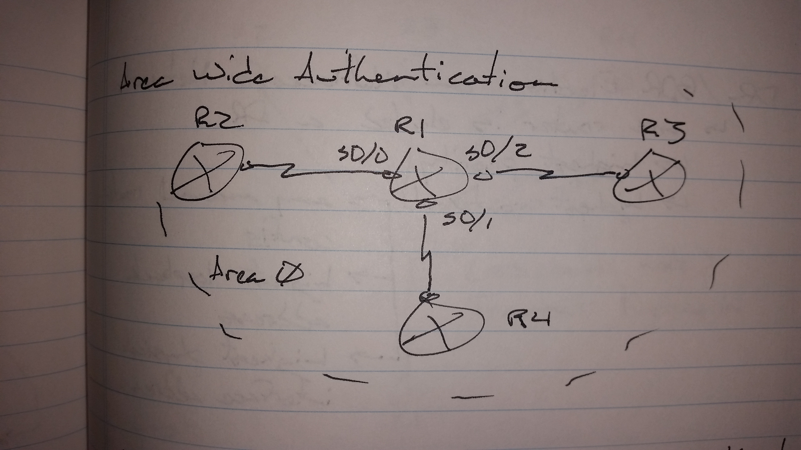

Scenario -> Configure area wide authentication on R1 for area 0, but R2 is not configured for authentication, so skip s0/0 of R1.

R1(config)# router ospf 1

area 0 authentication

     -> all interfaces must now use authentication

int s0/1

  ip ospf authentication-key <password>

int s0/2

  ip ospf authentication-key <password>

int s0/0

  ip ospf authentication NULL

Interface configuration is preferred over area wide authentication

Virtual-links are a special case with authentication and commonly comes up in the lab

**DR / BDR Election on multi-access networks**

- One router is elected the DR

     -> highest priority

     -> highest router-id

          -> any manual router-id config

          -> highest loopback address

          -> highest physical interface address

- Another router which is second best is elected the BDR

- All routers for a fully adjacent neighborship with the DR and BDR

     -> 2-WAY neighborship is formed with all other routers

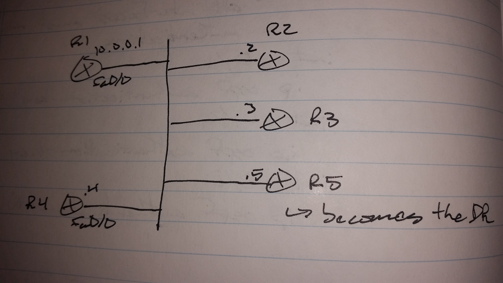

SPF is a point-to-point protocol

- It doesn't work on multi-access networks

- DR becomes a pseudo node to create a logical point-to-point network

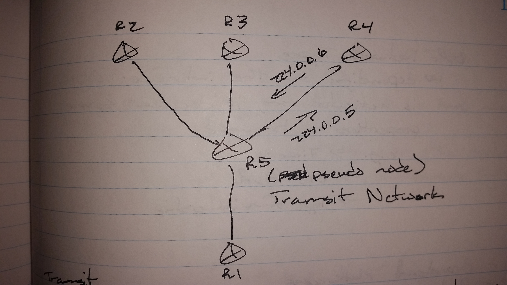

Transit network means you have to go through the pseudo node

R3# sh ip ospf nei

     R1      2-way / DROTHERS

     R2      2-way / DROTHERS

     R4      Full / BDR

     R5      Full / DR

Changing Priority

     int fa0/0

          ip ospf priority <number>

               -> 0 - 255 (higher is better)

               -> 0 - no participation in election

               -> 1 - default priority

**OSPF Network Types**

- Depending on the interface OSPF is activated on, it decides some properties to be used

     -> Timers

     -> DR / BDR

     -> Type of neighborship

1. Broadcast Multi-access

2. Point-to-point

3. Non-broadcast Multi-access (NBMA)

4. Point-to-multipoint

5. Point-to-multipoint Non-broadcast

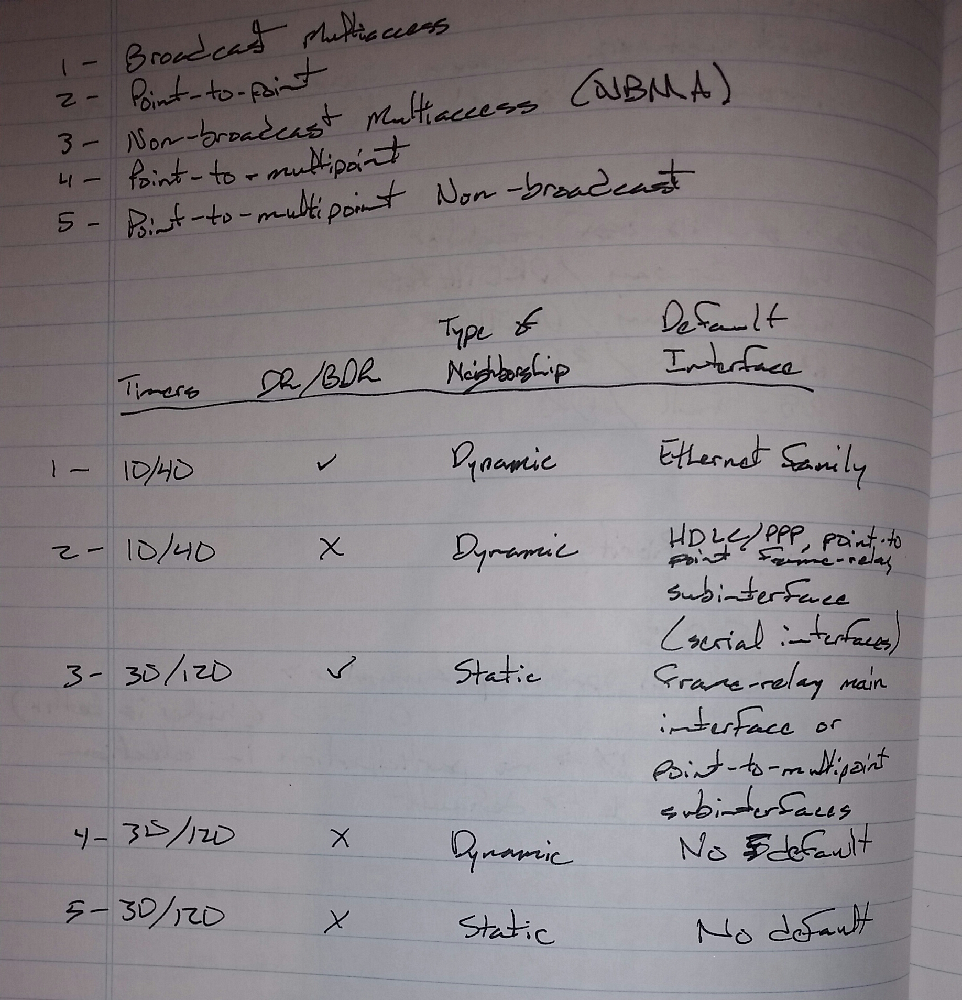

Frame-relay default to NBMA

- When it is setup as a hub and spoke

     -> If a spoke is elected DR, the other spokes will not be able to communicate with the DR

int s0/0

     ip ospf network <options>

sh ip ospf database

     -> shows database header information

**Link State Update (LSU)**

- A set of LSAs (Link State Advertisements)

     -> LSA 1 - Router LSA

          -> LSA-ID - router-id

          -> neighbors connected to a router

          -> networks connected to a router

     -> LSA 2 - Network LSA

          -> LSA-ID - IP address of DR

          -> Information about transit network ( DR / BDR / DROTHERS )

          -> Originated by DR

     -> LSA 3 - Summary LSA

          -> LSA-ID - for every network in the other area

          -> Created by ABR

          -> Cost to reach network from the ABR

     -> LSA 4 - ASBR Summary

          -> LSA-ID - router-id of ASBR

          -> Contains cost of ABR to reach ASBR

     -> LSA 5 - AS-External

          -> LSA-ID - external networks

          -> Created by ASBR

          -> Cost of ASBR to reach external networks

     -> LSA 7 - Not-so-stubby-area (NSSA)

          -> LSA-ID - external network

          -> Created by ASBR

          -> Cost of ASBR to reach external networks

sh ip ospf database <LSA type>

     - router

     - network

     - summary

     - asbr-summary

     - as-external

     - nsaa-external

**OSPF Cost Calculation**

- Cumulative cost of all exit interfaces towards destination

Cost of serial ethernet = 100 / 1.544 = 64

Cost of fast ethernet = 100 / 100 = 1

Cost of gigabit ethernet = 100 / 1000 = 1

Fast ethernet and Gigabit ethernet having the same cost is not a good thing

On the exam, if you see Gigabit ethernet interfaces, you may need to change the formula

     router ospf 1

          auto-cost reference-bandwidth <Mbps>

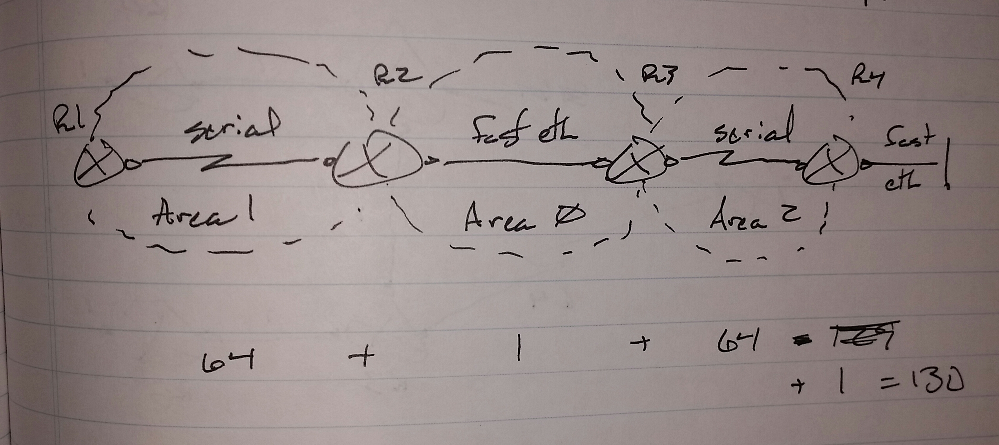

R3# sh ip ospf database route 4.4.4.4

     -> shows the cost to R4's connected network from R4's point of view

The change cost

     -> bandwidth manipulation

     int s0/0

          bandwidth 2000

     int s0/0

          ip ospf cost < 1 - 65535 >

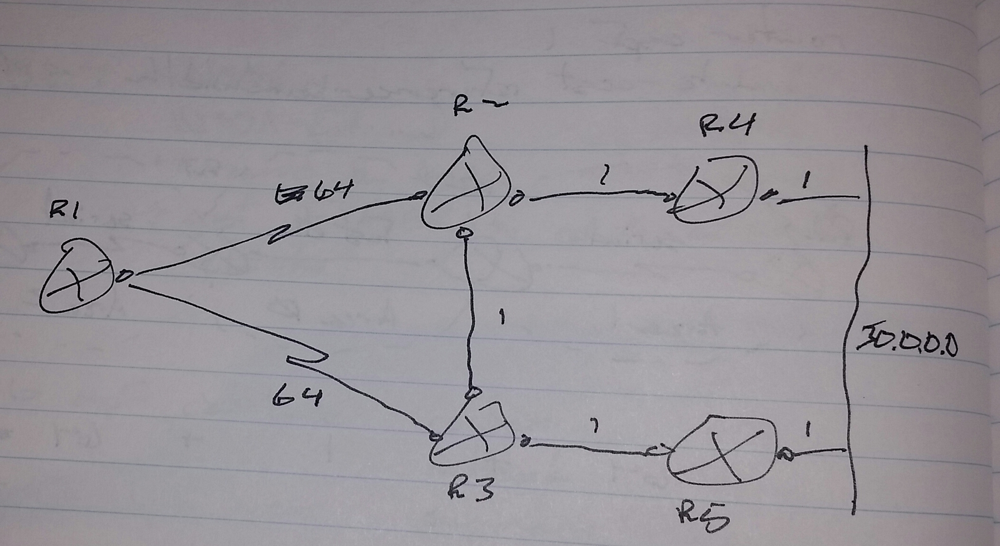

R1 to 50.0.0.0

- Route #1 - R1 -> R2 -> R4 -> 50.0.0.0 = cost of 66

- Route #2 - R1 -> R3 -> R5 -> 50.0.0.0 = cost of 66

Scenario -> Change the cost in this diagram in such a way that R1 goes to 50.0.0.0 by following the route R1 -> R2 -> R3 -> R5 -> 50.0.0.0

When asked a question about traffic engineering, always start at the end

     -> R2's link to R4 - ip ospf cost 3

     -> R1's link to R3 - ip ospf cost 67

**OSPF Summarization**

- Can be done on Area Border (ABR)

- Can be done on Domain Border (ASBR)

     -> border between routing protocols

-You cannot summarize within an area
     -> That would defeat the point of SPF
 - summary-address
     -> Used for external networks
 - area <num> range
     -> Used for inter-area networks

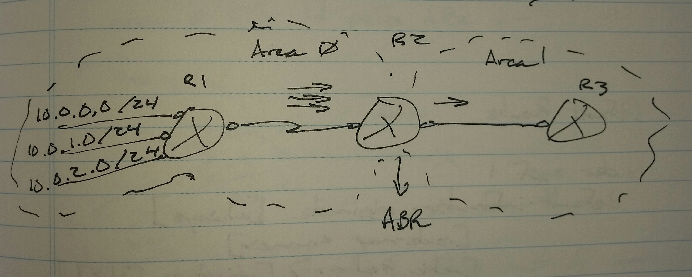

R2(config)# router ospf 1

area <source area> range <network> <subnet>

router ospf 1

area 0 range 10.0.0.0 255.255.252.0

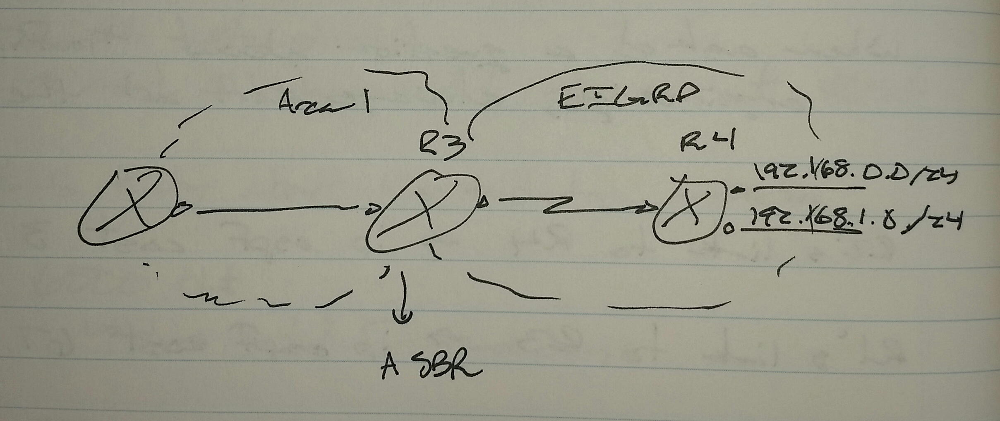

R3(config)# router ospf 1

redistribute eigrp 1 subnets

summary-address 192.168.0.0 255.255.254.0

**Default Route**

router ospf 1

default-information originate [always] [router-map <name>] [metric <value>] [metric-type [1|2]]

     -> always

          ->without this keyword, the local router needs a default route in the routing table

          -> with this keyword, the default route is injected regardless of a default route being represent in the local routing table

     -> metric - default is 1

**OSPF Filtering**

- Filtering is only possible on Area Borders

router ospf 1

area <number> filter-list prefix <name> in | out

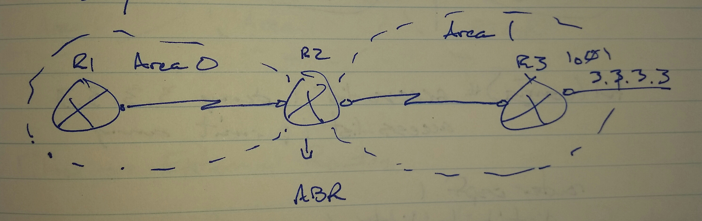

Scenario -> Filter lo0 of R3 from Area 0

R2(config)# ip prefix-list ABC deny 3.3.3.3 255.255.255.255

ip prefix-list ABC permit 0.0.0.0 0.0.0.0 le 32

router ospf 1

area 0 filter-list prefix ABC in

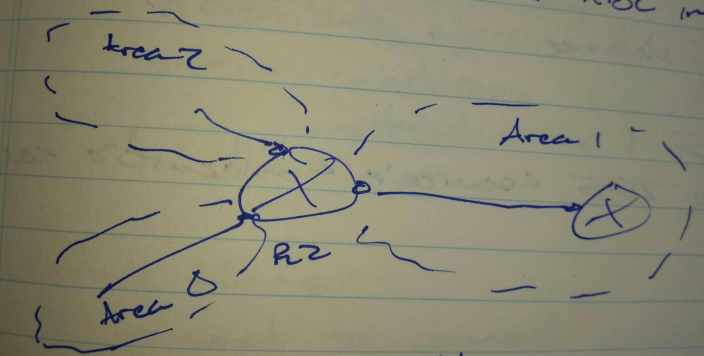

It's preferable to filter out of an area when multiple areas are present

- Filtering coming into an area does not stop the router from entering the database table

     -> it can be filtered and prevented from entering the routing table

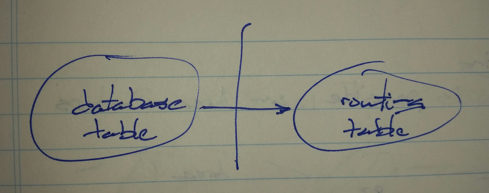

R1(config)# access-list 1 deny 3.3.3.3

access-list 1 permit any

router ospf 1

distribute-list 1 in

Not a good method;  it can cause problems, but will likely come up in the exam

- A static route pointing to NULL0 is much better, but static routes are heavily frowned upon in the exam

**Filtering by Distance**

router ospf 1

distance 255 <source> <wildcard> <acl>

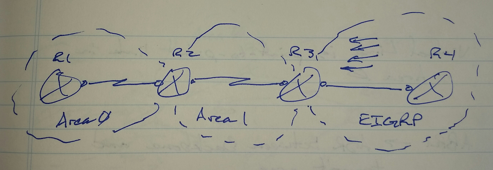

**Filtering External Routes**

Scenario -> R3 is redistributing the following routes from EIGRP

     - 10.0.0.0 /24

     - 10.0.1.0 /24

     - 10.0.2.0 /24

     - 10.0.3.0 /24

          -> Filer 10.0.0.0 and 10.0.1.0 when redistributing

R3(config)# router ospf 1

redistribute eigrp 1 subnets

summary-address 10.0.0.0 255.255.254.0 not-advertise

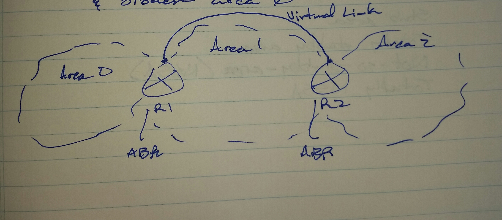

**Virtual Links**

- Used to connect discontiguous areas and broken area 0

- A virtual link is a point-to-point link in area 0

ABR1 - ABR between backbone and transit area

ABR2 - ABR between transit area and discontiguous area

ABR1 | ABR2

router ospf 1

area <transit area> virtual-link <router-id of other ABR>

R1(config)# router ospf 1

area 1 virtual-link 2.2.2.2

R2(config)# rotuer ospf 1

area 1 virtual-link 1.1.1.1

sh ip ospf interface

**Stub Areas**

- Stub area

- Totally stubby area

- Not-so-stubby-area (NSSA)

- Totally NSSA

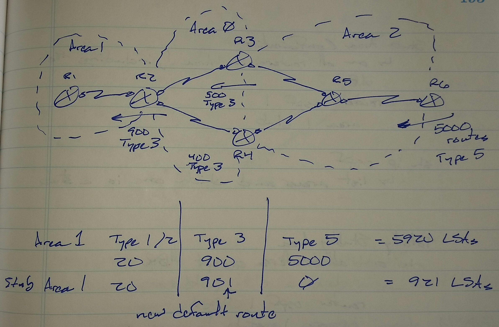

Stub area

- Does not allow type 5 routes into the area

- All external routes (type 5) are filtered by ABR and replaced with one type 3 default route

Totally stubby area

- Do not allow type 3 or type 5 routes into the area

- Replaced with a type 3 default route

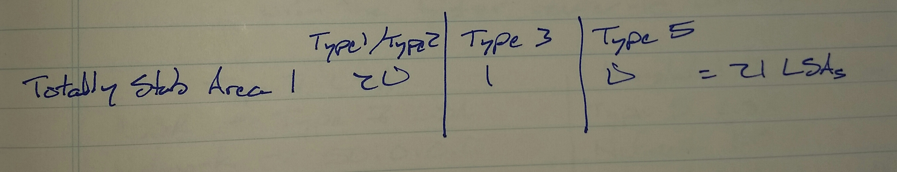

**Stub Area Configuration**

- On all routers in area 1, including the ABR

router ospf 1

area 1 stub

sh ip ospf

- lists areas and which ones are stubs

**Totally Subby Area Configuration**

- On all routers in the area except the ABR

router ospf 1

area 1 stub

- On ABR

router ospf 1

area 1 stub no-summary

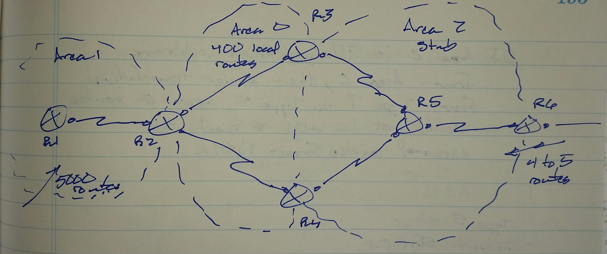

NSSA

- Stub area with redistribution possible

- It's a stub area with an ASBR

- External routes created inside the NSSA are type 7

     -> Because type 5 LSAs are not allowed in stub areas

- When type 7 LSAs reach an ABR between the NSSA and area 0, the LSAs are translated to type 5 LSAs by a "translator ABR"

- If multiple ABRs are present, there will be a translator election and the one with the highest router-id wins

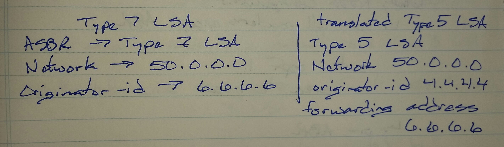

If area 2 is filtering R6's address from area 0, then after translation from type 7 to type 5, area 0 routes would not be able to reach the external routers from the NSSA

type 5

network 50.0.0.0

originator-id 4.4.4.4

forwarding address 6.6.6.6 -> 0.0.0.0

     -> forwarding address would need to be suppressed when translated from type 7 to type 5

**NSSA Configuration**

- On all routers in the area, including the ABR

router ospf 1

area 2 nssa

**Totally NSSA Configuration**

- On all routers in the area, except the ABR

router ospf 1

area 2 nssa

- On the ABR

router ospf 1

area 2 nssa no-summary

To suppress forwarding address on translator ABR

router ospf 1

area 2 nssa translate type 7 supress-fa

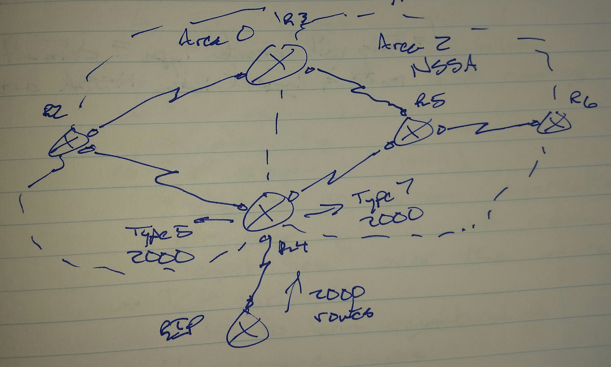

no-redistribution
 - When no-redistribution is done, it will normally create type 5 and type 7 LSAs
 - By using the keyword "no-redistribution", the ABR is instructed not to generate type 7 LSAs

R4(config)# router ospf 1
 area 2 nssa no-redistribution
     -> Stub area - injects a default router type 3 LSA
     -> Totally stubby area - injects a default route type 3 LSA
     -> NSSA - no default route is injected
     -> Totally NSSA - default router type 3 LSA

To inject a default router in a NSSA

router ospf 1
 area 2 nssa default-information-originate
     -> This will create a type 7 default route be injected into the NSSA
