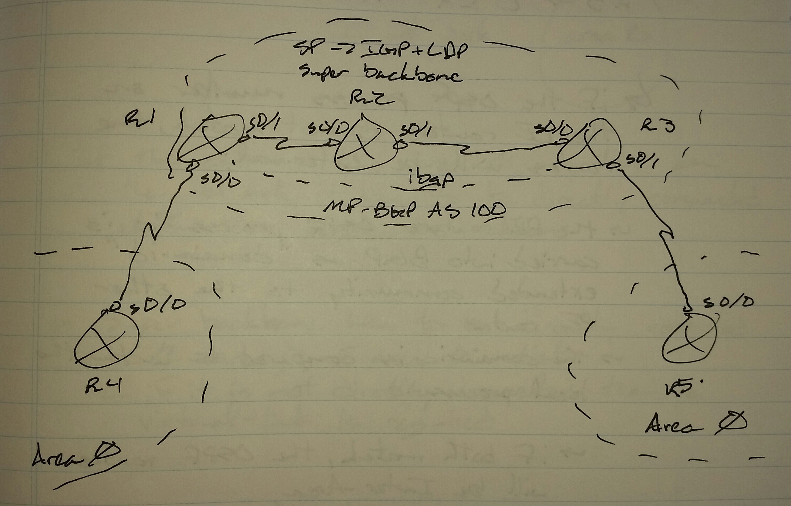
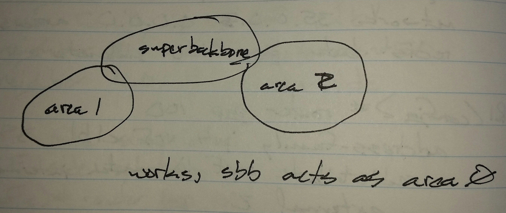
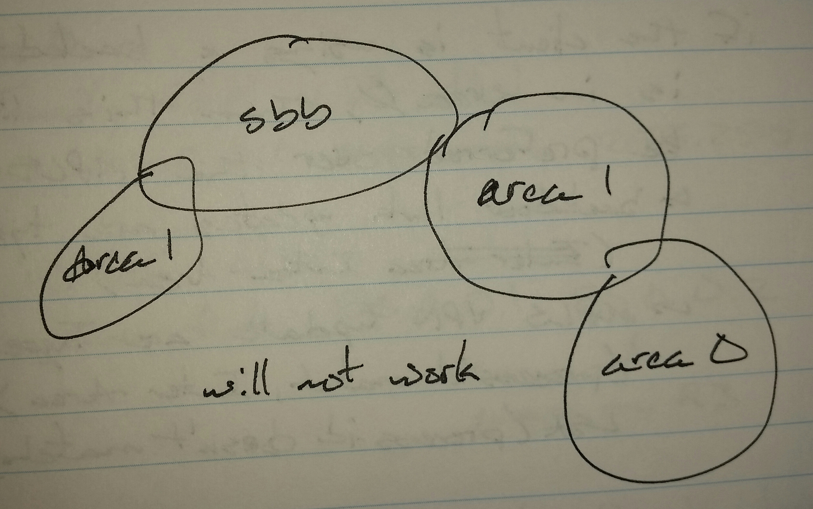

# OSPF as the PE - CE Protocol - Class Notes

**OSPF as the PE - CE Protocol** (3 Sept 2014)

Lab:  MPLS 1 - 3

Configuration assumes IGP + LDP is complete, MP-BGP is complete, and CE IGP is complete

R1(config)# router ospf 10 vrf c1b1

 network 14.0.0.1 0.0.0.0 area 0

 redistribute bgp 100 subnets

R3(config)# router ospf 10 vrf c1b2

 network 35.0.0.3 0.0.0.0 area 0

 redistribute bgp 100 subnets

R1(config)# router bgp 100

 address-family ipv4 vrf c1b1

  redistribute ospf 100 match internal external 1 external 2

R3(config)# router bgp 100

 address-familty ipv4 vrf c1b2

  redistribute ospf 10 match internal external 1 external 2

sh ip route

 On R4 -> O IA 5.5.5.5

 On R5 -> O IA 4.4.4.4

If the OSPF process number on the CE routers do not match, the routes will be external.

 - The PE router's OSPF process-id is carried into BGP as the "domain-id" extended community to the other PE router

 - The domain-id is compared with the local process-id

     -> If they match, the OSPF routes will be Inter-Area

     -> If the do not match, the OSPF routes will be external (E2)

The PE network acts as a super backbone area for the customer's OSPF.

Instructor comment, "The super backbone is like a higher, more intellignt area 0."

If the customer has area 0 anywhere on the network, it has to be directly connected with the super backbone

     -> If area 0 is not directly connected with the super backbone, virtual-links are required
