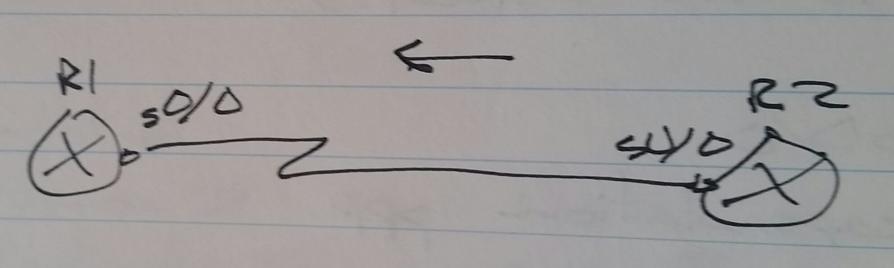

# Point-to-Point Protocol (PPP) - Class Notes

**Point-to-Point Protocol (PPP)**

R1(config)# int s0/0

 encapsulation ppp

On the exam, they will always ask for authentication

**Authentication**

 - Password Authentication Protocol (PAP)

     -> Plain text

     -> One way or two way

     -> One time authentication

 - Challenge Handshake Authentication Protocol (CHAP)

     -> Encrypted

     -> Periodic authentication

**PPP Authentication**

 - Server / Client authentication

     -> Server (authenticator) authenticates by comparing received credentials with the security database

     -> Client (authenticated) sends credentials to be authenticated

R1(config)# username R2 password CISCO

int s0/0

 encapsulation ppp

 ppp authentication pap

R2(config)# int s0/0

 encapsulation ppp

 ppp pap sent-username R2 password CISCO

**CHAP**

R1(config)# username R2 password CISCO

int s0/0

 encapsulation

 ppp authentication chap

R2(config)# int s0/0

 encapsulation

 ppp chap hostname R2

     -> sent as username

 ppp chap password CISCO

 - If the ppp chap hostname is not configured, the router hostname will be sent as the username

**Mutual Authentication**

R1(config)# username R1 password CISCO

int s0/0

 encapsulation ppp

 ppp authentication chap

R2(config)# username R2 password CISCO

int s0/0

 encapsulation ppp

 ppp authentication chap

**Multi Link Point-to-Point Protocol (MLPPP)**

R1(config)# int s0/0

 encapsulation ppp

 ppp multilink

 ppp multilink group 1

int s0/1

 encapsulation ppp

 ppp multilink

 ppp multilink group 1

int multilink1

 ip address 10.0.0.1 255.255.255.0

 ppp multilink

 ppp multilink group 1

In IOS 12.4, the multilink interface number has to match the group number

**Load-balancing**

 - Frame level

 - Divided equally

 - Should be used on high end routers

show ppp multilink
show int multilink1

**Verification**

sh ppp int <int>
sh ppp all
sh int <int>
ping <ip address>
