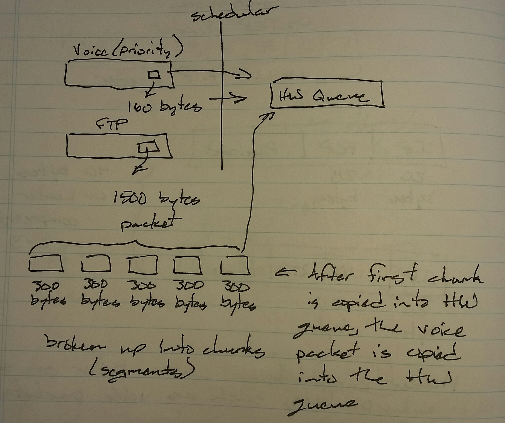

# QoS Link Fragmentation and Interleaving (LFI) - Class Notes

**QoS Link Fragmentation and Interleaving (LFI)** (4 Sept 2014)

Lab: QoS 1

Time in ms taken to send packet segment to hardware queue

 - Fragment delay

Fragment delay = fragment size / clock rate in ms

LFI can only be configured on frame-relay or PPP multilink scenarios

int multilink1

 ip add <ip add>

 ppp multilink

 ppp multilink group 1

 ppp multilink interleave

 ppp multilink fragment-delay <ms>
