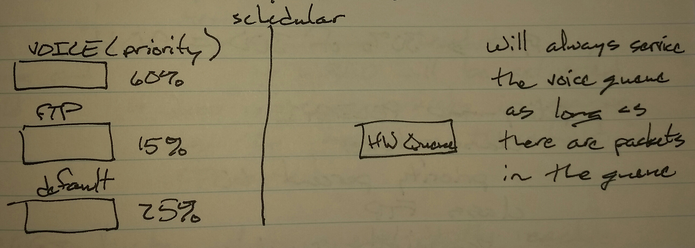

# QoS Low Latency Queueing (LLQ) - Class Notes

**QoS Low Latency Queueing (LLQ)** (4 Sept 2014)Lab: QoS 1

polciy-map POLICY1

 class VOICE

  priority percent 60

 class FTP

  bandwidth percent 15

**Priority**

 - Bandwidth is the minimum guaranteed, but it is also the maximum limit

     -> Above this limit, traffic will be dropped

Between priority and bandwidth, the format can be mixed

class VOICE

 priority percent 60

class FTP

 bandwidth 300

**Remaining Percent**

 - e.g. - Voice -> 60% of bandwidth

              FTP -> 30% of the remaining bandwidth

 - Remaining bandwidth = Actual BW - (any priority bandwidth + class-default bandwidth)

 - 200 - ( 1200 + 500 ) = 300 kbps

policy-map POLICY1

 class VOICE

  priority percent 60

 class FTP

  bandwidth remaining-percent 30
