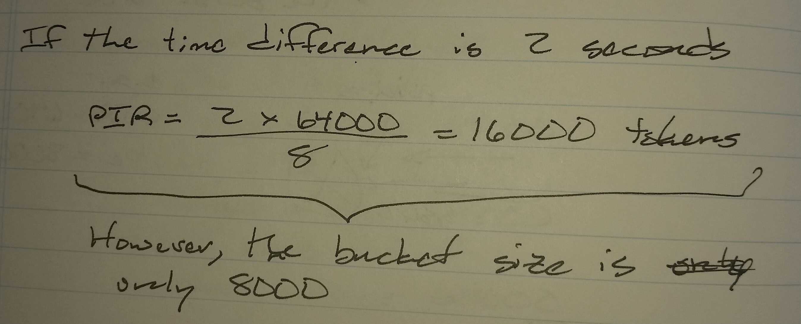
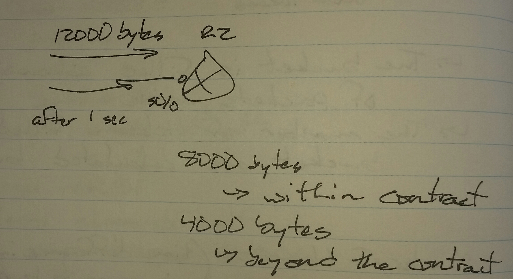

# QoS Shaping and Policing - Class Notes - Part 2

- Note: Split on 7 April 2024, because the original export was 32 MB in size. Github file size limit is 25 MB.

**Policing**

 - Punishing the traffic to enforce the service level agreement

     -> Traffic rate

          -> To control the incoming traffic rate

               -> Called metering

          -> 1 token = 1 byte

          -> b sub c = bucket size

               -> The burst size

The bucket is filled when the burst of packets arrive

The number of tokens filled in the bucket are calculated by a formula

The faster traffic is sent, the less traffic can be sent

The slower traffic is sent, the more traffic can be sent

Conforming rate

 - within the contract

Exceeding rate

 - beyond the contract

Violating rate

 - way beyond the contract

When a single bucket is used, it is called single rate, two bucket policing

 - Single rate = CIR

 - Colors = actions

     -> Conform

     -> Exceed

**Actions**

 - drop

 - transmit

 - set-dscp-transmit <dscp>

 - set-precedence-transmit <precedence>

 - set-frde-transmit

     -> Frame-Relay Discard Eligible (FRDE)

policy-map <name>

 class <name>

  police <cir> <b sub c> conform-action <action> exceed-action <action>

When two buckets are used, it is called single rate, three colors

 - Single rate = CIR

 - Colors = actions

     -> Conform

     -> Exceed

     -> Violate

18000 bytes

 - First 8000 bytes use b sub c tokens

     -> Conforming

 - Second 8000 bytes use b sub e tokens

     -> Exceeding

 - last 2000 bytes are dropped

     -> Violating

policy-map <name>

 class <name>

  police 64000 8000 8000 confirm-action transmit exceed-action set-dscp-transmit 0 violate-action drop

     -> 64000 - bps

     -> 8000 - bytes

     -> 8000 - bytes

When two buckets and two rates are used, it is called dual rate, three color policing

Ratio = CIR * PIR

b sub c and b sub e buckets are filled

 - b sub c tokens are used to send the first 8000 bytes

 - For every b sub c token used, one token will be removed from the b sub e bucket

 - b sub e tokens are used to send the next 8000 bytes

 - The last 2000 bytes are violating

policy-map <name>

 class <name>

  police cir <value> bc <value> pir <value> be <value> conform-action transmit exceed-action set-dscp-transmit AF11 violate-action drop
