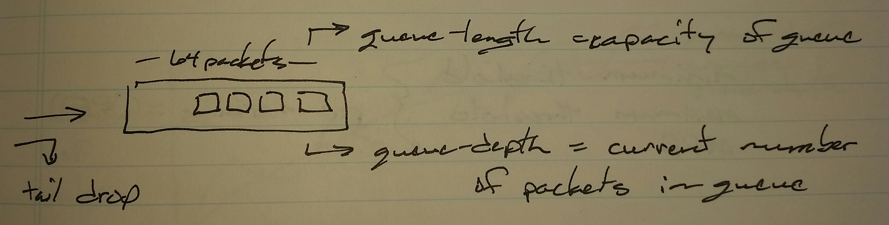
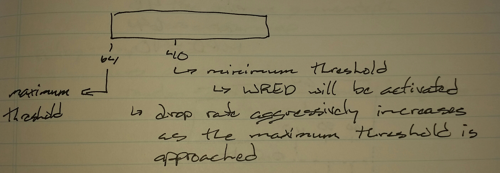
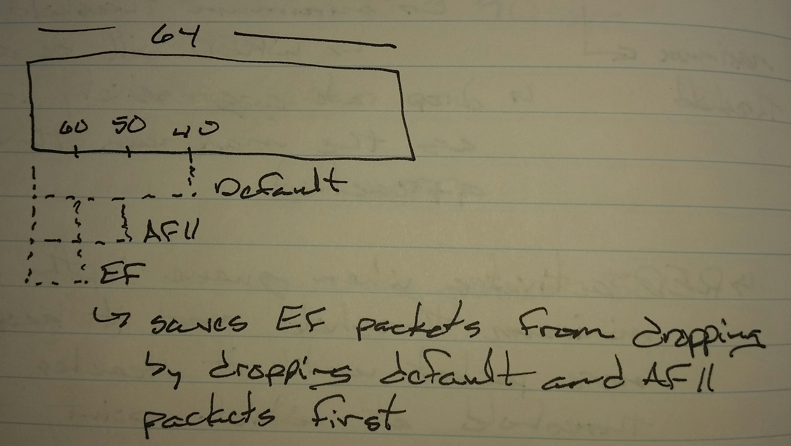
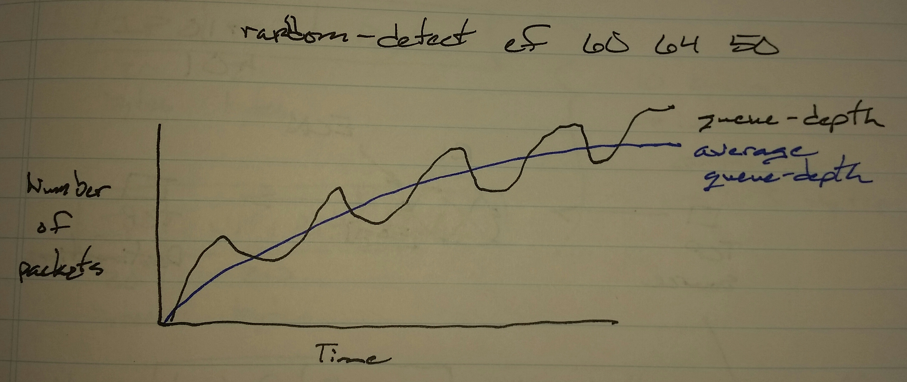

# QoS Weighted Random Early Detection (WRED) - Class Notes

**QoS Weighted Random Early Detection (WRED)** (4 Sept 2014)

Lab: QoS 1

**Congestion Avoidance**

 - Avoiding tail drop

 - WRED

 - Explicit Congestion Notification (ECN)

To avoid tail drop, the incoming packet rate of the packets needs to be lowered

 - Pick random TCP packets to drop

     -> TCP window of the sending and receiving endpoints will be reduced

          -> Lowers the sending rate

          -> Congestion Window Size (CWND)

     -> Packets within the queue are dropped when the queue is almost full

RED Activates when queue-depth reaches minimum threshold and it keeps dropping more packets until it reaches maximum threshold, at which point tail drops start

The maximum percentage of packets dropped just maximum queue threshold is reached is called the Mark Probability Dnominator

max percent = 1 / MPD

WRED

 - Per marking

     -> Minimum threshold

     -> Maximum threshold

     -> MPD

Scenario

 - Drop DSCP EF packets only when

     -> min threshold = 60

     -> max threshold = 64

     -> MPD = 50

 - Drop AF11 packets only when

     -> min threshold = 50

     -> max threshold = 64

     -> MPD = 20

 - Drop everything else when

     -> min threshold = 40

     -> max threshold = 64

     -> MPD = 10

policy-map POLICY1

 class class-default

  random-detect

  random-detect { dscp-based | precedence-based }

  random-detect { dscp | precednce } <min> <max> <mpd>

policy-map POLICY1

 class class-default

  random-detect

  random-detect dscp-based

  random-detect dscp ef 60 64 40

  random-detect af11 50 64 20

  random-detect default 40 64 10

**Exponential Weighting Constant**

 - The average queue-depth is calculated by using an exponential weighting constant which by default is 9

     -> A higher value means slower changes to the average queue-depth

     -> A lower value means faster changes to the average queue-depth

     -> Per class-map

policy-map POLICY1

 class class-default

  random-detect exponential-weighting-constant <value>
