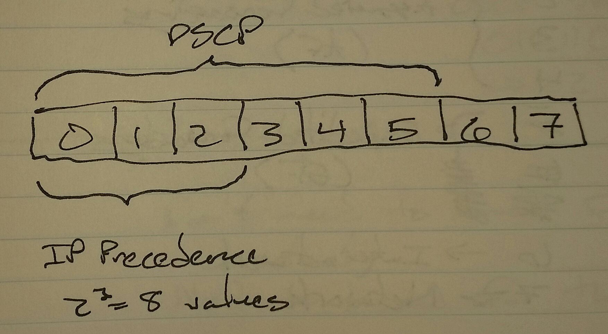
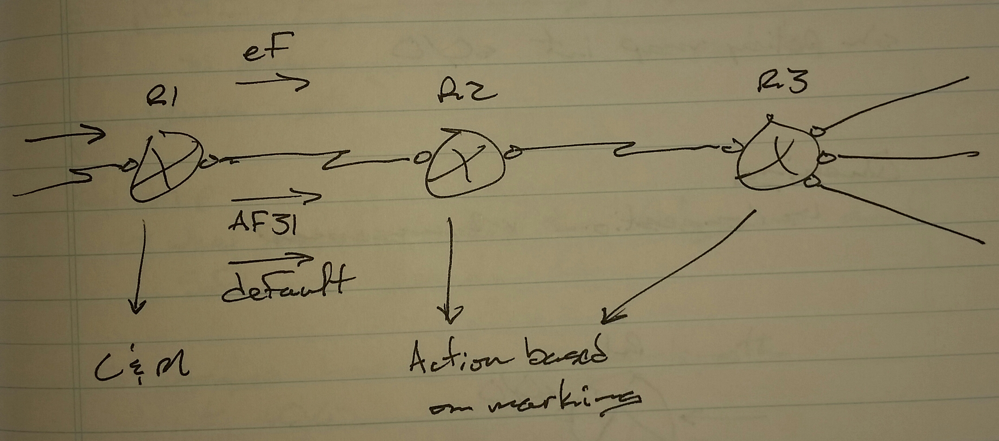

# Quality of Service (QoS) - Class Notes

**Quality of Service (QoS)** (4 Sept 2014)

Lab: QoS 1

 - Managed unfairness

 - Problem with QoS is you will not see any results unless there is traffic congestion

     -> It's hard to generate a variety of different types of traffic

     -> During the lab, they are not expecting to you to generate traffic to verify the configuration

     -> They will only verify your configuration

Instructor comment, "Bandwidth and sex, there is never enough."

Bandwidth

     -> Traffic rate (width of the pipe)

Propagation Delay

     -> The time is takes to get from point A to point B (length of the pipe)

Serialization Delay

     -> The time it takes to send traffic from the interface to the media

     -> Delay = Amount of data / clock rate

          -> Clock rate of the interface

Jitter

     -> Variance in delay

**QoS Architecture**

 - Integrated QoS

     -> End-to-end QoS

 - Differential Service QoS

     -> Per-hop QoS

**Integrated Services QoS**

**Resource Reservation Protocol (RSVP)**

 - Path message set to destination and waits for a reservation message response before sending traffic

 - If any router disagrees with Path, it will be dropped and no traffic will be sent

**Diff Serv**

 - The first hop router will mark the important traffic and hope that other routers agrees with the markings

 - Mark the traffic and hope for the best

 - Per hop behavior (PHB)

**Differential Service**

 - Marking of packet

     -> Layer 3

          -> IP header

          -> IP Precedence / Differential Service Code Point (DSCP)

     -> Layer 2

          -> Frame header

          -> Class of Service (CoS)

               -> 802.1q tag

IP Header

 - 8 bit field called Type of Service (ToS)

**IP Precedence (IPP)**

 - Higher is better

     -> 0 - Routine

     -> 1 - Priority

          -> Data

     -> 2 - Immediate

          -> Video signaling

     -> 3 - Flash

          -> Voice signaling

     -> 4 - Flash Override

          -> Video stream

     -> 5 - Critical

          -> Voice stream

     -> 6 - Internetwork

          -> Management protocol

     -> 7 - Network

          -> Management protocol

**Priority Values**

     -> 0 - Default

     -> 1 - Assured Forwarding (AF)

     -> 2 - Assured Forwarding (AF)

     -> 3 - Assured Forwarding (AF)

     -> 4 - Assured Forwarding (AF)

     -> 5 - Expedited Forwarding (EF)

     -> 6 - Internetwork

     -> 7 - Network

**Drop Precedence**

 - Only works with AF

 - 2^2 = 4 Drop Precedence Values

     -> 0 0 = 0 -> Never used

     -> 0 1 = 1

     -> 1 0 = 2

     -> 1 1 = 3

AF X Y

 - X - Priority Value

     -> Higher is better

 - Y - Drop Precedence

     -> Lower is better

AF1     ->     AF11     AF12     AF13

AF2     ->     AF21     AF22     AF23

AF3     ->     AF31     AF32     AF33

AF4     ->     AF41     AF42     AF43

AF23     -> Priority 2                         -> 010

                 Drop Precendence 3         -> 11

                 Last bit                            -> 0

                 DSCP Value - 010110 = 22 in decimal

                    -> Don't need to know for the lab, but need to know for the written

AF X Y = ( 8X + 2Y )

AF23   = ( 8*2 + 2*3 ) = 22

**Modular QoS CLI (MQC)**

 - Old configuration was directly in global config

 - Class-map

     -> Matching procedure

     -> Classifying the data

 - Policy-map

     -> Defines the action

          -> Marking

          -> Queueing

          -> Shaping

          -> Policing

          -> Dropping

 - Service-policy

     -> Implement the policy-map

     -> Inside interface configuration

     -> In | out direction

Class-map

class-map [match-any | match-all] <name>

 match <condition>

match [ip] precedence <up to 4 comma separated values>

 - ip option

     -> If used, then only IPv4 packets are checked

     -> Otherwise, both IPv4 and IPv6 packets are checked

match [ip] dscp <up to 8 different vlaues>

     -> match dscp AF11 AF12

match cos <up to 4 values>

match address-group <acl> [ip address]

     -> IP addresses and port numbers

match source-address mac <mac address>

match destination-address mac <mac address>

match mpls experimental [topmost] <value>

Network Based Application Recognition (NBAR)

 - Performs deep packet inspection

match protocol <name>

match packet length min <value> max <value>

     - Only min or max needs to be specified, or both

match input-interface <int>

Voice Traffic

 - Real-time Transport Protocol (RTP)

     -> Port numbers

          -> 16384 - 32767

          -> Even port number

               -> Voice traffic

          -> Odd port number

               -> Voice signal

     -> Best way to match is to use NBAR

match protocol rtp audio

     - or -

match ip rtp <start of range> <range>

     - start of range is a port number

match ip rtp 100 50

     -> Ports 100 - 150

match ip rtp 16384 16384

     -> Matches the entire RTP port range

match not <condition>

match class <class-map name>

     -> For nesting class-maps for advanced matching scenarios

Policy-map

policy-map <name>

 class <name>

  <action>

 class <name>

  <action>

 class class-default

  <action>

     -> All traffic not matching other classes

**Class-map Actions**

 - Marking

 - Queueing

 - Shaping

 - Policing

 - Dropping

 - Random-detect

int s0/0

 service policy { input | output } <name of policy-map>

sh policy-map interface <int>

**Classification and Marking**

Scenario -> R1 is the edge router.  Mark all incoming voice traffic with DSCP EF.  Mark all incoming http traffic with AF31.  All other traffic should be marked "default".

R1(config)# class-map CLASS1

 match protocol rtp audio

class-map CLASS2

 match protocol http

policy-map POLICY1

 class CLASS1

  set dscp ef

 class CLASS2

  set dscp AF31

 class class-default

  set dscp default

int s0/0

 service-policy input POLICY1

sh policy-map int s0/0

**Queueing**

 - Congestion Management

e.g. - Clock rate 64000bps

     -> But if traffic rate is 96000bps

**Congestion**

 - If there HW queue is full and more traffic is waiting to be sent

**Software Queue**

 - Collection of pointers to the memory locations where the packets are located

 - FIFO queue

**Tail Drop**

 - What happens when the HW queue and Software queue is full

**To change the hardward queue-length**

int s0/0

 tx-ring-limit <number>

**To change the software queue-length**

int s0/0

 hard-queue <number> out

**To display the HW Queue**

sh controllers s0/0

 . . .

 . . . 

 . . .

tx-limit x(y)

     -> x - 0 -> default sofware queue

              1 -> advanced queueing

     -> y - queue-length

tx-limit 0(16)

     -> Default for most routers

tx-limit 0(128)

     -> IOU routers

          -> This could cause unexpected results if QoS was first tested in an IOU environment
