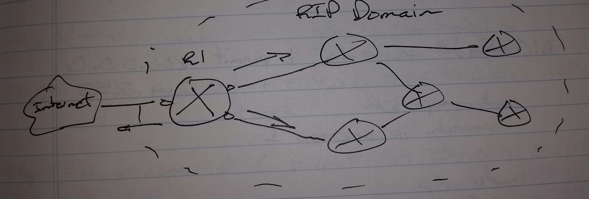
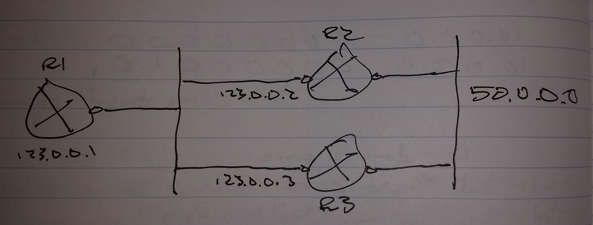
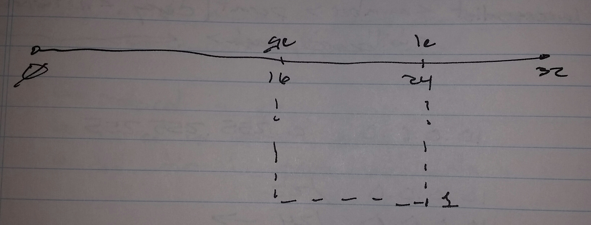
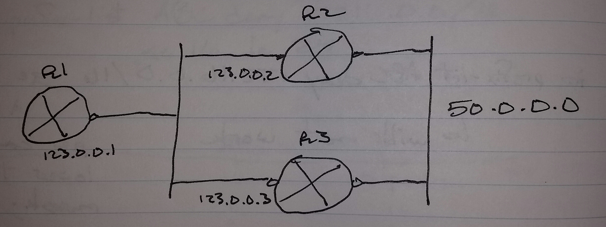
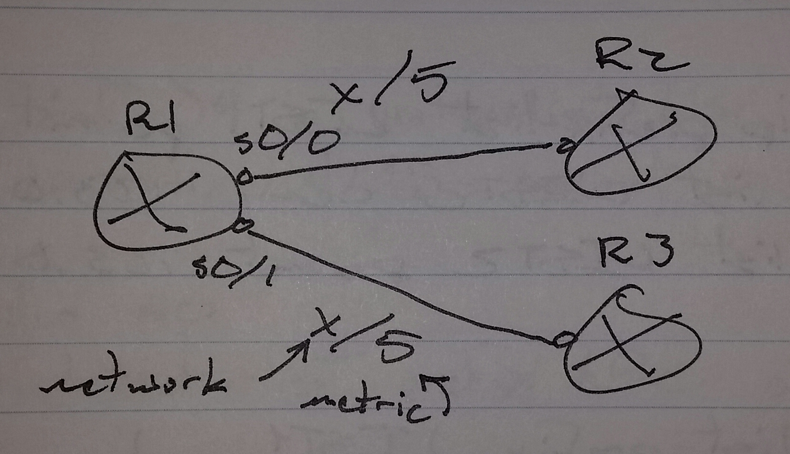
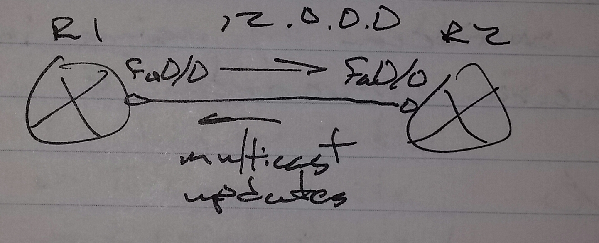

# RIPv2 - Class Notes

**[RIPv2** (20 Aug 2014)

 - UDP port 520

 - Multicast IP 224.0.0.9

 - Classless (not by default)

     -> Cannot have discontiguous networks

 - Metric is hop count

 - Metric 16 is infinite metric

 - Timers

     -> Update timer:  30 seconds

     -> Invalid timer:  180 seconds

     -> Holddown timer:  180 seconds

     -> Flush timer:  240 seconds

 - Supports authentication

     -> Plain text

     -> MD5

 - AD is 120

router rip

 version 2

 no auto-summary

 network x.x.x.x

Mismatched version updates can cause one way communication between the routers

 \- R1

     -> Send v1 updates

     -> Receive v1 and v2 updates

 - R2

     -> Send and receive v2 updates

**Authentication**

 - Plain text

 - MD5

     -> Create key chain

     -> Apply to an interface

key chain CISCO

 key 1

  key-string CCIE

int s0/0

 ip rip authentication mode { text | md5 }

 ip rip authentication key-chain CISCO

sh ip protocols

 - Lists the authentication method

debug ip rip

 - To troubleshoot authentication problems

     -> Such as key mismatch

sh key chain

 - To see if a space is present in the key-string

**Summarization**

Summary address 10.0.0.0/22

int fa0/0

 ip rip summary-address 10.0.0.0 255.255.252.0

A summary address is installed into the routing table pointing to the NULL interface

 - Used when one of the more specific networks is not rachable

 - This prevents the packets from being default routed to 0.0.0.0/0

 - Causes packets to be dropped

 - Summary address AS is still 120

RIP does not create a summary route pointing to NULL0

 - Must be created manually

ip route 10.0.0.0 255.255.252.0 NULL0

172.16.0.0 /24

172.16.1.0 /24

172.16.2.0 /24

172.16.3.0 /24

     -> 172.16.0.0 /22

          -> Works with RIPv2

172.0.0.0 /16

172.1.0.0 /16

172.2.0.0 /16

172.3.0.0 /16

     -> 172.0.0.0 /14

          -> Will not work with RIPv2

          -> Error message when trying to configure

RIPv2 summarization is only possible within the limits of a class (A, B, C)

     -> RIPv2 summarization is not classles

**Default Routing**

R1(config)# router rip

 default-information originate

In other routing tables:

R*  0.0.0.0     [120|*]

     -> The metric of the summary route is the least metric among more specific routes

**Conditional Default Routing**

In conditional default routing, the exit interface network is checked

 - If the network is in the routing table, the default network will be injected

 - If the network is not in the routing table, the default route is not injected

R1(config)# access-list 1 permit 200.0.0.0 0.0.0.255

route-map DR

 match ip address 1

router rip

 default-information originate route-map DR

This is conditional, but not reliable

 - Have to make the route-map false to be reliable

 - Link may be up, but the connection to the Internet may be down

Reliable Conditional Default Routing

 - Uses IP SLA

Apply to RIP

 - IP SLA (Step 1) <--> Track (Step 2) <-- Dummy Static Route (Step 3) <-- Access-list (Step 4) <-- Route-map (Step 5)

R1(config)# ip sla 1

 icmp-echo 4.2.2.2

  timeout 2000

     -> In milliseconds

  frequency 4

     -> In seconds

ip sla schedule 1 start-time now life forever

track 1 ip sla 1 reachability

ip route 169.254.0.0 255.255.0.0 NULL0 track 1

access-list 1 permit 169.254.0.0 0.0.255.255

route-map ABC

 match ip address 1

router rip

 default-information originate route-map ABC

**RIP Filtering**

**Passive Interface**

 - It stops sending updates out the specified interface

router rip

 passive-interface { <interface> | default }

passive-interface default

 - Can be used if there are a lot of loopback interfaces that you do not want to advertise

**Distribute List**

 - Which network to filter

 - Direction ( in | out )

 - In | out which interface

     -> If not specified, the network will be filtered from all interfaces

 - Filter is outsourced!

     -> ACL

     -> Prefix-list

router rip

 distribute-list <acl> in | out int <int>

router rip

 distribute-list prefix <list> in | out int <int>

**Distribute List - Standard ACL**

access-list 1 deny 1.1.1.1

access-list 1 permit any

router rip

 distribute-list 1 out fa0/0

Scenario -> Filter all even number octets (in the 3rd octet) of outgoing network

255.255.11111110.255

     -> I don't care about the first 7 bits, I only care about the last bit

     -> Subnet mask:  255.255.254.255

     -> Wild card mask:  0.0.1.0

10.0.0.0 - 00000000

10.0.2.0 - 00000010

     -> Last bit doesn't change

     -> 0 - don't care

     -> 1 - do care

access-list 1 deny 0.0.0.0 255.255.254.255

access-list 1 permit any

     - or -

access-list 1 permit 0.0.1.0 255.255.254.255

**Distribute List - Extended ACL**

 

access-list <number> permit | deny <protocol> <source> <destination>

 - Protocol is ip

 - Source is update source

 - Destination is update network

Scenario -> On R1, filter incoming update for network 50.0.0.0 if it is coming from R3

R1(config)# access-list 100 deny ip host 123.0.0.3 host 50.0.0.0

access-list 100 permit ip any any

router rip

 distribute-list 100 in

**Prefix Lists**

 - More flexible

 - Can match on subnet masks

ip prefix-list <name> [seq <number] permit | deny <network/wildcard mask> [le | ge <0 - 32>]

 - <network/wildcard mask> - prefix

 - le | ge <0 - 32> - subnet mask

access-list <number> permit | deny <network> <wildcard mask>

10.0.0.0 0.255.255.255

10.0.0.0 /22

10.0.0.0 /24

ip prefix-list LIST1 deny 10.0.0.0/8 ge 24 le 24

 - Matches 10.0.0.0 /24

Match any network starting with 172.16.x.x with subnet mask from 255.255.0.0 to 255.255.255.0

255.255.0.0          -> /16

255.255.128.0      -> /17

255.255.192.0      -> /18

255.255.224.0      -> /19

255.255.240.0      -> /20

255.255.248.0      -> /21

255.255.252.0      -> /22

255.255.254.0      -> /23

255.255.255.0      -> /24

ip prefix-list ABC deny 172.16.0.0/16 ge 16 le 24

1. 

 - Wildcard ->16

 - Range -> 16 - 24

2.

 - Wildcard -> 16

 - Range -> 18 - 32

     -> If on the exam, upper boundary is not specific, assume it's 32

3.

 - Wildcard -> 16

 - Range -> 18 - 24

ip prefix-list ABC deny 172.16.0.0/16 ge 18

ip prefix-list ABC deny 172.16.0.0/16 ge 18 le 24

Drawback of using prefix-lists

 - ge cannot be lower than the wildcard mask

Scenario -> Match any network starting with 172.16.0.0 and subnet mask between 8 and 24

ip prefix-list ABC deny 172.16.0.0/16 ge 8 le 24

     -> **Will not work**

     -> ge cannot be lower than the wildcard mask

If a single subnet mask is to be matched and it happens to be equal to the wildcard mask, then ge and le can be skipped

 - Compare first octet of 10.0.0.0 and subnet mask must be 255.0.0.0

ip prefix-list permit 10.0.0.0/8

Filter 1.1.1.1 /32 from R2

R1(config)# ip prefix-list ABC deny 1.1.1.1/32

 ip prefix-list ABC permit 0.0.0.0/0 le 32

router rip

 distribute-list prefix ABC out fa0/0

**Filter from a specific source**

Scenario -> Filter any network coming from R3 and accept all networks from R2

 - In this scenario, two prefix lists will be used

     -> 1. To identify which networks will be filtered

     -> 2. To identify the source

**Distribute List**

distribute-list prefix <list1> gateway <list2> in | out [<interface>]

R1(config)# ip prefix-list LIST1 permit 50.0.0.0/8

 ip prefix-list LIST2 deny 123.0.0.3/32

 ip prefix-list LIST2 permit 123.0.0.2/32

router rip

 distribute-list prefix LIST1 gateway LIST2 in fa0/0

During the lab, always use extended ACLs unless using prefix-lists is spcified

sh ip protocols

 - Displays the distribute-lists applied

**Offset-list**

 - This is used to add an offset number to the metric value when updates are sent or received

Scenario -> R1 should always use R2 as next-hop to reach network x (50.0.0.0)

 - If connection to R2 goes down, R1 should start using R3 as next-hop for network x

offset-list <acl> in | out <offset-number> [<interface>]

 - Standard ACL is used

access-list 1 permit 50.0.0.0

router rip

 offset-list 1 in 2 s0/1

For filtering purposes, offset number 16 can be used

Scenario -> Filter all network from R3

access-list 1 permit any

router rip

 offset 1 in 16 s0/1

     - or -

! No ACL needed

router rip

 offset-list 0 in 16 s0/1

**Filtering By Manipulating AD**

 - AD 255

     -> Unreachable

     -> Route deleted from the routing table

Scenario -> Filter network 50.0.0.0 from any router

access-list 1 permit 50.0.0.0

router rip

 distance 255 0.0.0.0 255.255.255.255 1

     -> 0.0.0.0 255.255.255.255 - the source

     -> 1 - ACL

Scenario -> Filter 50.0.0.0 from R3 (123.0.0.3)

access-list 1 permit 50.0.0.0

router rip

 distance 255 123.0.0.3 0.0.0.0 1

**RIP Miscellaneous Topics**

 - Change timers

 - Unicast updates

 - Triggered updates

 - Send / receive version

**Changing Timers**

 - rip configation

 - inside interface

router rip

 timers basic <update> <invalid> <holddown> <flush>

int fa0/0

 ip rip advertise <sec>

Scenario -> Change the RIP timers to 20, 90, 90, 120, but keep the update time to 30 seconds for fa0/0

R1(config)# router rip

 timers basic 20 90 90 120

int fa0/0

 ip rip advertise 30

**Unicast Updates**

To switch to unicast updates

 - Stop sending multicast updates

 - Start sending unicast updates

On R1 / R2:

router rip

 passive-interface fa0/0

 neighbor 12.0.0.x

**Triggered Updates**

 - Any serial (point-to-point) interface the periodic updates can be disabled and made triggered

On R1 / R2:

int s0/0

 ip rip triggered

debug ip rip

sh ip protocols

Send | Receive Version

 - By default if the version command is not used, then all interfaces

     -> Send v1 updates

     -> Receive v1 and v2 updates

 - If the version command is used, the interfaces will send and receive the version specified

 - The impact of the version command can be overridden by using interface specific commands

int fa0/0

 ip rip send version { 1 | 2 }

 ip rip receive version { 1 | 2 }

sh ip protocols

router rip will not display in show run if a network statement is not configured

ip rip advertise 30 will not show up in the sh run config because it is the default configuration

 - Use sh ip route to verify the proper networks are received on the interface
