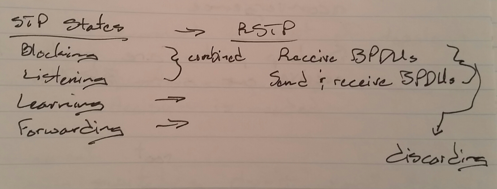
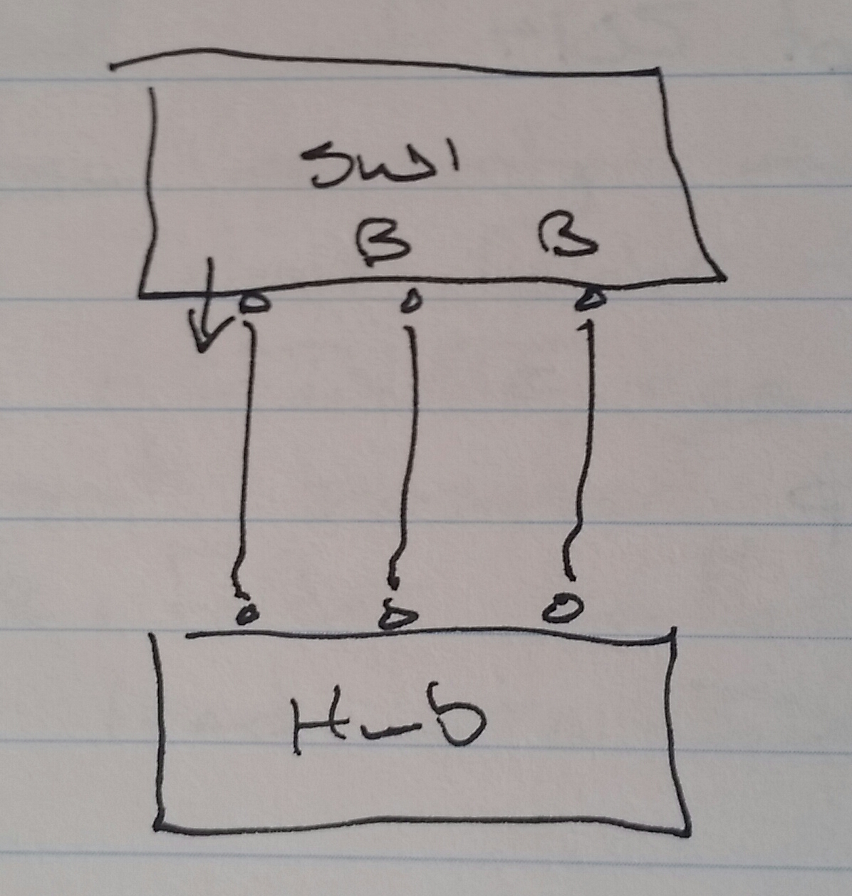
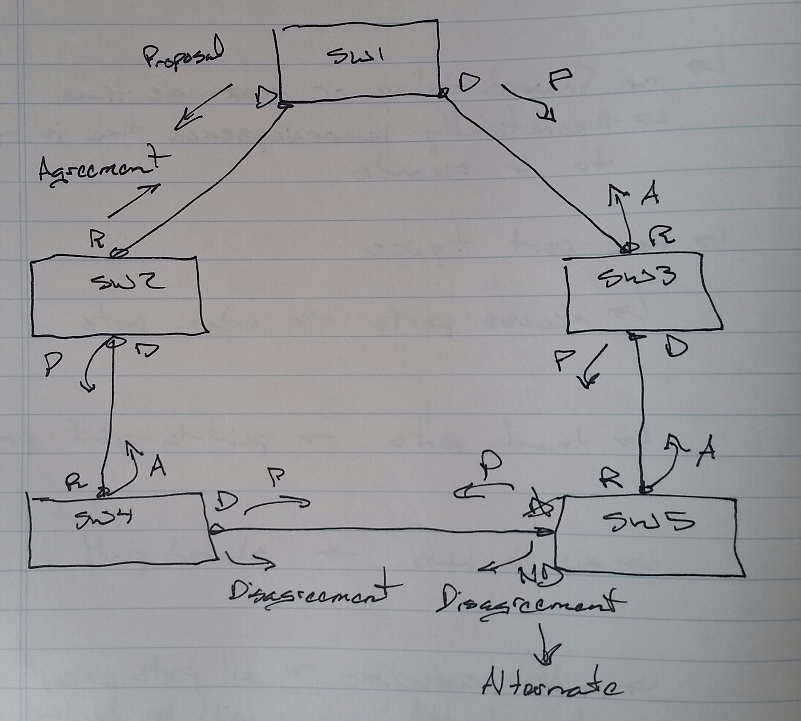
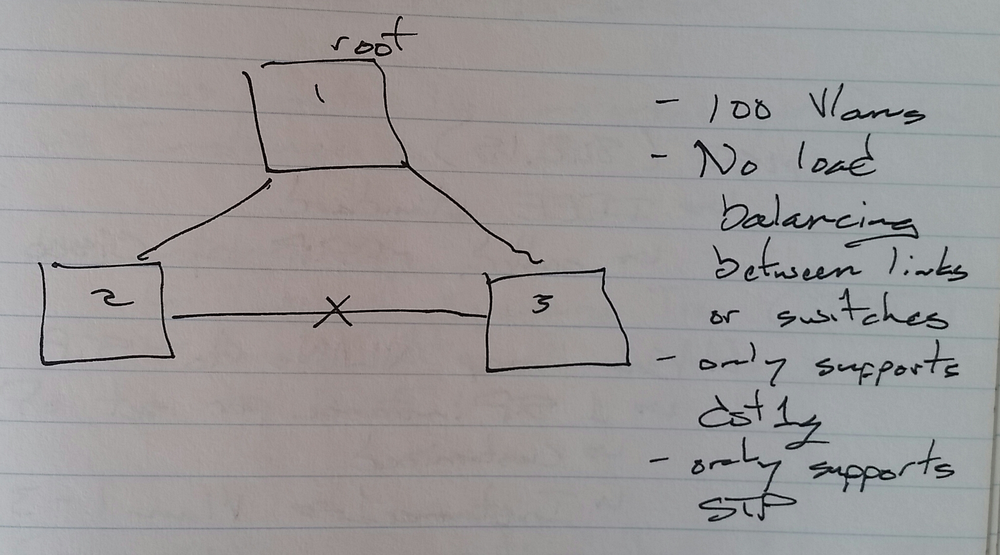
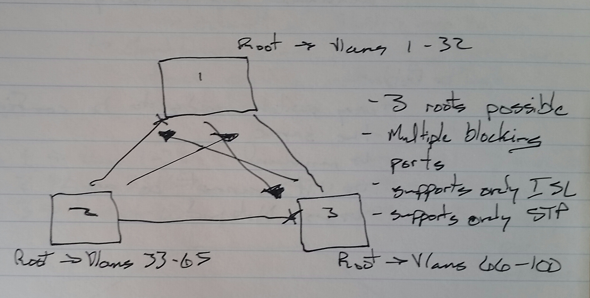

# Rapid STP (RSTP) - Class Notes

**Rapid STP (RSTP)**

 - 802.1W

 - STP plus fast convergence features

 - No forward-delay or max-age-time
     -> Theoretical reconvergence time is up to 6 seconds

**New Port Types**
 - Access ports —> Edge port
 - Trunk port —> Point-to-Point port
 - Switch to Hub —> Shared port
 - Multiple connections to a Hub —> All ports except one will become Backup ports
     -> Backup ports are ports that receive our own BPDUs

Failover does not have to wait for reconvergence

**Proposal**
 - Please make this port a root port
 - Receiving switch
     -> Disconnect from rest of topology
     -> Decide
     -> Send agreement
     -> Make port a root port
     -> Reconnect to the rest of topology
 - Disagreement
     -> Both switches don’t want to change port to a root port
 - The root bridge never sends an agreement

**Proposal and Agreement Procedure**
     1.  In RSTP once the root bridge is elected, it sends a Proposal message out all designated ports
     2.  The Proposal is a request to make the receiving port a root port
     3.  Whenever a switch receives a Proposal, it disconnects itself from the rest of the topology to decide to agree or disagree
     4.  If agree, an Agreement message is sent back and the sending port becomes a root port
     5.  Once the root port is decided, the switch sends Proposal messages further out potential designated ports

**Configuring RSTP**

SW1(config)#  spanning-tree mode rapid-pvst

**Convergence Methods**
 - Only two
     -> STP 
          -> Slower
     -> RSTP
          -> Faster
          -> Used by MST for convergence

**Topological Design**
  - STP to VLAN mapping
     -> Common Spanning Tree (CST)
     -> Per-VLAN Spanning Tree (PVST)
     -> Per-VLAN Spanning Tree + (PVST+)
     -> Multiple Spanning Tree (MST)

**Common Spanning Tree (CST)**
 - One STP instance for all VLANs
 - Only one root election
 - Limited to 100 VLANs
 - No load balancing between links or switches
 - Only supports dot1q
 - Only supports STP for convergence

**Per-VLAN Spanning Tree (PVST)**
 - One STP instance per VLAN
 - 100 VLANs means
     -> 100 STP instances
     -> 100 root bridges
     -> 100 BPDUs
 - Only supports ISL
 - Only supports STP for convergence

**Per-VLAN Spanning Tree + (PVST+)**
 - Supports both ISL and dot1q
 - Supports both STP and RSTP for convergence
