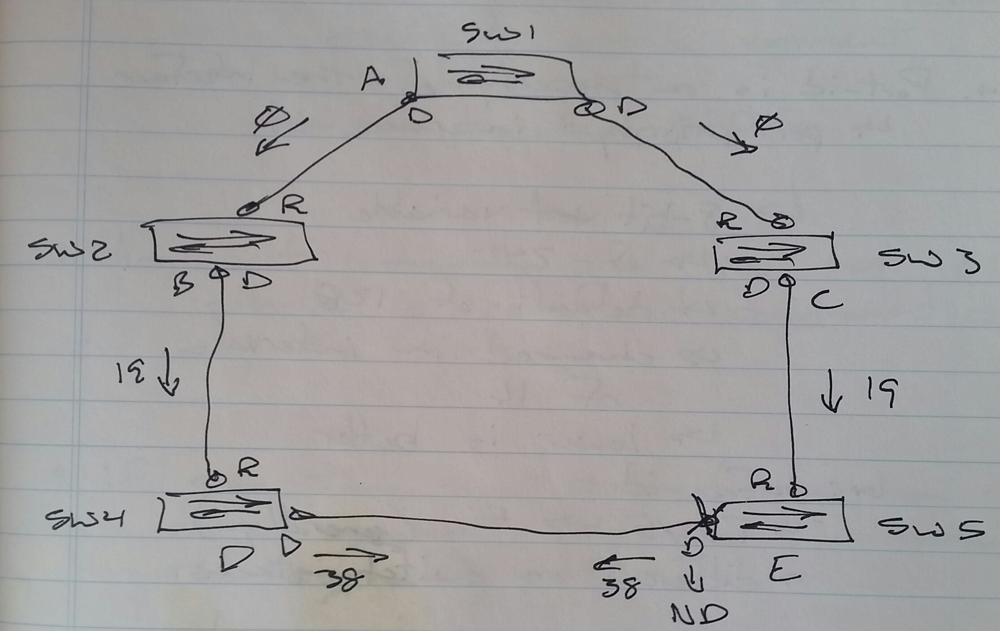
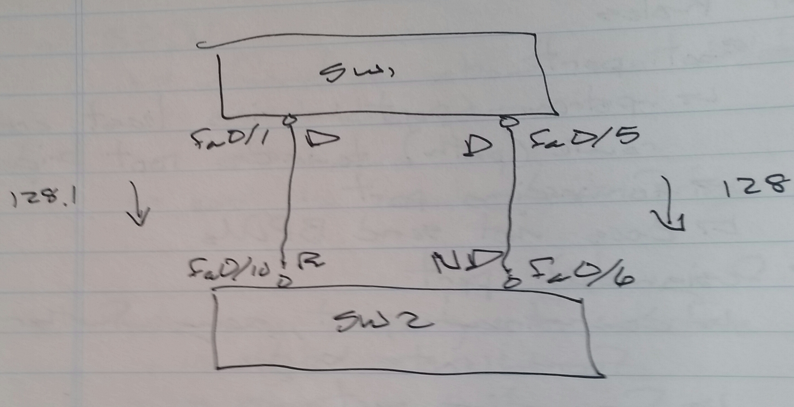

# Spanning Tree Protocol (STP) - Class Notes

**Spanning Tree Protocol (STP)**

 - 802.1D

 - Used to prevent loops while maintaining redundancy

1.  **Reference Point**

 - Root Bridge

     -> Priority

          -> Lower is better

     -> Base MAC address

          -> Lower is better

 - Priority

     -> 0 - 61440

          -> Default is 32768

2.  **Hello messages sent every 2 seconds to other switches**

 - Bridge Protocol Data Unit (BPDU)

     -> Information about the root bridge

          -> Bridge-ID

          -> Timers

     -> Cost to reach the root bridge

3.  **Cost is a property of the interface**

 - 10 Mbps

     -> 100

 - 100 Mbps

     -> 19

 - 1 Gbps

     -> 4

 - 10 Gbps

     -> 2

4.  **Port-id is a property of the interface**

 - Port-priority + Interface-id

 - Port-priority

     -> 8 bit variable

     -> 0 - 240

     -> Default is 128

     -> Changed in intervals of 16

     -> Lower is better

 - Interface-id

     -> fa0/5 == 5 (generally…)

     -> Different on switch stacks

5.  **Cost is incremented on every incoming port**

6.  **By default, the root bridge sends BPDU cost of 0**

7.  **Port Roles**

 - Root port

     -> Upstream port having least cost route (path) towards the root bridge

     -> Forwarding port

     -> Does not send BPDUs

 - Designated port

     -> Downstream port, going further away from the root bridge

     -> Forwarding port

     -> Sends BDPUs

 - Non-Designated port

     -> Downstream port, but least desirable on a network segment

     -> Blocking port

     -> Still processes BPDUs

8.  **Any port remaining after root port is selected is considered designated port by the switch**

9.  **If more than one designated port is on the same segment, only one can remain the designated port**

 - Decided by **STP Conflict Resolution Procedure (CRP)**

     1.  Root Bridge ID

     2.  Least cost towards root bridge

     3.  Sender Bridge-ID is compared with local Bridge-ID

     4.  Sender’s Port-ID is compared

          -> Used when multiple ports are connected to the same switch

**STP Reconvergence (1st Scenario)**

 - Direct link failure

     1.  Listening state

          -> 15 seconds (forwarding delay)

     2.  Learning state

          -> 15 seconds (forwarding delay)

     3.  Forwarding state

          -> After 30 seconds

**STP Reconvergence (2nd Scenario)**

 - Indirect link failure

 - Link between SW1 & SW3 goes down

     -> SW3 sends BPDUs to SW5 claiming to be the root bridge

     1.  MAX AGE time

          -> 20 seconds

     2.  Listening state

          -> 15 seconds (forwarding delay)

     3.  Learning state

          -> 15 seconds (forwarding delay)

     4.  Forwarding state

          -> After 50 seconds

     

**Going through old notebook, noticed I'd missed these:**

 - Added 6 April 2024

**Switch Priority**

SW1(config)# spanning-tree vlan 10 priority <value>

SW1(config)# spanning-tree vlan 10 root primary

-> If current root priority is the default, it is changed to 24,576

-> If the current root switch priority has a non-default priority, then the local switch will configure it's priority to 4096 less then the current root switch priority

SW1(config)# spanning-tree vlan 10 root secondary

-> Local switch priority changed to 28,572

**Changing Cost**

SW1(config)# int fa0/0

spanning-tree vlan 10 cost <value>

**Changing Port Priority**

SW1(config)# iint fa0/0

spanning-tree vlan 10 port-priority <value>

**Changing Timers**

 - Hello time          ->    2 seconds

 - Forward delay    ->    15 seconds

 - Max age              ->    20 seconds

SW1(config)# spanning-tree vlan 10 hello-time <sec>

SW1(config)# spanning-tree vlan 10 forward-delay <sec>

SW1(config)# spanning-tree vlan 10 max-age <sec>

**Err-Disable Feature**

  - Detects errors due to different triggers and err-disables the port

 - Err-disable recovery is disabled for all triggers by default

 - If err-disable recovery is configured, the port is reset after 300 seconds by default

SW1# sh errdisable detect cause

SW1(config)# errdisable recovery cause psecure-violation

SW1(config)# errdisable recovery interval <sec>
