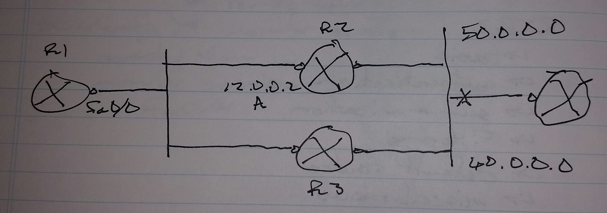

# Static Routing - Class Notes

**Static Routing** (20 Aug 2014)

ip route <destination> <direction>

 - destination

     -> network

     -> subnet mask

 - direction

     -> exit interface

     -> next-hop IP

     -> or both

Serial interface

 - Using next-hop IP or interface has no difference

 - Since there is only one other IP on the serial link

Multipoint interface

 - Using interface or next-hop IP address has a big difference

     -> An ARP request has to be sent

 - Exit interface

     -> If a packet arrives at R1 with a destination IP of 50.0.0.1

     -> Router will do a routing lookup;  since the next-hop IP address is missing, an ARP request is sent for 50.0.0.1

     -> The receiving router (R2) will reply with it's own MAC address on that segment if proxy-arp is enabled

          -> A new ARP entry is created for each IP packet sent to R2

          -> There could be hundreds of ARP entries

     -> Eventually, the sending router will have a huge ARP table with all IPs  in the 50.0.0.0 network mapped to the MAC address of R2

     -> Proxy-arp is enabled on routers by default

 - Next-hop IP address

     -> Whenever a packet is received for 50.0.0.0, an ARP request will be sent for the next-hop IP address

 - Next-hop IP address and exit interface

     -> Whenever a packet is received for 50.0.0.0, an ARP request will be sent for the next-hop IP address

     -> Scenario based

          -> Commonly used with BGP

          -> To prevent routing packets through another service provider

     -> If both an exit interface and next-hop IP address is used, the network is considered reachable if the exit interface is up

          -> An ARP request will be sent for the next-hop IP address

**Floating Static Routes**

ip route 50.0.0.0 255.0.0.0 12.0.0.2

ip route 50.0.0.0 255.0.0.0 12.0.0.3 50

     -> 50 is the administrative distance

     -> First route is installed into the routing table

 - Default administrative distance for static routes is 1

**Recursive Static Route**

 - When the next-hop is not directly connected

ip route 50.0.0.0 255.0.0.0 20.0.0.2

ip route 20.0.0.0 255.0.0.0 12.0.0.2

ip route 20.0.0.0 255.0.0.0 21.0.0.2

 - Used with BGP loopback to loopback peer netghborship

 - Will do a recursive lookup for each packet

     -> Unless CEF is being used

     -> Cases packets to the load-balanced across the serial links

**Unequal cost load-balancing**

 - EIGRP

 - BGP

ip route 20.0.0.0 255.0.0.0 12.0.0.2

ip route 30.0.0.0 255.0.0.0 12.0.0.2

ip route 40.0.0.0 255.0.0.0 21.0.0.2

ip route 50.0.0.0 255.0.0.0 20.0.0.2

ip route 50.0.0.0 255.0.0.0 30.0.0.2

ip route 50.0.0.0 255.0.0.0 40.0.0.2

 - Two packets will be sent to 12.0.0.2 for each packet sent to 21.0.0.2

 - Recursive lookup is used when CEF is not used
