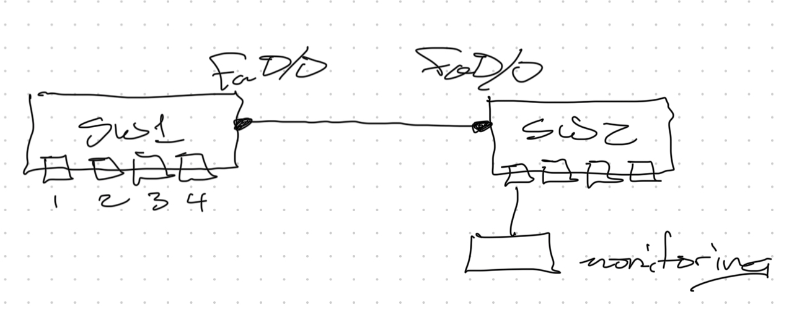

# Switchport Analyzer (SPAN) - Class Notes

 - I never typed these up.

 - Added 6 April 2024

 - Mechanism to sniff ( monitor ) the current communication going through a port, a set of ports, or VLAN and send it to a monitoring port

SW1(config)# monitor session 1 source interface fa0/0 [ rx | tx | both ]

 - Default is both if not specified

SW1(config)# monitor session 1 destination interface fa0/1

SW1# sh int brief

 - Line protocol for fa0/1 will show down

 - Destination interface cannot be used for any other communication purposes

SW1(config)# monitor session 1 destination int fa0/1 ingress vlan 10

SW1# sh int brief

 - Line protocol for fa0/1 will show up

 - Allows port to be used for communication purposes

**Remote SPAN**

SW1(config)# monitor session 1 source interface fa0/1 - 2

SW1(config)# monitor session 1 destination remote vlan 10

SW2(config)# monitor session 1 source vlan 10

SW1(config)# monitor session 1 destination interface fa0/1
