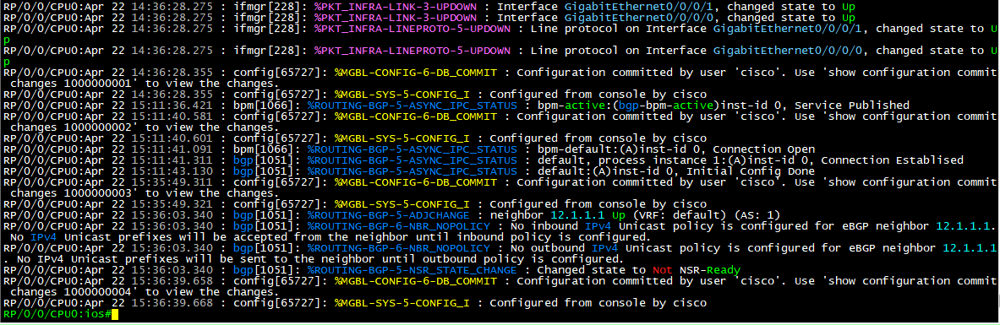

# CCIE Service Provider v5.1 Certification Study Notes

Here we go.

## Progress Tracker
Updated the progress tracker and added the SP v5.1 exam topics.

## Learning Matrix
Looks like most of the links are broken.  Surprise.  Will take a lot of work to update and fix.

## 2014 CCIE Class Notes
Uploaded the Evernote .enex exports of the notes from a CCIE class I took in 2014.

## SecureCRT Keyword Highlighting
Created a new .ini for IOS XR.  Warning, it's a work in progress.  **feralpacket_iosxr_2024.ini** can be found here:  [SecureCRT Keywork Highlighting](https://github.com/feralpacket/securecrt-keyword-highlighting/)


## Always Be Labbing

### BGP
Reduce some BGP timers to speed up convergence.  So I can see changes to the route table and BGP table faster.  Note:  **ONLY DO THIS IS A LAB ENVIRONMENT!**  Can also potenially cause route flaps or routing loops in complex lab environments.  Which would actually be cool to see.
```
bgp scan-time 10
neighbor 192.0.2.1 advertisement-interval 10
```
